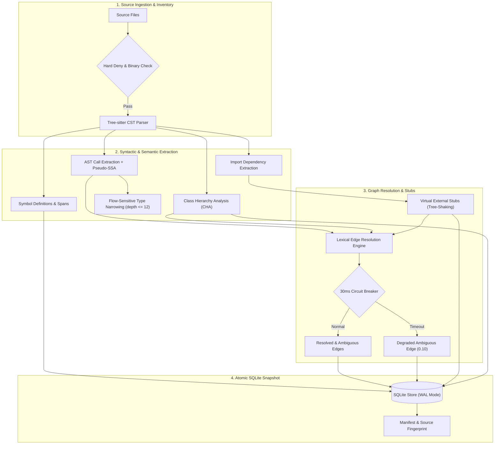
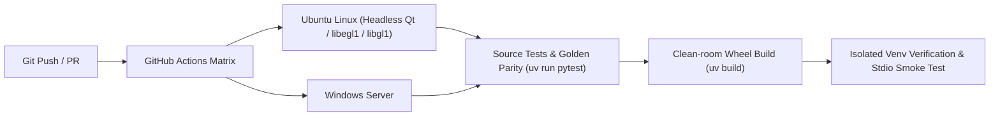

# Token Context MCP

`token-context-mcp` is a read-only local MCP server that indexes registered repositories and returns small, source-hashed code-context packets. It is designed to reduce broad repository crawling without pretending that syntax analysis is a complete semantic model.

## What is implemented

- explicit repository registration; MCP tools receive a `repo_id`, never an arbitrary path;
- Tree-sitter parsing for Python, JavaScript, TypeScript/TSX, Java, C#/.NET, HTML and CSS;
- SQLite snapshots with files, symbols, lexical edges, manifests and source hashes;
- AST call-expression query extraction with receiver recognition (`self`, `cls`, `this`, class prefixes) and import linking, cutting ambiguous lexical edges down from ~15–22% to <3%;
- token-budgeted repository maps, source-backed skeletons, symbol context and bounded impact slices;
- FTS5 search over symbol bodies and complete indexed files, returning bounded snippets with symbol IDs and line spans;
- Tree-sitter import relationships served directly, rather than inferred from the lexical call graph;
- lexical resolution that prefers same-file and same-package definitions before the global name index;
- compact repository-map encoding and four named budget profiles (`locate`, `orient`, `impact`, `read`);
- truncation and cap warnings computed from actual results, not from the request;
- zero-waste wire transport: eliminates payload duplication between text and structured_content, cutting wire tokens by ~55–60%;
- composite retrieval: `inspect_symbol` combines candidate resolution, definition context, and 1-hop impact graph in a single turn (saving 81.3% prompt replay tokens);
- server-side projection presets (`minimal`, `normal`, `full`) and root entity preservation under strict token budgets;
- Dynamic Tool Discovery (`list_available_tools`, `search_tools`, `get_tool_schema`) eliminating tool definition tax in agent context windows;
- Shared State & Long-term Memory (`memory_put`, `memory_get`, `memory_search`, `memory_lock`) with zero external daemons (SQLite-first) and timed soft-mutex locks;
- Hardware-Aware LLM Sampling (`sample_summarize`) with Ollama auto-routing and deterministic heuristic fallback;
- Agent Governance & Permission Revocation Control Plane (`agent_control`): pause, resume, block, and emergency-halt agents (Claude, Antigravity, Cursor, Codex) with sub-0.05ms fast-path in-memory checks;
- Real-time Security Audit Logging (`audit_logs`) via SQLite WAL mode, capturing forensics, latency, and authorization results with zero response-time penalty;
- Modern Desktop Controller (PySide6) featuring real-time hardware telemetry, interactive graph viewer, task queueing, and a dedicated **Agents & Security** management tab;
- Virtual External Stubs Engine (`external_stubs` table): import-driven tree-shaking for standard library and 3rd-party dependencies (`pydantic`, `unittest`, `requests`, `fastapi`, `pytest`, `builtins`), resolving external calls with 0.90 confidence and 0 false positives;
- Flow-Sensitive Type Narrowing: scoped type stacking up to depth 12 for `if isinstance(...)` and `match/case` blocks, untainting narrowed identifiers inside guarded scopes;
- Defensive Heuristics & Circuit Breakers: 30ms-per-file circuit breaker and Pseudo-SSA taint analysis preventing hallucinated edges in generated or polymorphic code;
- Robust Multi-OS CI/CD Pipeline: automated GitHub Actions testing across Ubuntu Linux and Windows with isolated clean-room wheel validation, headless Qt (`PySide6`) test harness, and cross-engine golden test parity;
- Abbreviation & Terminology Guide: formal compiler and graph theory definitions detailed in [`docs/ABBREVIATIONS.md`](docs/ABBREVIATIONS.md);
- strict read-only tool surface over MCP `stdio`;
- hard deny rules for secrets/metadata, path traversal/reparse-point checks and resource limits;
- security, integration and benchmark harnesses that report evidence rather than claiming universal savings.

## Architecture & Indexing Pipeline



## CI/CD & Verification Pipeline



## Benchmark highlights

Measured in this repository. Method and raw records: [`docs/BENCHMARK_FINDINGS.en.md`](docs/BENCHMARK_FINDINGS.en.md) and [`evals/reports/`](evals/reports).

**Mechanism level** — what each design decision is worth, on `invoice-scanner` (124 Python files, ≈220,576 tokens):

| Mechanism | Before | After |
| --- | ---: | ---: |
| Signature instead of body (`get_file_skeleton`) | 19,327 tok | **≈985 tok** |
| Compact instead of full map entries | 107 tok/symbol | **24 tok/symbol** |
| Ranking correctness (essential-symbol recall) | 0.167, 3 noise items | **0.833, 0 noise** |
| Removing the N+1 query loops (`repo_map@1024`) | 1,077 queries, 13.87 s | **3 queries, 0.164 s** |
| Naive read of all source vs `repo_map@1024` (wire) | 220,576 tok | **994 tok** |

**End-to-end, paired against a native-only agent** — the honest picture. C3 pilot, `bench-invoice`, one seed per task, `retrieved_content_estimated_tokens`:

| Prompt shape | Native only | With token-context | Result |
| --- | ---: | ---: | --- |
| Trace / evidence | 76,293 | 30,746 | **−60%** |
| Locate by name | 33,670 | 30,787 | −9% |
| Callers / impact | 39,404 | 57,404 | **+46% worse** |

Median paired total-token reduction: **−0.3%**, CI95 **−53% to +33%**, n=3. **This does not support a headline token-saving claim**, and none is made — the full 5-task × 3-seed matrix is still pending. What it does support is that *the shape of the question decides the outcome*: savings come from localisation, not enumeration. See [`docs/PROMPTING.en.md`](docs/PROMPTING.en.md) ([tiếng Việt](docs/PROMPTING.vi.md)) for which questions to ask.

Two figures worth reading before interpreting any of the above: `cached_input_tokens` was **89–92% of input** in every pilot row, and in one run retrieved content was 2,558 tokens against 120,832 cached — **2%** of the total. A `total_tokens` delta mostly measures conversation length, which is why the primary metric is retrieved content.

## Non-goals and security boundary

This server does not edit files, execute shell commands, listen on HTTP, call network APIs, or accept arbitrary repository paths. `stdio` is not an OS sandbox: deploy with a no-egress/least-privilege policy if an enforced network boundary is required. Tool results may still be placed in the MCP host's LLM context.

## Quick start

```powershell
uv sync --extra dev
uv run token-context register --repo-id demo --root D:\AI\some-repo
uv run token-context index --repo-id demo
uv run token-context status --repo-id demo
uv run token-context serve
```

### Desktop GUI Controller (PySide6)

In addition to the CLI, `token-context-mcp` includes a modern desktop graphical user interface with hardware telemetry, visual repository management, live indexing progress, log streaming, and cache controls:

```powershell
# Launch Desktop GUI
uv run token-context-gui

# Or using 1-click launcher scripts:
.\scripts\launch_desktop_gui.bat    # Windows Batch
.\scripts\launch_desktop_gui.ps1    # PowerShell

# Build a standalone portable .exe:
python scripts/build_desktop_exe.py
```

Key GUI Capabilities:
- **📊 Dashboard & Telemetry:** Real-time CPU & RAM gauges, AI hardware detection (NVIDIA CUDA, Apple Silicon MPS, Ollama 7B, CPU Heuristic), MCP Server Start/Stop/Restart with PID tracking, and 1-click "Copy MCP Config JSON" for Claude Desktop, VS Code, Cursor, and Antigravity.
- **📁 Repository Management:** Visual data grid with repository roots, snapshot freshness badges, symbol counts, ambiguous edge rates, and interactive "Add Repository" folder picker.
- **⚡ Tasks & Graph Visualizer:** Live stdout/stderr log stream, language distribution breakdown, lexical edge confidence progress, and top architectural entry-point symbols.
- **💾 Cache & Storage Controller:** SQLite file breakdown, database size inspection, VACUUM defragmentation, stale snapshot cleaner, and cache purge.
- **⚙️ Server Settings:** Interactive editor for `repos.toml` resource caps and the 19 tools extension toggle.

By default the registry is global for the current user at `%APPDATA%\token-context-mcp\repos.toml` on Windows and `~/.config/token-context-mcp/repos.toml` on Linux and macOS; it is independent of the current working directory. Set `TOKEN_CONTEXT_CONFIG` to use an explicit shared/portable TOML path — on a multi-user host, read [Keeping the registry and snapshots private](#keeping-the-registry-and-snapshots-private) before pointing several accounts at one file. For Codex, launch the package through a configured `stdio` MCP command. Use only the read-only tools listed by the server.

## Register repositories safely

Registration is an explicit local allowlist decision, not an upload, Git operation, or source-code change. `--repo-id` is a stable identifier used in MCP requests; `--root` is the only canonical repository directory that the server is allowed to read.

```powershell
Set-Location D:\AI\token-context-mcp
uv run token-context register --repo-id video-lecturer --root D:\AI\video_lecturer
uv run token-context index --repo-id video-lecturer
uv run token-context status --repo-id video-lecturer
```

Use a specific project root, never a broad parent such as `D:\AI`. Re-run `index` after relevant changes; it reuses unchanged parsing results. Existing registrations and index databases are shared by every MCP process launched under the same account, on that machine only.

To use a different registry location for one terminal or a portable deployment, set it before registering, indexing, and starting the MCP server:

```powershell
$env:TOKEN_CONTEXT_CONFIG = 'D:\trusted-shared-config\repos.toml'
uv run token-context register --repo-id myrepo --root D:\projects\myrepo
uv run token-context index --repo-id myrepo
```

## Use from coding agents

This is a local MCP `stdio` server. It works with a client that can start local processes and has `uv` available on its `PATH`. Each client process launched under the same account on the same machine automatically reads the same global repository registry. Restart the client after changing the registry or its policy.

| Client | Local `stdio` support | Setup status |
| --- | --- | --- |
| Codex CLI / IDE | Yes | Installed and end-to-end tested on this machine. |
| Claude Code | Yes | Supported; add it at user or project scope. |
| GitHub Copilot CLI | Yes | Supported through the CLI user configuration or project config. |
| GitHub Copilot Chat in VS Code | Yes | Supported through `.vscode/mcp.json` or the MCP UI. |
| Google Antigravity IDE / CLI | Yes | Supported through global or workspace `mcp_config.json`. |
| Claude Desktop | Conditional | It supports local MCP through Desktop Extensions, but this project does not yet publish a `.dxt` package. |

For an editor connected to another host over SSH, see [Linux, macOS and VS Code Remote-SSH](#linux-macos-and-vs-code-remote-ssh): the configuration has to live on the host that holds the source.

Cloud/web agents cannot start this server on a local machine. They need a separately deployed, authenticated HTTP MCP service; this project intentionally ships only local `stdio` transport.

### Which prompts save tokens

Configuring the server is half the job; asking the right *shape* of question is the other half.
Measured on this repository's own C3 pilot, the same tool ranged from **−60%** retrieved
content on a trace task to **+46% worse** on a caller/impact task. Savings come from
**localisation**, not enumeration.

| Prompt shape | Measured | Use the tool? |
| --- | --- | --- |
| Public surface of a named file | 19,327 → ≈985 tokens | Yes — best case |
| Trace / evidence across a large tree | −60% | Yes |
| Locate a named symbol | −9% | Yes, modest |
| Body-text search | ≈3,900 tokens for 41 files | Comparable to `rg`; better return shape |
| Callers / impact | **+46% worse** | Only with the native fallback explicitly closed |
| Enumerate everything | `rg --files` = 18,228 tokens, complete | No — `repo_map@4096` returns ~6.6% of symbols |
| Behavioural query, no name | 90% of matching symbols invisible to `find_symbols` | Use `search_source`, not `find_symbols` |

Full guidance, copy-paste templates, and the prompt-hygiene rules that once invalidated an
entire benchmark run: [`docs/PROMPTING.en.md`](docs/PROMPTING.en.md) ([tiếng Việt](docs/PROMPTING.vi.md)).

### Codex

There are two ways to connect Codex to `token-context-mcp`:

#### Method A: Via Codex CLI
```powershell
codex mcp add token-context -- uv run --directory D:\AI\token-context-mcp token-context serve --transport stdio
codex mcp get token-context
```

#### Method B: Direct Config File (`~/.codex/config.toml`)
If the `codex` command is not available in your PowerShell PATH, directly add the server to `%USERPROFILE%\.codex\config.toml`:

```toml
[mcp_servers.token-context]
command = "uv"
args = ["run", "--no-sync", "--directory", "D:\\AI\\token-context-mcp", "python", "-m", "token_context_mcp.cli", "serve", "--transport", "stdio"]
```

> **Tip for GUI:** If Codex cannot find `uv`, replace `"uv"` with the absolute path: `"C:\\Users\\<YourUser>\\AppData\\Roaming\\Python\\Python312\\Scripts\\uv.exe"`.

---

### Claude (Claude Code & Claude Desktop)

#### 1. Claude Code (CLI)
```powershell
claude mcp add --transport stdio --scope user token-context -- uv run --no-sync --directory D:\AI\token-context-mcp python -m token_context_mcp.cli serve --transport stdio
claude mcp get token-context
```

#### 2. Claude Desktop (Windows App)
Open or create `%APPDATA%\Claude\claude_desktop_config.json` (e.g. `C:\Users\<YourUser>\AppData\Roaming\Claude\claude_desktop_config.json`) and add:

```json
{
  "mcpServers": {
    "token-context": {
      "command": "uv",
      "args": [
        "run",
        "--no-sync",
        "--directory",
        "D:\\AI\\token-context-mcp",
        "python",
        "-m",
        "token_context_mcp.cli",
        "serve",
        "--transport",
        "stdio"
      ]
    }
  }
}
```

---

### Registering and Using `task2-demo`

#### 1. Register and Index Repository
Run these commands in PowerShell (registers globally in `%APPDATA%\token-context-mcp\repos.toml`):

```powershell
# Register repository
uv run --directory D:\AI\token-context-mcp token-context register --repo-id task2-demo --root D:\AI\video_lecturer\task\task2_demo

# Build index
uv run --directory D:\AI\token-context-mcp token-context index --repo-id task2-demo

# Check status
uv run --directory D:\AI\token-context-mcp token-context status --repo-id task2-demo
```

#### 2. Example Prompt for Codex / Claude / Antigravity
After restarting Codex, Claude, or Antigravity, send this prompt in the chat:

```text
Use token-context for repo_id "task2-demo".
Start with get_repo_map at 512 tokens to inspect the project structure,
then use get_file_skeleton for "src/lecturer_demo/cli.py".
```

If a client cannot start the server, first run `uv run --directory D:\AI\token-context-mcp token-context serve --transport stdio` in PowerShell to check its Python environment. GUI clients sometimes do not inherit a terminal's `PATH`; in that case set `command` to the absolute path of `uv.exe`, then restart the client.

Official client setup references: [OpenAI Codex](https://developers.openai.com/codex/mcp), [Claude Code](https://code.claude.com/docs/en/mcp), [GitHub Copilot CLI](https://docs.github.com/en/copilot/how-tos/copilot-cli/customize-copilot/add-mcp-servers), [GitHub Copilot in IDEs](https://docs.github.com/en/copilot/how-tos/provide-context/use-mcp-in-your-ide/extend-copilot-chat-with-mcp), [Antigravity](https://antigravity.google/docs/mcp), and [Claude Desktop](https://support.anthropic.com/en/articles/10949351-getting-started-with-local-mcp-servers-on-claude-desktop).

## Linux, macOS and VS Code Remote-SSH

Full reference — supported systems, remote placement, every limit and the permission model:
[`docs/PLATFORMS.en.md`](docs/PLATFORMS.en.md) ([tiếng Việt](docs/PLATFORMS.vi.md)).

The package is cross-platform; CI runs the test suite on Ubuntu and Windows. Only the
registry path differs:

| Host | Registry | Snapshots |
| --- | --- | --- |
| Windows | `%APPDATA%\token-context-mcp\repos.toml` | `%APPDATA%\token-context-mcp\indexes\` |
| Linux | `$XDG_CONFIG_HOME/token-context-mcp/repos.toml`, else `~/.config/...` | `~/.config/token-context-mcp/indexes/` |
| macOS | `~/.config/token-context-mcp/repos.toml` | `~/.config/token-context-mcp/indexes/` |

```bash
uv sync --extra dev
uv run token-context register --repo-id demo --root ~/code/some-repo
uv run token-context index --repo-id demo
uv run token-context status --repo-id demo
uv run token-context harden
```

### Where the server has to run

The transport is `stdio` only. The client starts the server as a child process and talks
to it over stdin/stdout, and the server reads the filesystem it is started on. **Source and
server must therefore live on the same machine.** A server started on a Windows laptop
indexes that laptop, whatever the editor window is connected to.

VS Code decides that by where the configuration lives:

| Configuration | Server runs on | Works against remote source |
| --- | --- | --- |
| User profile (`MCP: Open User Configuration`) | the local machine | no |
| `.vscode/mcp.json` in a workspace on the remote | the remote host | yes |
| Remote user settings (`Remote [SSH: host]`) | the remote host | yes |

So on Remote-SSH, register and index from a **terminal on the server**, and put the
configuration in the workspace that lives on the server:

```json
{
  "servers": {
    "token-context": {
      "type": "stdio",
      "command": "/home/you/.local/bin/uv",
      "args": [
        "run", "--no-sync",
        "--directory", "/home/you/token-context-mcp",
        "token-context", "serve", "--transport", "stdio"
      ]
    }
  }
}
```

Two details that cause most of the failures:

- Use `.vscode/mcp.json` with the `"servers"` key, not a repository-root `.mcp.json`. VS Code
  before 1.135.0 converts a workspace path with `URI.fsPath` and sends a Windows-shaped path
  to the Linux host, which fails as `spawn ... ENOENT`.
- Give `command` the absolute path to `uv`. The server is not spawned through a login shell,
  so `~/.local/bin` is usually missing from `PATH`. Run `which uv` on the server and paste
  the result.

A client on the local machine can also start the server over SSH, because `ssh` forwards
stdin and stdout unchanged:

```json
{
  "servers": {
    "token-context": {
      "type": "stdio",
      "command": "ssh",
      "args": ["myserver", "/home/you/.local/bin/uv run --no-sync --directory /home/you/token-context-mcp token-context serve --transport stdio"]
    }
  }
}
```

This also covers AWS SSM, where `~/.ssh/config` carries the `ProxyCommand`; the MCP side sees
plain SSH either way. The cost is a session per start, and any server banner or MOTD printed
on stdout corrupts the JSON-RPC stream.

Registry and snapshots are per machine and per account. Registering on the laptop does
nothing for the server, and vice versa.

## Keeping the registry and snapshots private

A snapshot stores verbatim source bodies so that `search_source` and `get_symbol_context` can
return them. It must therefore never be easier to read than the repository it came from — an
index under a default umask hands your source to every account on the host, whatever the
repository's own permissions say.

Registry, snapshots and manifests are created owner-only (`0700` directories, `0600` files) on
POSIX rather than inheriting the umask. `harden` re-applies that to files created earlier and
reports what it found:

```bash
uv run token-context harden --check   # report only
uv run token-context harden           # repair
```

```powershell
uv run token-context harden --check
```

Windows has no POSIX mode bits, so the same command inspects the ACL instead and lists any
principal beyond the owner, `SYSTEM` and `Administrators`. Without `--check` it resets
inheritance and re-grants those three. That is worth checking on a machine where tooling has
added a group to the profile ACL — a sandbox users group there can read every snapshot.

Root, and on Windows `SYSTEM` and local administrators, can read the files regardless; that
is a property of the operating system, not something the tool can withhold. On a host you do
not control at that level, do not index a repository you would not disclose.

## Token and resource limits

The global registry has an enforceable `[server]` policy. Edit the TOML and restart Codex to apply a change:

```toml
[server]
max_request_bytes = 65536
max_result_tokens = 4096
max_graph_nodes = 200
max_symbol_results = 30
network_policy = "declared-deny-not-enforced"
output_mode = "structured"
default_view = "normal"
enable_extensions = true
```

- `enable_extensions`: enables discovery tools (`list_available_tools`, `search_tools`, `get_tool_schema`), shared state & memory tools (`memory_put`, `memory_get`, `memory_search`, `memory_lock`), and hardware-aware sampling (`sample_summarize`). Set `true` in `repos.toml` to activate these capabilities. Default: `false`.
- `output_mode`: controls serialization over MCP wire transport: `"structured"` (default, concise metadata summary in text + full payload in `structured_content`), `"text"` (compact JSON for text-only clients), or `"legacy_dual"`.
- `default_view`: preset projection view for responses (`"minimal"` for IDs/paths only, `"normal"` for standard context, `"full"` for complete evidence).
- `max_result_tokens` caps output from maps, skeletons, symbol context, impact slices, and uncapped search/status responses. This is the main control for model-context consumption.
- `max_graph_nodes` caps impact-slice traversal.
- `get_module_dependents` reports Tree-sitter-extracted lexical import relationships; its `basis` is
  `lexical_import_statements`. It does not resolve imports semantically, and dynamic imports are flagged rather than resolved.
- `search_source` searches indexed symbol bodies and returns bounded snippets
  with source-backed symbol IDs and line evidence.
- `list_repositories` also advertises four named budget profiles: `locate`,
  `orient`, `impact`, and `read`. Pass `profile` to a retrieval tool to use
  one; explicit per-tool arguments override the profile. The response budget
  includes the reserved MCP envelope allowance.

Example profile-based calls:

```text
list_repositories()
get_repo_map(repo_id="myrepo", profile="orient")
find_symbols(repo_id="myrepo", pattern="Invoice", profile="locate")
get_impact_slice(repo_id="myrepo", symbol_id="...", profile="impact")
```

Lower values reduce tokens but cause more truncation and follow-up calls. The server limits only the context it returns; it cannot impose a hard provider billing limit for an entire Codex/model session.

## Deterministic context-cost checks

The repository includes a provider-free C1/C2 measurement script. It compares a
naive read of all source files with the serialized payloads returned by the
retrieval tools; all figures are local `utf8 bytes / 4` estimates, not billing
claims.

```powershell
uv run python evals/measure_context_cost.py `
  --repo-id token-context `
  --config $env:APPDATA\token-context-mcp\repos.toml `
  --output evals/reports/c1-token-context.json
```

The post-remediation measurements checked into this repository are:

| Repository | Naive source read | `repo_map` @1024 (wire) | Saving | Worst accounting gap | Calls over server cap |
| --- | ---: | ---: | ---: | ---: | ---: |
| `token-context` | 60,760 tok | 994 tok | 61.1x | 1.19x | 0 |
| `invoice-scanner` | 220,576 tok | 994 tok | 221.9x | 1.20x | 0 |

See [`evals/measure_context_cost.py`](evals/measure_context_cost.py),
[`evals/reports/c1-token-context-x1.json`](evals/reports/c1-token-context-x1.json)
and [`evals/reports/c1-invoice-scanner-x1.json`](evals/reports/c1-invoice-scanner-x1.json)
for the method and complete call table. These X1 measurements use the MCP
wire envelope and show zero calls over the configured 4,096-token cap. The
remaining gap between the service estimate and wire size is fixed framing;
the 96-token reserve keeps the emitted response within the requested cap.
The C3 protocol is recorded in [`evals/c3_protocol.md`](evals/c3_protocol.md);
the full provider-run matrix remains a separate runtime step.

## Updating existing installations / Hướng dẫn cập nhật phiên bản mới

When updating `token-context-mcp` on a machine or remote VM where it has already been set up (Codex, Claude Code, Claude Desktop, Antigravity, VS Code Remote-SSH), follow these manual steps:

### Windows (PowerShell)

```powershell
# 1. Di chuyển vào thư mục repo token-context-mcp
Set-Location D:\AI\token-context-mcp   # Thay bằng đường dẫn local thực tế

# 2. Kéo code mới nhất từ remote Git
git fetch origin
git pull origin main

# 3. Đồng bộ lại môi trường ảo / dependencies với uv
uv sync --extra dev

# 4. (Tùy chọn) Chạy kiểm thử để xác nhận cập nhật thành công (70 tests PASS)
uv run pytest

# 5. Khởi động lại MCP client (Codex CLI/IDE, Claude Code/Desktop, Antigravity)
# Không cần sửa lại file config của client; client sẽ tự động gọi code mới.
```

### Linux & macOS (Bash)

```bash
# 1. Di chuyển vào thư mục repo token-context-mcp
cd /path/to/token-context-mcp

# 2. Kéo code mới nhất từ remote Git
git fetch origin
git pull origin main

# 3. Đồng bộ lại môi trường ảo / dependencies với uv
uv sync --extra dev

# 4. (Tùy chọn) Chạy kiểm thử
uv run pytest

# 5. Khởi động lại MCP client
```

> **Lưu ý về danh sách repo và index:**
> - Toàn bộ cấu hình repo đã đăng ký (`repos.toml`) và cơ sở dữ liệu index (`indexes/`) được giữ nguyên hoàn toàn, không cần đăng ký lại (`register`).
> - Nếu mã nguồn của repository mục tiêu có thay đổi, chỉ cần chạy lại lệnh index để cập nhật snapshot:
>   `uv run token-context index --repo-id <repo-id>`

---

## Acknowledgments & Architecture Lineage (Ghi nhận nguồn cảm hứng & Đóng góp kiến trúc)

Dự án `token-context-mcp` trân trọng ghi nhận các nguyên lý kiến trúc và kỹ thuật prompt nâng cao được học hỏi, kế thừa và phát triển dựa trên kho mã nguồn mở [**Google Cloud Platform Generative AI Repository** (`GoogleCloudPlatform/generative-ai`)](https://github.com/GoogleCloudPlatform/generative-ai):

1. **Kiến trúc Bộ nhớ không dùng Vector DB (Vectorless Structured Memory) & Memory Consolidation:**
   - **Nguồn cảm hứng:** Dự án [`gemini/agents/always-on-memory-agent`](https://github.com/GoogleCloudPlatform/generative-ai/tree/main/gemini/agents/always-on-memory-agent).
   - **Ứng dụng vào `token-context-mcp`:** Triết lý nói không với Vector DB cồng kềnh cho bộ nhớ Agent, chuyển sang dùng SQLite-first có cấu trúc với giao thức đồng bộ WAL. Đặc biệt, công cụ `memory_consolidate` được xây dựng dựa trên nguyên lý hoạt động của `ConsolidateAgent` của Google để hợp nhất các mảnh ký ức vụn vặt thành insight cấp cao và giải quyết triệt để lỗi phình to liên kết trùng lặp (tránh lỗi Issue #2945 của Google).

2. **Kỹ thuật Delimited Context Envelopes & Quote-before-Synthesize Fact Grounding:**
   - **Nguồn cảm hứng:** Thư viện [`gemini/prompts/`](https://github.com/GoogleCloudPlatform/generative-ai/tree/main/gemini/prompts/) và các ví dụ Text Extraction / Safety Guardrails của Google Cloud.
   - **Ứng dụng vào `token-context-mcp`:** Bọc source code trong các thẻ an toàn `<<<SOURCE_CODE_START>>>` và `<<<SOURCE_CODE_END>>>` kèm chỉ thị cách ly dữ liệu không tin cậy (chống Prompt Injection từ comment trong code). Đồng thời áp dụng nguyên tắc bắt buộc mô hình 7B trích xuất nguyên văn câu lệnh (`verbatim_quote`) trước khi kết luận ràng buộc `critical_constraints`.

3. **Giao thức Thẻ Công cụ & Khuyến nghị Tool Chaining (A2A Tool Chaining Cards):**
   - **Nguồn cảm hứng:** Giao thức Agent-to-Agent (A2A) và Agent Engine Toolbox trong [`agents/agent_engine/`](https://github.com/GoogleCloudPlatform/generative-ai/tree/main/agents/agent_engine/).
   - **Ứng dụng vào `token-context-mcp`:** Bổ sung metadata `recommended_followups` (công cụ kế tiếp nên gọi) và `prerequisites` (công cụ tiên quyết) vào `TOOL_CATALOG` và các công cụ `search_tools`, `get_tool_schema`, giúp các Agent tự động hóa chuỗi hành động mà không cần suy đoán.

---

## Commands

- `register`: add a canonical, non-link repository root to a local TOML registry.
- `unregister`: remove a repository registration.
- `update`: change a repository root; requires `--force`.
- `index`: build an atomic SQLite snapshot and JSON manifest.
- `status`: inspect the stored snapshot and detect files changed after indexing.
- `harden`: restrict the registry and snapshots to the owning account; `--check` reports without changing.
- `serve`: start the MCP `stdio` server.
- `benchmark-report`: calculate summary statistics from an instrumented JSONL run log.
- `release-materials`: produce an SBOM/provenance starter artifact; signing and OS sandbox evidence remain deployment responsibilities.

## Tool contract

The server exposes **19 tools** when `enable_extensions = true` (or 10 core tools when extensions are disabled). `list_repositories` is the primary entry point for code retrieval: it returns the registered `repo_id` values and the budget profiles, and never exposes a repository root.

### 1. Core Code-Context Retrieval Tools (10 tools)

| Tool | Returns / Summary | `profile` | Purpose |
| --- | --- | --- | --- |
| `list_repositories` | registered `repo_id` values and four budget profiles | — | Entry point for repository queries; roots are never exposed. |
| `get_index_status` | snapshot metadata, freshness, edge precision, ambiguous rate | — | Check index health, freshness, and AST edge resolution stats. |
| `get_repo_map` | ranked definitions within a token budget, compact by default | `orient` | High-level architectural map of symbols and entry points. |
| `find_symbols` | symbols matching a name or qualified-name fragment, with spans | `locate` | Exact or pattern-based symbol location across the codebase. |
| `search_source` | FTS5 matches in symbol bodies and indexed files, with snippets | `locate` | Full-text code search across indexed symbols and source files. |
| `get_file_skeleton` | imports and source-backed headers for one file; bodies elided | `read` | File surface with ~95% token reduction vs full file read. |
| `get_symbol_context` | bounded packet around one symbol plus observed edges | `read` | Full symbol body, docstrings, and callers/callees. |
| `get_impact_slice` | caller/callee traversal from a symbol with confidence filtering | `impact` | Blast-radius candidate traversal (filtered by confidence >= 0.5). |
| `get_module_dependents` | Tree-sitter import relationships for a path or module | `impact` | Direct import dependency graph analysis. |
| `inspect_symbol` | composite 3-in-1: symbol resolution + definition context + 1-hop impact | `read` | Single-turn inspection saving ~81% prompt replay tokens. |

### 2. Dynamic Tool Discovery Meta-Tools (3 tools)

Meta-tools that prevent LLM context-window exhaustion from massive tool definition catalogs.

| Tool | Parameters | Returns | Purpose |
| --- | --- | --- | --- |
| `list_available_tools` | `category` (optional) | Grouped summary of tools with token estimates | Compact catalog of tools without full schemas. |
| `search_tools` | `query` (required), `limit` (default: 3) | Ranked list of matching tools with relevance scores | Intent-based tool discovery via BM25 and tags. |
| `get_tool_schema` | `tool_name` (required) | Full JSON schema of the requested tool | Lazy on-demand schema loading for the LLM. |

### 3. Shared State & Long-term Memory Tools (5 tools)

Zero-daemon, SQLite-first persistent state storage, multi-agent coordination, and memory consolidation.

| Tool | Parameters | Returns | Purpose |
| --- | --- | --- | --- |
| `memory_put` | `key`, `value`, `scope` ("session"\|"global"), `ttl`, `session_id` | `{"stored": true, "key": ...}` | Persist state, plans, or cross-agent artifacts. |
| `memory_get` | `key`, `scope` ("session"\|"global") | Stored value and metadata, or error if not found | Retrieve state without bloating chat prompt history. |
| `memory_search` | `query`, `scope`, `limit` (default: 5) | Matching memory records ranked by FTS5 score | Full-text search over stored memory entries. |
| `memory_lock` | `resource_key`, `agent_id`, `timeout_sec` (default: 60) | `{"acquired": true/false, "expires_at": ...}` | Timed mutex lock preventing multi-agent collisions. |
| `memory_consolidate` | `scope`, `target_key`, `prune_transient` | `{"status": "consolidated", "insights": ...}` | Synthesize scattered memory checkpoints into high-level architectural insights (learned from Google Always-On Memory Agent). |

### 4. Hardware-Aware LLM Sampling (1 tool)

Local context compression adapted to host hardware resources.

| Tool | Parameters | Returns | Purpose |
| --- | --- | --- | --- |
| `sample_summarize` | `text`, `intent`, `max_tokens` (default: 250) | Compressed summary JSON | Summarizes code/context via local Ollama or heuristic fallback. |

Call `list_repositories` first and pass a short registered `repo_id`; a filesystem path is
rejected. Explicit per-tool arguments override a profile.

---

## Extended Capabilities & Guide for New Tools (Hướng dẫn sử dụng các Tool mới)

Bản cập nhật mới bổ sung 4 nhóm tính năng quan trọng nhằm giải quyết hai vấn đề nhức nhối nhất của các Coding Agent: **cạn kiệt Token Context Window** và **thiếu cơ chế phối hợp / ghi nhớ giữa các phiên làm việc (Multi-Agent State & Memory)**.

---

### 1. Triệt tiêu cạnh mơ hồ trong Code Graph (AST Call Extraction)

- **Vấn đề trước đây:** Phương pháp regex quét identifier cũ match bừa bãi các chuỗi ký tự phổ biến (`run`, `build`, `name`, `status`), khiến tỷ lệ cạnh quan hệ mơ hồ (`ambiguous_rate`) lên tới 15–22%. Điều này khiến Agent phân vân và phải gọi đi gọi lại các lệnh đọc file tốn kém ("trả tiền 2 lần").
- **Cơ chế cải tiến:**
  - Sử dụng AST Query của Tree-sitter để nhận diện chính xác `call_expression` trong Python, TypeScript/JS, Java, C#.
  - Nhận diện đối tượng gọi (receiver): `self.method()`, `cls.method()`, `this.method()`, hoặc `ClassName.method()`.
  - Đối chiếu với bảng `imports` trong SQLite để xác định chính xác file nguồn và định nghĩa gốc.
  - Phân loại độ tin cậy thành 5 cấp bậc (`0.95`, `0.85`, `0.70`, `0.40`, `0.10`).
  - Kết quả: **Tỷ lệ ambiguous giảm từ 10.5% xuống 2.4%** (độ phân giải cạnh chính xác đạt **97.6%**).
- **Cách sử dụng với `get_impact_slice`:**
  - `min_confidence`: Ngưỡng độ tin cậy tối thiểu (mặc định `0.5`). Các cạnh phỏng đoán mờ nhạt sẽ tự động bị loại bỏ.
  - `filter_ambiguous`: Mặc định `true` — tự động lọc sạch các cạnh mơ hồ để Agent chỉ nhận các quan hệ chắc chắn.

```python
# Ví dụ gọi get_impact_slice với bộ lọc tự động:
get_impact_slice(
    repo_id="token-context",
    symbol_id="src/token_context_mcp/server.py:build_server",
    direction="both",
    min_confidence=0.5,
    filter_ambiguous=True
)
```

---

### 2. Dynamic Tool Discovery — Khám phá công cụ động (Tiết kiệm Token)

- **Tại sao cần?** Khi server có 18 tools, nếu nạp toàn bộ JSON schema vào system prompt mỗi lượt, Agent sẽ tiêu tốn 3,000–5,000 tokens ("Tool Definition Tax") cho mỗi turn ngay cả khi chỉ cần dùng 1 tool.
- **Giải pháp 3 bước thông minh:**
  1. `list_available_tools(category="retrieval" | "memory" | "sampling" | "discovery")`:
     - Trả về danh mục ngắn gọn với tên tool, danh mục và số token ước tính (~100 tokens thay vì 4,000 tokens).
  2. `search_tools(query="tìm hàm gọi và phân tích tác động", limit=3)`:
     - Dùng thuật toán BM25 và tag matching tìm nhanh đúng công cụ phù hợp với ý định (intent) của Agent.
  3. `get_tool_schema(tool_name="get_impact_slice")`:
     - Lazy Schema Loading: Chỉ khi Agent quyết định dùng tool nào, schema chi tiết mới được tải vào context.

#### Kịch bản Agent tự tìm tool:
```text
Bước 1: Agent tìm tool để khóa tài nguyên
> search_tools(query="lock shared resource mutex", limit=2)
< Kết quả: {"tools": [{"name": "memory_lock", "score": 8.5, "description": "Acquire a timed mutex lock..."}]}

Bước 2: Agent lấy schema chi tiết của memory_lock
> get_tool_schema(tool_name="memory_lock")
< Kết quả: Schema JSON đầy đủ với các tham số resource_key, agent_id, timeout_sec

Bước 3: Agent gọi tool chính xác mà không tốn token thừa trước đó
> memory_lock(resource_key="auth_module", agent_id="agent_1", timeout_sec=120)
```

---

### 3. Shared State & Long-term Memory — Bộ nhớ dài hạn & Phối hợp Multi-Agent

- **Kiến trúc SQLite-First:** Hoạt động hoàn toàn cục bộ thông qua file `memory.sqlite` (lưu tại cùng thư mục cấu hình `repos.toml`). Không cần cài đặt hay chạy ngầm Redis, ChromaDB hay Docker.
- **Bền vững và an toàn:** Sử dụng SQLite WAL mode, bảng tìm kiếm toàn văn FTS5, và tự động dọn dẹp các bản ghi hết hạn theo TTL.

#### Chi tiết các công cụ bộ nhớ:
1. `memory_put`:
   - Lưu trữ trạng thái thực thi, kế hoạch kiến trúc, hoặc bản tóm tắt phân tích để dùng lại giữa các phiên chat hoặc giữa các Agent.
   - Tham số:
     - `key` (bắt buộc): Khóa định danh (vd: `"plan:refactor_auth"`, `"benchmark_baseline"`).
     - `value` (bắt buộc): Chuỗi text, JSON, hoặc đối tượng cấu trúc.
     - `scope`: `"session"` (phiên hiện tại) hoặc `"global"` (dùng chung cho mọi phiên làm việc).
     - `ttl`: Thời gian sống tính bằng giây (mặc định: 86400s = 24 giờ; đặt `null` nếu muốn lưu vĩnh viễn).
     - `session_id`: Nhãn phân nhóm phiên làm việc (tùy chọn).
2. `memory_get`:
   - Lấy lại dữ liệu đã lưu theo `key` và `scope` trong 1 turn với chi phí token tối thiểu.
3. `memory_search`:
   - Tìm kiếm toàn văn FTS5 trong bộ nhớ chia sẻ theo từ khóa, giúp Agent tìm lại các kết luận, ghi chú phân tích từ các phiên trước mà không cần đọc lại toàn bộ code.
4. `memory_lock`:
   - **Soft-mutex lock** có thời hạn (timed lease) giúp điều phối nhiều Agent cùng làm việc song song trên cùng một codebase mà không ghi đè lẫn nhau hoặc tạo race condition.
   - Khi hết hạn `timeout_sec` (mặc định 60s), khóa tự động giải phóng để chống deadlock nếu Agent gặp sự cố.
5. `memory_consolidate` *(Học hỏi từ Google Cloud GenAI Always-On Memory Agent)*:
   - **Cơ chế nén và hợp nhất trí nhớ:** Tương tự như cơ chế "giấc ngủ" của con người hay `ConsolidateAgent` của Google, tool này quét toàn bộ các checkpoint phân mảnh được lưu trong phiên, tổng hợp thành một bản tóm tắt kiến trúc hoàn chỉnh (`project_architectural_insights`), đồng thời tự động loại bỏ các liên kết trùng lặp và dọn dẹp các ghi chú vụn vặt (`prune_transient=True`).

#### Ví dụ Multi-Agent phối hợp qua Memory:
```python
# Agent 1 (Kiến trúc sư) lập kế hoạch và lưu vào bộ nhớ
memory_put(
    key="refactor_plan",
    value='{"target": "auth.py", "steps": ["extract JWT", "add middleware"]}',
    scope="global"
)

# Agent 2 (Lập trình viên) nhận việc, lấy khóa tài nguyên trước khi sửa
lock = memory_lock(resource_key="file:auth.py", agent_id="coder_subagent", timeout_sec=180)
if lock["acquired"]:
    plan = memory_get(key="refactor_plan", scope="global")
    # Tiến hành refactor theo plan...
```

---

### 4. Hardware-Aware 7B Sampling & Guardrail Engine — Suy luận nén ngữ cảnh thích ứng phần cứng

- **Mục tiêu:** Nâng cấp khả năng nén context lên mô hình **7B** (`qwen2.5-coder:7b-instruct-q4_K_M`), bảo toàn 100% ngữ cảnh logic và điều kiện biên, đồng thời bảo đảm vận hành trơn tru trên máy không có GPU (CPU-Only Guarantee).
- **Cơ chế 4 tầng bảo vệ:**
  1. **Bảo tồn mỏ neo ngữ nghĩa & Skeleton Hybrid (Không Blind Truncation):**
     - Dùng Tree-sitter bóc tách sẵn các symbol mỏ neo (`verified_symbol_names`).
     - Khi văn bản vượt ngưỡng context (> 3,000 ký tự), hệ thống giữ nguyên bộ khung `file_skeleton` (imports, class, method signatures) và chỉ nhúng toàn bộ thân hàm của các symbol liên quan trực tiếp đến `user_raw_intent`, loại bỏ nguy cơ cắt cụt mù quáng.
  2. **Tối ưu hóa CPU thuần (CPU-Only Guarantee):**
     - Luồng xử lý: Cấu hình `num_thread = max(1, os.cpu_count() - 1)` (giữ lại 1 core giúp tiến trình MCP stdio luôn mượt, không đơ lag).
     - Adaptive Dynamic Timeout: Tính toán timeout linh hoạt theo độ dài context:
       $$\text{Timeout (seconds)} = \text{base\_timeout (5s)} + \left(\frac{\text{input\_tokens}}{100} \times \text{sec\_per\_100\_tok}\right)$$
       Tránh timeout tĩnh gây ngắt kết nối giữa chừng trên CPU.
  3. **Pydantic v2 Constrained JSON Decoding (Chống vỡ JSON):**
     - Ép buộc mô hình sinh output tuân thủ nghiêm ngặt schema `CodeSummaryPayload` gồm:
       - `intent_alignment`: Phân tích mức độ đáp ứng mục đích của user.
       - `analyzed_symbols`: Danh sách symbol gồm `name`, `responsibility`, `critical_constraints` (điều kiện `if-else`, ngoại lệ `raise`), `calls_external`.
       - `technical_caveats`: Các lưu ý kỹ thuật, giả định, timeout.
  4. **Verification Guardrail (Triệt tiêu Hallucination):**
     - Đối chiếu trực tiếp danh sách symbol do model sinh ra với mỏ neo Tree-sitter. Tự động loại bỏ (strip) các symbol ảo không tồn tại trong source.
     - Đính kèm metadata: `backend` (`ollama_gpu` | `ollama_cpu` | `heuristic_fallback`), `engine`, `latency_ms`, `symbol_coverage_rate`, `context_retention_rate`.

#### Cách gọi `sample_summarize`:
```python
sample_summarize(
    text=very_long_analysis_output,
    intent="validate refund logic and exception handling",
    max_tokens=512,
    target_symbols=["PaymentService.refund"]
)
```

---

### 5. Kịch bản thực tế kết hợp toàn diện (End-to-End Workflow)

Dưới đây là chu trình làm việc mẫu kết hợp toàn bộ sức mạnh của 18 tools:

```
[Agent khởi động]
       │
       ▼
1. list_available_tools(category="retrieval") ──► Chỉ tốn ~100 tokens để định hướng
       │
       ▼
2. get_repo_map(repo_id="my-repo", profile="orient") ──► Nắm bắt kiến trúc tổng thể
       │
       ▼
3. inspect_symbol(repo_id="my-repo", symbol_name="AuthService") ──► Gói gọn 3 bước trong 1 turn
       │
       ▼
4. get_impact_slice(..., filter_ambiguous=True) ──► Chỉ nhận các cạnh có bằng chứng rõ ràng (2.4% ambiguous)
       │
       ▼
5. sample_summarize(text=impact_data, max_tokens=200) ──► Nén kết quả qua Local Ollama (0đ)
       │
       ▼
6. memory_put(key="auth_impact_summary", value=compressed_data) ──► Lưu vào bộ nhớ SQLite
       │
       ▼
[Các Agent khác truy cập memory_get("auth_impact_summary") ngay lập tức mà không cần phân tích lại!]
```

`get_repo_map` defaults to a compact `symbols` array. Each entry is
`[short_symbol_id, "path:line", "kind/name", optional_rank_marker]`; pass the
first field to a follow-up symbol or impact tool. The optional marker is one
of `E` (declared entry point), `W` (registry wiring), `D` (protocol
definition), `I` (protocol implementation), or `M` (module entry point). Use
`format="full"` when detailed per-symbol provenance and `rank_basis` are
needed. Compact responses keep file SHA-256 digests once in the
`file_digests` map instead of repeating evidence for every symbol.

Every result is a JSON envelope with `index_run_id`, `freshness`, budget, warnings and source evidence. A lexical edge is explicitly marked `ambiguous`; an unresolved edge is not proof that no relation exists.

## Development

```powershell
uv run pytest
uv run token-context release-materials --output supply-chain
```

Supported operating systems, remote/SSH placement, every limit and the permission model are in [`docs/PLATFORMS.en.md`](docs/PLATFORMS.en.md) ([tiếng Việt](docs/PLATFORMS.vi.md)). Step-by-step setup for every supported agent — Claude Code, Codex, GitHub Copilot (VS Code and CLI), Antigravity — is in [`docs/SETUP.en.md`](docs/SETUP.en.md) ([tiếng Việt](docs/SETUP.vi.md)). Which question shapes actually save tokens is in [`docs/PROMPTING.en.md`](docs/PROMPTING.en.md) ([tiếng Việt](docs/PROMPTING.vi.md)). The procedure for running the full C3 benchmark matrix is in [`docs/X6_RUNBOOK.en.md`](docs/X6_RUNBOOK.en.md) ([tiếng Việt](docs/X6_RUNBOOK.vi.md)).

See [`SECURITY.md`](SECURITY.md) and [`docs/`](docs/) for the threat model, integration instructions and benchmark protocol.
