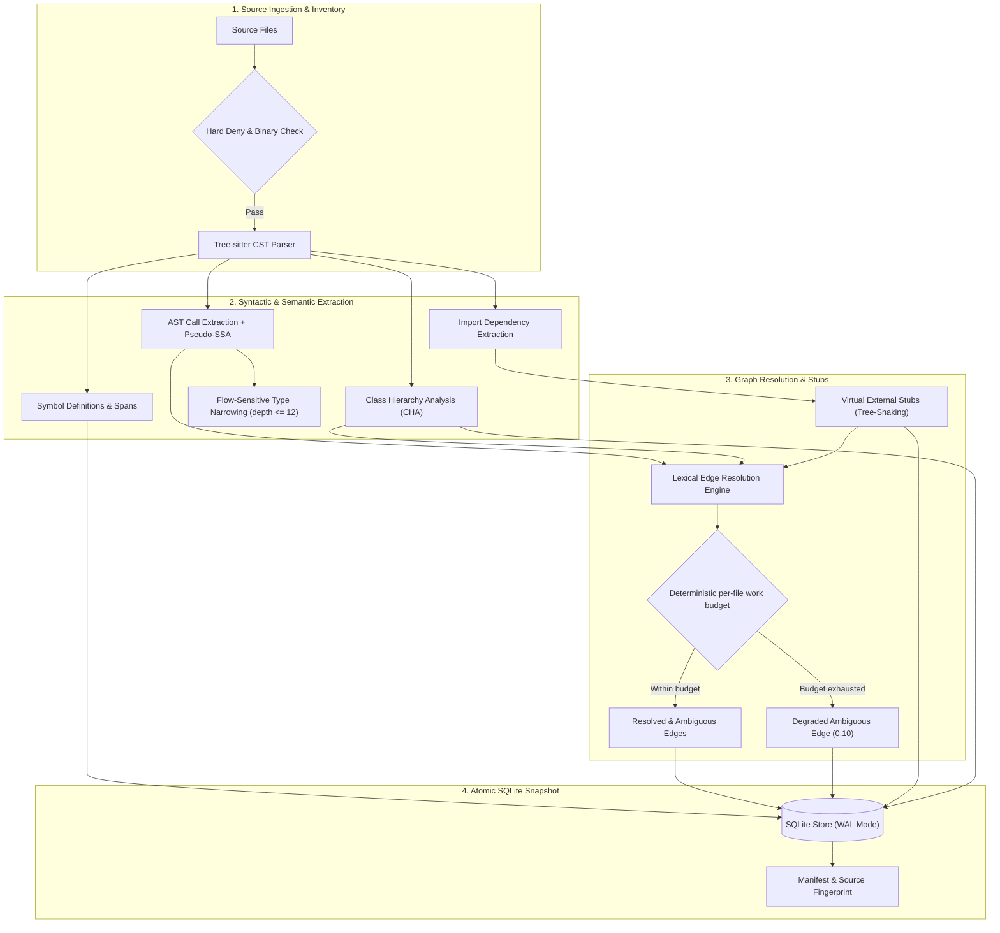
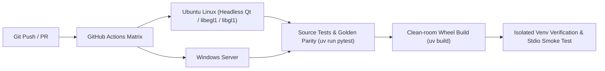

# Token Context MCP

> English edition: [`README.en.md`](README.en.md) (all sections in English).

`token-context-mcp` is a read-only local MCP server that indexes registered repositories and returns small, source-hashed code-context packets. It is designed to reduce broad repository crawling without pretending that syntax analysis is a complete semantic model.

## Có gì mới ở 0.3.x

Chi tiết: [`CHANGELOG.md`](CHANGELOG.md); số đo trong [`docs/BENCHMARK.md`](docs/BENCHMARK.md) (M12) và mục [Kết quả benchmark (0.3.x)](#kết-quả-benchmark-03x) bên dưới.

- **JavaScript** — method gán qua `X.prototype.m = …`, `X.prototype = {…}`, `Object.defineProperty(X.prototype, …)`, `this.m = …` trong constructor, `exports.m` / `module.exports = {…}` và object literal giờ là symbol; 0.3.1 thêm gán chuỗi (`res.set = res.header = function …`) và sửa lỗi hồi quy của 0.3.0 làm mất method trong object literal truyền làm đối số (`describe("x", { test() {} })`).
- **C#** — method triển khai xếp trên khai báo interface/abstract, doc comment gắn vào member thay vì container, kế thừa doc từ interface, hạ ưu tiên CSS/JS vendored.
- **Giảm cạnh gọi mơ hồ (JS/TS/C#)** — `this` ngầm, overload theo số tham số, namespace C#, kiểu biến cục bộ, field không có `this.`, cạnh khởi tạo `new X()`, binding CommonJS và ES module, kiểu property-signature của TypeScript.
- **Cạnh gọi Java và C# (0.3.2, M13)** — kiểu receiver và kiểu đối số, chọn overload theo số tham số rồi kiểu đối số, override gần nhất, các tầng kế thừa, kiểu `Outer.Inner`, `package`/import wildcard của Java, nhánh `#if` của C#, receiver thư viện ngoài, cùng token tìm kiếm tách từ con/gốc từ cho các tên nhiều từ. Bộ mới gson (Java) và Newtonsoft.Json (C#): recall call site 0,22 → 0,89 và 0,43 → 0,71, cạnh mơ hồ 28 % → 15 % và 34 % → 25 %; `R2` File Acc@5 0,80 → 0,93 và 0,73 → 0,80 (15 tác vụ mỗi bộ, khoảng tin cậy rộng, chưa có người duyệt; 2/10 và 2/7 cạnh tin cậy cao là sai). Xem [`docs/BENCHMARK.md`](docs/BENCHMARK.md) (M13).
- **Ngân sách cạnh tất định** — cầu dao 30 ms theo đồng hồ làm đồ thị gọi phụ thuộc tải máy; nay thay bằng ngân sách công việc tất định, và phiên bản resolver nằm trong fingerprint của index.
- **Đánh giá trung thực** — bộ tác vụ cho 4 repo *held-out* (Python `starlette`, TypeScript `zod`, JavaScript `express`, C# `serilog`) do các phiên độc lập soạn và duyệt trước khi đo; code được đóng băng (tag `m12-freeze`), mỗi bộ held-out chỉ đo một lần. Một số mục tiêu khai báo trước **không đạt**; chúng được liệt kê bên dưới, không giấu.
- **Nâng cấp:** `PARSER_ARTIFACT_VERSION` (7), `FTS_BUILDER_VERSION` (2), `RESOLVER_VERSION` (3) đã đổi, nên lần `token-context index --all` đầu tiên sau khi nâng cấp sẽ index lại toàn bộ repo. Kết quả Python giữ nguyên từng byte.

## What was new in 0.2.0

Full details: [`CHANGELOG.md`](CHANGELOG.md), report [`docs/reports/M6_M10_REPORT.vi.md`](docs/reports/M6_M10_REPORT.vi.md), client results [`docs/CLIENT_MATRIX.md`](docs/CLIENT_MATRIX.md).

- **Context packet** — `inspect_symbol(view="full")` returns `data.packet`: the target body (or its kept lines), callee/caller signatures, remaining relations, imports and sibling methods, with file hashes, inside the response budget. `minimal` and `normal` are unchanged. Short 8-character symbol refs are accepted by `get_symbol_context` and `get_impact_slice`.
- **Incremental, parallel, commit-aware index (schema 2.4)** — files are skipped by `(size, mtime_ns)`, parse results are cached per file hash, edges are re-resolved only where needed, and `get_index_status` reads manifest aggregates and reports `commit_sha` / `head_changed_since_index`. **After upgrading, re-index every repository once: `token-context index --all`.**
- **Client compatibility** — `serve --output-mode {auto,structured,text,legacy_dual}` and `serve --schema-profile {auto,default,gemini_safe}`; `get_tool_schema` returns the real schema; repository text is flagged as untrusted and scanned for prompt-injection patterns (warning only, nothing is redacted).
- **Desktop GUI that does not block** — no I/O on the UI thread, indexing in a child process with a Cancel that kills the whole tree, honest status badges, a running-servers panel instead of Start/Stop, VACUUM only for the mutable databases.
- **Go** is now parsed (`.go`, tree-sitter-go). Go call edges are name based, so Go graphs are more ambiguous than Python's.
- **Single version source** (`token_context_mcp.__version__`) and a deterministic retrieval benchmark, `evals/bench_retrieval.py`, with results on a public repository (see [Benchmark status](#benchmark-status-020)).

## What is implemented

- explicit repository registration; MCP tools receive a `repo_id`, never an arbitrary path;
- Tree-sitter parsing for Python, JavaScript, TypeScript/TSX, Java, C#/.NET, Go, HTML and CSS;
- SQLite snapshots with files, symbols, lexical edges, manifests and source hashes;
- AST call-expression query extraction with receiver recognition (`self`, `cls`, `this`, class prefixes) and import linking, cutting ambiguous lexical edges down from ~15–22% to <3% on Python (Go edges are name based and remain more ambiguous);
- token-budgeted repository maps, source-backed skeletons, symbol context and bounded impact slices;
- FTS5 search over symbol bodies and complete indexed files, returning bounded snippets with symbol IDs and line spans;
- Tree-sitter import relationships served directly, rather than inferred from the lexical call graph;
- lexical resolution that prefers same-file and same-package definitions before the global name index;
- compact repository-map encoding and four named budget profiles (`locate`, `orient`, `impact`, `read`);
- truncation and cap warnings computed from actual results, not from the request;
- zero-waste wire transport: eliminates payload duplication between text and structured_content, cutting wire tokens by ~55–60%;
- composite retrieval: `inspect_symbol` combines candidate resolution, definition context, and 1-hop impact graph in a single turn (saving 81.3% prompt replay tokens);
- server-side projection presets (`minimal`, `normal`, `full`) and root entity preservation under strict token budgets;
- Dynamic Tool Discovery (`list_available_tools`, `search_tools`, `get_tool_schema`) eliminating tool definition tax in agent context windows;
- Shared State & Long-term Memory (`memory_put`, `memory_get`, `memory_search`, `memory_lock`, `memory_unlock`, `memory_consolidate`) with zero external daemons (SQLite-first) and timed soft-mutex locks;
- Hardware-Aware LLM Sampling (`sample_summarize`) with Ollama auto-routing and deterministic heuristic fallback;
- Agent Governance & Permission Revocation Control Plane (`agent_control`): pause, resume, block, and emergency-halt agents (Claude, Antigravity, Cursor, Codex) with sub-0.05ms fast-path in-memory checks;
- Real-time Security Audit Logging (`audit_logs`) via SQLite WAL mode, capturing forensics, latency, and authorization results with zero response-time penalty;
- incremental and parallel indexing (`index --all`, `--watch`, `--workers`, `--verify-hashes`, `--full`, NDJSON progress) with per-file parse artifacts stored in the snapshot;
- context packets from `inspect_symbol(view="full")`, and per-client output modes and schema profiles for `serve`;
- Desktop Controller (PySide6) with hardware telemetry, interactive graph viewer, task queueing and a dedicated **Agents & Security** management tab; all reads run off the UI thread;
- Virtual External Stubs Engine (`external_stubs` table): import-driven tree-shaking for standard library and 3rd-party dependencies (`pydantic`, `unittest`, `requests`, `fastapi`, `pytest`, `builtins`), resolving external calls with 0.90 confidence and 0 false positives;
- Flow-Sensitive Type Narrowing: scoped type stacking up to depth 12 for `if isinstance(...)` and `match/case` blocks, untainting narrowed identifiers inside guarded scopes;
- Heuristics phòng thủ: ngân sách công việc tất định theo từng file trong bộ giải cạnh (`FILE_EDGE_WORK_BUDGET`, mọi máy cho cùng một đồ thị; cầu dao 30 ms theo đồng hồ trước đây làm đồ thị phụ thuộc tải máy nên đã bị gỡ ở 0.3.0) và phân tích taint Pseudo-SSA để tránh cạnh ảo trong code sinh tự động hoặc đa hình;
- Robust Multi-OS CI/CD Pipeline: automated GitHub Actions testing across Ubuntu Linux and Windows with isolated clean-room wheel validation, headless Qt (`PySide6`) test harness, and cross-engine golden test parity;
- Abbreviation & Terminology Guide: formal compiler and graph theory definitions detailed in [`docs/ABBREVIATIONS.md`](docs/ABBREVIATIONS.md);
- strict read-only tool surface over MCP `stdio`;
- hard deny rules for secrets/metadata, path traversal/reparse-point checks and resource limits;
- security, integration and benchmark harnesses that report evidence rather than claiming universal savings.

## Có dùng được cho ngôn ngữ của tôi không? (0.3.x, bằng chứng held-out)

Trả lời ngắn: **có, dùng tốt để định vị code trong Python, JavaScript và TypeScript; dùng được nhưng có giới hạn với C#; đồ thị gọi và context packet chỉ tốt bằng độ phân giải cạnh của từng ngôn ngữ** (tốt nhất ở Python, một phần ở các ngôn ngữ còn lại). Số liệu lấy từ bốn repo *không* được dùng để phát triển 0.3.0 (mỗi repo 30 tác vụ locate, đo một lần, code đã đóng băng; [chi tiết](#kết-quả-benchmark-03x)). `R2` là `search_source(profile="locate")`, khoảng 1,9k token mỗi câu trả lời.

| Ngôn ngữ (repo, số file) | File Acc@5, R2 | grep cắt cùng cỡ | grep không giới hạn (token đọc) | Symbol Recall@10, R2 | Nên kỳ vọng gì |
| --- | ---: | ---: | ---: | ---: | --- |
| Python (`starlette`, 88) | 0,77 | 0,47 | 0,77 (23,8k) | 0,44 (grep 0,28) | **Tốt.** 0.3.x không làm thay đổi. Câu hỏi phụ thuộc ẩn (không có tên trong truy vấn) tìm đúng file 4/10 lần. |
| JavaScript (`express`, 154) | **0,93** (trước 0,80) | 0,67 | 0,97 (15,9k) | 0,67 (grep 0,16) | **Tốt**, và là ngôn ngữ được cải thiện nhiều nhất: cạnh 11 → 191, mơ hồ 64 % → 43 %, độ phủ tham chiếu của packet 0,00 → 0,39. |
| TypeScript (`zod`, 517) | 0,73 (không đổi) | 0,43 | 0,60 (43,9k) | 0,61 (trước 0,56; grep 0,13) | **Tốt khi định vị**, cải thiện nhỏ. Đồ thị gọi vẫn yếu (56 % mơ hồ; 0 cạnh có độ tin cậy ≥ 0,6 trong mẫu gold) và packet phủ 42 % lân cận. |
| C# (`serilog`, 216) | 0,70 (trước 0,73) | 0,50 | 0,80 (29,5k) | **0,64** (trước 0,43; grep 0,09) | **Dùng được, kèm lưu ý.** Symbol và cạnh gọi cải thiện rõ (recall cạnh 5/17 → 13/17, đúng 11/11 ở độ tin cậy ≥ 0,6), nhưng độ chính xác file không tăng, và câu hỏi hành vi không có tên trong truy vấn chỉ tìm đúng file 4/10 lần. grep không giới hạn hơn 0,10 về File Acc (không có ý nghĩa thống kê, CI95 −0,30 đến +0,10) nhưng đọc nhiều gấp 16 lần token. |

Java và các thay đổi C# của 0.3.2 được benchmark riêng ở M13 (bộ mới, mỗi ngôn ngữ một repo: recall call site Java 0,22 → 0,89 trên gson, C# 0,43 → 0,71 trên Newtonsoft.Json; [chi tiết](docs/BENCHMARK.md)). Bảng trên là số đo M12 (0.3.0). Go, HTML, CSS có parse nhưng chưa được benchmark (cạnh gọi Go dựa trên tên). Ở mọi ngôn ngữ, câu trả lời "file nào?" bị chặn ở khoảng 1,9k token trong khi grep không giới hạn đọc nhiều hơn 8 đến 23 lần; không chênh lệch nào giữa `R2` và grep không giới hạn có ý nghĩa thống kê ở 30 tác vụ mỗi repo. Bộ tác vụ do các phiên Claude độc lập soạn và duyệt, chưa có người duyệt.

## Architecture & Indexing Pipeline


```mermaid
flowchart TD
    subgraph Ingestion ["1. Source Ingestion & Inventory"]
        SRC["Source Files"] --> DENY{"Hard Deny & Binary Check"}
        DENY -->|Pass| TS["Tree-sitter CST Parser"]
    end

    subgraph Extraction ["2. Syntactic & Semantic Extraction"]
        TS --> SYM["Symbol Definitions & Spans"]
        TS --> IMP["Import Dependency Extraction"]
        TS --> CHA["Class Hierarchy Analysis (CHA)"]
        TS --> CALL["AST Call Extraction + Pseudo-SSA"]
        CALL --> NARROW["Flow-Sensitive Type Narrowing (depth <= 12)"]
    end

    subgraph Resolution ["3. Graph Resolution & Stubs"]
        IMP --> STUBS["Virtual External Stubs (Tree-Shaking)"]
        CALL --> RESOLVE["Lexical Edge Resolution Engine"]
        CHA --> RESOLVE
        STUBS --> RESOLVE
        RESOLVE --> CB{"Deterministic per-file work budget"}
        CB -->|Within budget| EDGES["Resolved & Ambiguous Edges"]
        CB -->|Budget exhausted| AMBIG["Degraded Ambiguous Edge (0.10)"]
    end

    subgraph Storage ["4. Atomic SQLite Snapshot"]
        SYM --> SQLITE[("SQLite Store (WAL Mode)")]
        EDGES --> SQLITE
        AMBIG --> SQLITE
        STUBS --> SQLITE
        CHA --> SQLITE
        SQLITE --> MANIFEST["Manifest & Source Fingerprint"]
    end
```

## CI/CD & Verification Pipeline


```mermaid
flowchart LR
    COMMIT["Git Push / PR"] --> CI["GitHub Actions Matrix"]
    CI --> LINUX["Ubuntu Linux (Headless Qt / libegl1 / libgl1)"]
    CI --> WIN["Windows Server"]
    LINUX --> TEST["Source Tests & Golden Parity (uv run pytest)"]
    WIN --> TEST
    TEST --> WHEEL["Clean-room Wheel Build (uv build)"]
    WHEEL --> ISOLATED["Isolated Venv Verification & Stdio Smoke Test"]
```

## Benchmark highlights

Measured in this repository. Method and raw records: [`docs/BENCHMARK_FINDINGS.en.md`](docs/BENCHMARK_FINDINGS.en.md) and [`evals/reports/`](evals/reports).

**Mechanism level** — what each design decision is worth, on `invoice-scanner` (124 Python files, ≈220,576 tokens):

| Mechanism | Before | After |
| --- | ---: | ---: |
| Signature instead of body (`get_file_skeleton`) | 19,327 tok | **≈985 tok** |
| Compact instead of full map entries | 107 tok/symbol | **24 tok/symbol** |
| Ranking correctness (essential-symbol recall) | 0.167, 3 noise items | **0.833, 0 noise** |
| Removing the N+1 query loops (`repo_map@1024`) | 1,077 queries, 13.87 s | **3 queries, 0.164 s** |
| Naive read of all source vs `repo_map@1024` (wire) | 220,576 tok | **994 tok** |

**End-to-end, paired against a native-only agent** — the honest picture. C3 pilot, `bench-invoice`, one seed per task, `retrieved_content_estimated_tokens`:

| Prompt shape | Native only | With token-context | Result |
| --- | ---: | ---: | --- |
| Trace / evidence | 76,293 | 30,746 | **−60%** |
| Locate by name | 33,670 | 30,787 | −9% |
| Callers / impact | 39,404 | 57,404 | **+46% worse** |

Median paired total-token reduction: **−0.3%**, CI95 **−53% to +33%**, n=3. **This does not support a headline token-saving claim**, and none is made — the full 5-task × 3-seed matrix was never run (a different, partial C3 v2 run on held-out repositories is under Benchmark status (0.3.x)). What it does support is that *the shape of the question decides the outcome*: savings come from localisation, not enumeration. See [`docs/PROMPTING.en.md`](docs/PROMPTING.en.md) ([tiếng Việt](docs/PROMPTING.vi.md)) for which questions to ask.

Two figures worth reading before interpreting any of the above: `cached_input_tokens` was **89–92% of input** in every pilot row, and in one run retrieved content was 2,558 tokens against 120,832 cached — **2%** of the total. A `total_tokens` delta mostly measures conversation length, which is why the primary metric is retrieved content.

### Kết quả benchmark (0.3.x)

**Đã đo gì.** Bốn repo không dùng để phát triển 0.3.0 — `encode/starlette` (Python), `colinhacks/zod` (TypeScript), `expressjs/express` (JavaScript), `serilog/serilog` (C#) — mỗi repo 30 tác vụ locate và 10 tác vụ packet, do một phiên độc lập soạn và một phiên khác (không có công cụ truy xuất) duyệt; chờ người duyệt. Code được đóng băng trước (tag `m12-freeze`, guard `evals/guard.py`), sau đó chạy code cũ (baseline 0.2.0, `m12-base`) và code mới trên cùng tác vụ, đúng một lần. Không có mô hình trong vòng lặp; CI95 là bootstrap theo tác vụ. Bảng đầy đủ, dữ liệu thô và so sánh trước/sau trên bộ dev nằm ở [`docs/BENCHMARK.md`](docs/BENCHMARK.md) (M12) và `evals/out/m12/`.

Cũ → mới: File Acc@5 và Symbol Recall@10 của `R2` (≈1,9k token), độ phủ tham chiếu của packet (`R3`) và tỷ lệ cạnh mơ hồ:

| Repo | File Acc@5 | Symbol Recall@10 | Độ phủ tham chiếu packet | Cạnh mơ hồ |
| --- | ---: | ---: | ---: | ---: |
| starlette (Python) | 0,77 → 0,77 | 0,44 → 0,44 | 0,52 → 0,52 | 31 % → 31 % |
| zod (TypeScript) | 0,73 → 0,73 | 0,56 → 0,61 | 0,34 → 0,42 | 65 % → 56 % |
| express (JavaScript) | 0,80 → **0,93** (+0,13, CI95 0,00 đến +0,30) | 0,68 → 0,67 | 0,00 → **0,39** | 64 % → 43 % |
| serilog (C#) | 0,73 → 0,70 | 0,43 → **0,64** (+0,21, CI95 +0,08 đến +0,36) | 0,30 → **0,47** | 69 % → 40 % |

**Mục tiêu khai báo trước, nói thẳng.** Trong mười mục tiêu đặt ra trước khi chạy, bốn đạt và sáu không đạt:

| | Mục tiêu | Kết quả | Đạt |
| --- | --- | --- | :-: |
| K1 | Recall method gán trong JS có trong index ≥ 0,95, 0 sai trong mẫu 30 symbol | 0,933 (mọi trường hợp thiếu đều là gán chuỗi; 1,00 nếu bỏ chúng), 0 sai | không |
| K2 | File Acc@5 JS, mới − cũ ≥ 0 | +0,13 (CI95 0,00 đến +0,30) | có |
| K3 | C# `R2` − grep không giới hạn ≥ −0,05 | −0,10 (CI95 −0,30 đến +0,10) | không |
| K4 | File Acc@5 C#, mới − cũ ≥ +0,10 | −0,03 (CI95 −0,13 đến 0,00) | không |
| K5 | Tác vụ phụ thuộc ẩn C# ≥ 0,40 | 0,40 (không đổi so với code cũ) | có |
| K6 | Tỷ lệ cạnh mơ hồ mới/cũ ≤ 0,70 ở JS, TS, C# | 0,68, **0,85**, 0,58 | không (zod) |
| K7 | Độ phủ tham chiếu packet +0,10 ở JS, TS, C# | +0,28, **+0,08**, +0,17 | không (zod) |
| K8 | Độ chính xác cạnh ≥ 0,95 ở độ tin cậy ≥ 0,6 | 1,00 cả ba (2, **0** và 11 cạnh vượt ngưỡng: vô nghĩa với TypeScript) | có |
| K9 | Python giống hệt | giống hệt từng byte | có |
| K10 | Độ trễ trung vị ≤ +20 % | tối đa +27 % (≤ 3,3 ms tuyệt đối) ở 2/12 truy vấn cố định | không |

Ý nghĩa: M12 giúp rõ rệt **JavaScript** và **symbol cùng cạnh gọi của C#**, **không** tăng độ chính xác file của C#, giúp TypeScript chút ít và không đụng tới Python. Một lỗi hồi quy của 0.3.0 phát hiện sau đó — method trong object literal truyền làm đối số không còn được index, nhiều khả năng là lý do mẫu gold đồ thị gọi TypeScript tụt từ 2/12 xuống 0/12 — và chỗ thiếu gán chuỗi gây ra K1 đã được sửa ở **0.3.1** (`tests/test_js_object_methods.py`); 0.3.1 chỉ được đo lại trên các repo dev vì bộ held-out chỉ đo một lần, nên bảng trên mô tả 0.3.0.

**End-to-end (C3 v2, Claude Sonnet 5.5, reasoning medium, 20 tác vụ held-out × 3 arm).** *Dở dang, chưa kiểm định:* mới chạy seed 1 trong 2 seed (60/120 lượt); phần còn lại bị dừng vì chi phí. Cả ba arm đều giải đúng 20/20 tác vụ (hiệu ứng trần: tỷ lệ thành công không phân biệt được các arm). Arm MCP-first (B2) dùng **ít hơn 20 % tổng token** so với agent chỉ dùng công cụ gốc (khoảng 65k so với 82k mỗi lượt, CI95 theo cặp −25,1k đến −8,6k) và nhanh hơn khoảng 13 % do ít lượt hơn; nhưng nó truy xuất *nhiều* nội dung hơn (1.387 so với 753 token ước tính) và chi phí nhà cung cấp tính ra như nhau (US$1,08 cho mỗi 20 lượt), vì phần tiết kiệm chủ yếu là đọc cache rẻ hơn. Ở arm hybrid (B1) agent không gọi MCP lần nào (0/20), nên B1 chỉ cho thấy nhiễu giữa các lần chạy. Kết quả này không nói gì về tác vụ khó hơn hay mô hình yếu hơn, và các repo đều nổi tiếng với mô hình. Chi tiết và lưu ý: [`docs/BENCHMARK.md`](docs/BENCHMARK.md) (M12, mục C3).

Giới hạn: mỗi ngôn ngữ một repo và 30 tác vụ (khoảng tin cậy rộng), baseline grep là mô phỏng, bộ tác vụ do phiên độc lập chứ không phải người duyệt, đo chất lượng truy xuất chứ không phải năng suất của agent, C3 chỉ có một agent và một mô hình, và các repo công khai nổi tiếng mà mô hình có thể đã nhớ một phần.

### Hướng xử lý trong tương lai (nhẹ)

Chưa làm gì trong số này; đây là nơi các số đo chỉ tới.

- **Xếp hạng:** tìm nguyên nhân Symbol Recall@10 của fastify giảm (symbol method gán mới chen vào top 10) và cân nhắc thân hàm cho truy vấn hành vi trong C#, nơi độ chính xác file chưa nhúc nhích.
- **Đồ thị gọi:** suy luận kiểu receiver cho JavaScript và TypeScript (43 đến 56 % cạnh vẫn mơ hồ, đó là trần của packet), và đo lại mẫu edge-gold TypeScript sau bản sửa 0.3.1.
- **Mức độ agent dùng công cụ:** chế độ hybrid không khiến agent gọi MCP lần nào; nên thử cách viết prompt hoặc mô tả công cụ để agent dùng `search_source` trước, cùng tác vụ khó hơn, repo ít nổi tiếng hơn, nhiều seed hơn, mô hình yếu hơn và adapter Gemini, Codex (đã viết, chưa chạy).
- **Vệ sinh đánh giá:** bộ held-out mới có người duyệt cho vòng sau, độ trễ với truy vấn cố định trong `bench_latency.py`, và vá kẽ hở baseline-trên-`PYTHONPATH` của guard Luật 17.

### Benchmark status (0.2.0)

The figures above come from the earlier pilot and the X1 measurements. Version 0.2.0 adds a deterministic retrieval benchmark (`evals/bench_retrieval.py`, protocol and full tables in [`docs/BENCHMARK.md`](docs/BENCHMARK.md)). It ran on the public `Textualize/rich` v15.0.0 (30 locate tasks and 10 packet tasks, task set reviewed by the repository owner, no model in the loop, CI95 by bootstrap):

| Locate, 30 tasks | File Acc@5 | Symbol Recall@10 | Mean tokens |
| --- | ---: | ---: | ---: |
| grep simulation, unbounded | 0.93 | 0.22 | 17,553 |
| grep simulation, cut to the same size as R2 | 0.57 | 0.10 | 1,878 |
| `search_source` (FTS) | 0.97 | 0.52 | 1,897 |
| `search_source(profile="locate")` (with graph expansion) | 0.90 | 0.54 | 1,886 |

At equal cost token-context finds the right file far more often than grep (0.90 against 0.57, paired difference +0.33, CI95 +0.13 to +0.53) and names the right symbol. Unbounded grep reads about 9 times more tokens for a File Acc@5 only about 3 points higher (the difference is not significant, CI95 −0.17 to +0.07), and it wins on the multi-file group (1.00 against 0.80). The graph expansion did not beat plain FTS on this set (0.90 against 0.97). For `inspect_symbol(view="full")` packets, 98% of the gold neighbour signatures and references were covered with 91% fewer tokens than reading the files (`savings_vs_read` 0.915, CI95 0.89 to 0.93).

On a second, TypeScript repository (`honojs/hono` v4.9.9; task set reviewed by another Claude session, not yet by the owner) the locate result holds: at equal cost `search_source(profile="locate")` finds the right file in 80% of tasks against 23% for grep cut to the same size (63% for unbounded grep, which reads about 11 times more tokens). **The packet did not meet its targets there** (signature and reference coverage 0.58 against targets of 0.60 and 0.80, saving against reading 0.57 against 0.70) because call edges in TypeScript are far more ambiguous, so the packet can only return what the graph reaches. Details in [`docs/BENCHMARK.md`](docs/BENCHMARK.md).

Two more repositories, JavaScript (`fastify`) and C# (`CsvHelper`), give a four-language picture (task sets reviewed by another Claude session, not by the owner). File Acc@5 at equal cost: `rich` (Python) 0.90 vs 0.57, hono (TypeScript) 0.80 vs 0.23, fastify (JavaScript) 0.90 vs 0.27, CsvHelper (C#) 0.60 vs 0.43; against unbounded grep the tool is roughly level in Python (0.90 vs 0.93), ahead in TypeScript (0.80 vs 0.63) and JavaScript (0.90 vs 0.57), and **behind in C#** (0.60 vs 0.77, significantly), where behavioural queries mostly fail (declarations, attributes and interfaces outrank implementations). The packet meets its targets only in Python (coverage 0.98, saving 0.91); in TypeScript, JavaScript (0.46) and C# (0.47) it misses, tracking the share of ambiguous call edges (17 %, 45 %, 72 %, 90 %). At the time, the JavaScript indexer did not index prototype-assigned methods (fixed in 0.3.0). Details and cross-language table in [`docs/BENCHMARK.md`](docs/BENCHMARK.md).

Limits: one repository per language, wide intervals, a simulated grep baseline, and retrieval quality only, not agent task success. At the time the end-to-end C3 matrix had not been run; a partial C3 run (seed 1 only, Claude Sonnet 5.5) is reported under Benchmark status (0.3.x) above and is not validated. Measured M7/M8 results, including the targets that were missed, are in the [changelog](CHANGELOG.md) and the [M6–M10 report](docs/reports/M6_M10_REPORT.vi.md).

## Non-goals and security boundary

This server does not edit files, execute shell commands, listen on HTTP, call network APIs, or accept arbitrary repository paths. `stdio` is not an OS sandbox: deploy with a no-egress/least-privilege policy if an enforced network boundary is required. Tool results may still be placed in the MCP host's LLM context.

## Prerequisites and installation

Everything below is needed only for the part you use. The MCP server alone needs Python and `uv`; the GUI, the `.exe` build, the file watcher and the local 7B summariser are optional add-ons.

| Component | Needed for | How to get it |
| --- | --- | --- |
| Git | cloning the repository | <https://git-scm.com/downloads> |
| Python 3.12 or newer | everything | <https://www.python.org/downloads/> or, once `uv` is installed, `uv python install 3.12` |
| `uv` | environment and dependency management | Windows: `powershell -ExecutionPolicy ByPass -c "irm https://astral.sh/uv/install.ps1 \| iex"`; Linux/macOS: `curl -LsSf https://astral.sh/uv/install.sh \| sh` |
| Python libraries | see below | `uv sync --all-extras` |
| Ollama + a coder model (optional) | `sample_summarize` with a local 7B model | see [Local model](#local-model-optional) |

### Python libraries

`uv sync` installs the exact versions in `uv.lock` into `.venv/`. The libraries are grouped:

| Group | Contents | Install |
| --- | --- | --- |
| core (always) | `mcp`, `mcp-types`, `pydantic`, `pathspec`, `tree-sitter` and the grammars for Python, JavaScript, TypeScript/TSX, Java, C#, HTML, CSS and Go | `uv sync` |
| `dev` | `pytest`, `pytest-cov`, `jsonschema`, `psutil` | `uv sync --extra dev` |
| `gui` | `PySide6`, `psutil`, `pyinstaller` (desktop GUI and the `.exe` build) | `uv sync --extra gui` |
| `watch` | `watchdog` (event-based `index --watch`; without it the watcher polls) | `uv sync --extra watch` |

**Recommended for a full development machine:**

```powershell
uv sync --all-extras
```

> `uv sync` is exact: it *removes* packages that are not in the extras you list. Running only `uv sync --extra dev` therefore leaves PySide6 out (or uninstalls it if it was there), and `uv run token-context-gui` then fails with `No module named 'PySide6'`. Always pass every extra you need in the same command (or use `--all-extras`).

Run project tools through `uv run` (`uv run token-context-gui`, `uv run python scripts/build_desktop_exe.py`), not with a bare `python`, so that they use `.venv` and not the system Python.

### Local model (optional)

`sample_summarize` can compress text with a local model served by [Ollama](https://ollama.com/download). Without Ollama, or on a machine with too little memory, it falls back to a deterministic heuristic on the CPU; no other feature depends on a model, and no embedding model is used.

1. Install Ollama from <https://ollama.com/download> and make sure it is running (`ollama serve`; the desktop app starts it for you). The server probes `http://localhost:11434`.
2. Download the model, either with the helper script or by hand:

   ```powershell
   .\scripts\download_models.ps1              # qwen2.5-coder:7b-instruct-q4_K_M (recommended)
   .\scripts\download_models.ps1 -Lightweight # qwen2.5-coder:1.5b, for small machines
   # or directly:
   ollama pull qwen2.5-coder:7b-instruct-q4_K_M
   ollama pull qwen2.5-coder:1.5b
   ```

   On Linux/macOS: `./scripts/download_models.sh` (`--lightweight` for the 1.5B model).
3. Check it: `ollama list` should show the model, and `uv run python -c "from token_context_mcp.sampling.router import SamplingRouter; print(SamplingRouter().summarize('def f(x): return x+1', intent='describe'))"` reports the `backend` used (`ollama_gpu`, `ollama_cpu` or `heuristic_fallback`).

The Ollama backend is chosen only when Ollama is reachable and the host has a CUDA GPU with at least 6 GB of VRAM (`ollama_gpu`) or at least 6 GB of RAM (`ollama_cpu`); otherwise the heuristic fallback is used.

## Quick start

```powershell
uv sync --all-extras          # see Prerequisites; plain `uv sync` is enough for the server alone
uv run token-context register --repo-id demo --root D:\AI\some-repo
uv run token-context index --repo-id demo      # or: index --all
uv run token-context status --repo-id demo
uv run token-context serve
```

Useful `index` options: `--all` (every registered repository, JSON summary), `--watch` (re-index after the tree has been quiet; uses `watchdog` if installed, otherwise polls), `--workers N`, `--verify-hashes` (hash every file, ignore the mtime shortcut), `--full` (ignore the previous snapshot) and `--progress-format ndjson` (one JSON object per line on stdout).

### Desktop GUI Controller (PySide6)

In addition to the CLI, `token-context-mcp` includes a modern desktop graphical user interface with hardware telemetry, visual repository management, live indexing progress, log streaming, and cache controls:

Requires the `gui` extra (`uv sync --all-extras`); without it the command stops with an install hint.

```powershell
# Launch Desktop GUI
uv run token-context-gui

# Or using 1-click launcher scripts:
.\scripts\launch_desktop_gui.bat    # Windows Batch
.\scripts\launch_desktop_gui.ps1    # PowerShell

# Build a standalone portable .exe (needs PyInstaller from the gui extra):
uv run python scripts/build_desktop_exe.py --clean   # -> dist\desktop\TokenContextDesktop\TokenContextDesktop.exe
```

Key GUI Capabilities:
- **📊 Dashboard & Telemetry:** Real-time CPU & RAM gauges, AI hardware detection (NVIDIA CUDA, Apple Silicon MPS, Ollama 7B, CPU Heuristic), a table of running MCP servers (clients start and stop them; the GUI does not), and 1-click "Copy client config" for Claude, Claude Code, VS Code, Codex and Antigravity with the recommended `serve` flags.
- **📁 Repository Management:** Table with repository roots, snapshot badges (`FRESH`, `STALE`, `DOCS_CHANGED`, `SCHEMA_OUTDATED`, `NOT_INDEXED`), symbol counts, ambiguous edge rates, "Add Repository" folder picker, per-repository and "Re-index all" actions. Indexing runs in a child process and Cancel stops the whole process tree.
- **⚡ Tasks & Graph Visualizer:** Live stdout/stderr log stream, language distribution breakdown, lexical edge confidence progress, and top architectural entry-point symbols.
- **💾 Cache & Storage Controller:** SQLite file breakdown, database size inspection, VACUUM of `memory.sqlite`, `governance.sqlite` and `audit.sqlite` only (never index snapshots), stale snapshot cleaner, and cache purge.
- **⚙️ Server Settings:** Interactive editor for `repos.toml` resource caps and the 20 tools extension toggle.

By default the registry is global for the current user at `%APPDATA%\token-context-mcp\repos.toml` on Windows and `~/.config/token-context-mcp/repos.toml` on Linux and macOS; it is independent of the current working directory. Set `TOKEN_CONTEXT_CONFIG` to use an explicit shared/portable TOML path — on a multi-user host, read [Keeping the registry and snapshots private](#keeping-the-registry-and-snapshots-private) before pointing several accounts at one file. For Codex, launch the package through a configured `stdio` MCP command. Use only the read-only tools listed by the server.

## Register repositories safely

Registration is an explicit local allowlist decision, not an upload, Git operation, or source-code change. `--repo-id` is a stable identifier used in MCP requests; `--root` is the only canonical repository directory that the server is allowed to read.

```powershell
Set-Location D:\AI\token-context-mcp
uv run token-context register --repo-id video-lecturer --root D:\AI\video_lecturer
uv run token-context index --repo-id video-lecturer
uv run token-context status --repo-id video-lecturer
```

Use a specific project root, never a broad parent such as `D:\AI`. Re-run `index` after relevant changes; it reuses unchanged parsing results. Existing registrations and index databases are shared by every MCP process launched under the same account, on that machine only.

To use a different registry location for one terminal or a portable deployment, set it before registering, indexing, and starting the MCP server:

```powershell
$env:TOKEN_CONTEXT_CONFIG = 'D:\trusted-shared-config\repos.toml'
uv run token-context register --repo-id myrepo --root D:\projects\myrepo
uv run token-context index --repo-id myrepo
```

## Use from coding agents

This is a local MCP `stdio` server. It works with a client that can start local processes and has `uv` available on its `PATH`. Each client process launched under the same account on the same machine automatically reads the same global repository registry. Restart the client after changing the registry or its policy.

| Client | Local `stdio` support | Setup status |
| --- | --- | --- |
| Codex CLI / IDE | Yes | Installed and end-to-end tested on this machine. |
| Claude Code | Yes | Supported; add it at user or project scope. |
| GitHub Copilot CLI | Yes | Supported through the CLI user configuration or project config. |
| GitHub Copilot Chat in VS Code | Yes | Supported through `.vscode/mcp.json` or the MCP UI. |
| Google Antigravity IDE / CLI | Yes | Supported through global or workspace `mcp_config.json`. |
| Claude Desktop | Conditional | It supports local MCP through Desktop Extensions, but this project does not yet publish a `.dxt` package. |

Recommended `serve` flags per client and the real check results (only one client is recorded so far) are in [`docs/CLIENT_MATRIX.md`](docs/CLIENT_MATRIX.md). A client that reads only the text content should use `--output-mode text`; Gemini-family clients and Antigravity should use `--schema-profile gemini_safe`. Restart the client session after changing flags.

### Configuring Output Mode (`output_mode`)

MCP tool payloads can be delivered in two primary formats:

| Mode | Format | When to use |
| --- | --- | --- |
| `text` | Formatted JSON inside `TextContent` | **Recommended for Google Gemini & Antigravity IDE**, or any MCP client environment that summarizes or collapses array fields into scalar counts (e.g. `symbols=38 items`). Ensures the model receives the complete payload and exact source lines. |
| `structured` | Structured JSON inside `structuredContent` | **Recommended for Claude Code, Codex, and Cursor**, which natively parse JSON tool results. |
| `auto` | Dynamic based on client name | Picks `structured` for known structured-compatible clients (e.g. `claude-code`), and defaults to `text` for others. |
| `legacy_dual` | Dual `TextContent` + `structuredContent` | Backward compatibility with older clients requiring both representations. |

**How to configure:**

1. **Via Desktop GUI:** Open `token-context-gui`, navigate to the **Settings** tab, select your preferred **Output Mode** from the dropdown, and click **Save Server Settings**.
2. **Via `repos.toml`:** Set `output_mode` under `[server]`:
   ```toml
   [server]
   output_mode = "text"   # or "structured", "auto", "legacy_dual"
   ```
3. **Via MCP Client Command-Line Argument:** Add `--output-mode text` to the MCP `serve` command in your client configuration (e.g., Antigravity `mcp_config.json`):
   ```json
   {
     "mcpServers": {
       "token-context": {
         "command": "uv",
         "args": [
           "run",
           "--directory", "D:\\AI\\token-context-mcp",
           "token-context",
           "serve",
           "--output-mode", "text",
           "--schema-profile", "gemini_safe"
         ]
       }
     }
   }
   ```

For an editor connected to another host over SSH, see [Linux, macOS and VS Code Remote-SSH](#linux-macos-and-vs-code-remote-ssh): the configuration has to live on the host that holds the source.

Cloud/web agents cannot start this server on a local machine. They need a separately deployed, authenticated HTTP MCP service; this project intentionally ships only local `stdio` transport.

### Which prompts save tokens

Configuring the server is half the job; asking the right *shape* of question is the other half.
Measured on this repository's own C3 pilot, the same tool ranged from **−60%** retrieved
content on a trace task to **+46% worse** on a caller/impact task. Savings come from
**localisation**, not enumeration.

| Prompt shape | Measured | Use the tool? |
| --- | --- | --- |
| Public surface of a named file | 19,327 → ≈985 tokens | Yes — best case |
| Trace / evidence across a large tree | −60% | Yes |
| Locate a named symbol | −9% | Yes, modest |
| Body-text search | ≈3,900 tokens for 41 files | Comparable to `rg`; better return shape |
| Callers / impact | **+46% worse** | Only with the native fallback explicitly closed |
| Enumerate everything | `rg --files` = 18,228 tokens, complete | No — `repo_map@4096` returns ~6.6% of symbols |
| Behavioural query, no name | 90% of matching symbols invisible to `find_symbols` | Use `search_source`, not `find_symbols` |

Full guidance, copy-paste templates, and the prompt-hygiene rules that once invalidated an
entire benchmark run: [`docs/PROMPTING.en.md`](docs/PROMPTING.en.md) ([tiếng Việt](docs/PROMPTING.vi.md)).

### Codex

There are two ways to connect Codex to `token-context-mcp`:

#### Method A: Via Codex CLI
```powershell
codex mcp add token-context -- uv run --directory D:\AI\token-context-mcp token-context serve --transport stdio
codex mcp get token-context
```

#### Method B: Direct Config File (`~/.codex/config.toml`)
If the `codex` command is not available in your PowerShell PATH, directly add the server to `%USERPROFILE%\.codex\config.toml`:

```toml
[mcp_servers.token-context]
command = "uv"
args = ["run", "--no-sync", "--directory", "D:\\AI\\token-context-mcp", "python", "-m", "token_context_mcp.cli", "serve", "--transport", "stdio"]
```

> **Tip for GUI:** If Codex cannot find `uv`, replace `"uv"` with the absolute path: `"C:\\Users\\<YourUser>\\AppData\\Roaming\\Python\\Python312\\Scripts\\uv.exe"`.

---

### Claude (Claude Code & Claude Desktop)

#### 1. Claude Code (CLI)
```powershell
claude mcp add --transport stdio --scope user token-context -- uv run --no-sync --directory D:\AI\token-context-mcp python -m token_context_mcp.cli serve --transport stdio
claude mcp get token-context
```

#### 2. Claude Desktop (Windows App)
Open or create `%APPDATA%\Claude\claude_desktop_config.json` (e.g. `C:\Users\<YourUser>\AppData\Roaming\Claude\claude_desktop_config.json`) and add:

```json
{
  "mcpServers": {
    "token-context": {
      "command": "uv",
      "args": [
        "run",
        "--no-sync",
        "--directory",
        "D:\\AI\\token-context-mcp",
        "python",
        "-m",
        "token_context_mcp.cli",
        "serve",
        "--transport",
        "stdio"
      ]
    }
  }
}
```

---

### Registering and Using `task2-demo`

#### 1. Register and Index Repository
Run these commands in PowerShell (registers globally in `%APPDATA%\token-context-mcp\repos.toml`):

```powershell
# Register repository
uv run --directory D:\AI\token-context-mcp token-context register --repo-id task2-demo --root D:\AI\video_lecturer\task\task2_demo

# Build index
uv run --directory D:\AI\token-context-mcp token-context index --repo-id task2-demo

# Check status
uv run --directory D:\AI\token-context-mcp token-context status --repo-id task2-demo
```

#### 2. Example Prompt for Codex / Claude / Antigravity
After restarting Codex, Claude, or Antigravity, send this prompt in the chat:

```text
Use token-context for repo_id "task2-demo".
Start with get_repo_map at 512 tokens to inspect the project structure,
then use get_file_skeleton for "src/lecturer_demo/cli.py".
```

If a client cannot start the server, first run `uv run --directory D:\AI\token-context-mcp token-context serve --transport stdio` in PowerShell to check its Python environment. GUI clients sometimes do not inherit a terminal's `PATH`; in that case set `command` to the absolute path of `uv.exe`, then restart the client.

Official client setup references: [OpenAI Codex](https://developers.openai.com/codex/mcp), [Claude Code](https://code.claude.com/docs/en/mcp), [GitHub Copilot CLI](https://docs.github.com/en/copilot/how-tos/copilot-cli/customize-copilot/add-mcp-servers), [GitHub Copilot in IDEs](https://docs.github.com/en/copilot/how-tos/provide-context/use-mcp-in-your-ide/extend-copilot-chat-with-mcp), [Antigravity](https://antigravity.google/docs/mcp), and [Claude Desktop](https://support.anthropic.com/en/articles/10949351-getting-started-with-local-mcp-servers-on-claude-desktop).

## Linux, macOS and VS Code Remote-SSH

Full reference — supported systems, remote placement, every limit and the permission model:
[`docs/PLATFORMS.en.md`](docs/PLATFORMS.en.md) ([tiếng Việt](docs/PLATFORMS.vi.md)).

The package is cross-platform; CI runs the test suite on Ubuntu and Windows. Only the
registry path differs:

| Host | Registry | Snapshots |
| --- | --- | --- |
| Windows | `%APPDATA%\token-context-mcp\repos.toml` | `%APPDATA%\token-context-mcp\indexes\` |
| Linux | `$XDG_CONFIG_HOME/token-context-mcp/repos.toml`, else `~/.config/...` | `~/.config/token-context-mcp/indexes/` |
| macOS | `~/.config/token-context-mcp/repos.toml` | `~/.config/token-context-mcp/indexes/` |

```bash
uv sync --extra dev
uv run token-context register --repo-id demo --root ~/code/some-repo
uv run token-context index --repo-id demo
uv run token-context status --repo-id demo
uv run token-context harden
```

### Where the server has to run

The transport is `stdio` only. The client starts the server as a child process and talks
to it over stdin/stdout, and the server reads the filesystem it is started on. **Source and
server must therefore live on the same machine.** A server started on a Windows laptop
indexes that laptop, whatever the editor window is connected to.

VS Code decides that by where the configuration lives:

| Configuration | Server runs on | Works against remote source |
| --- | --- | --- |
| User profile (`MCP: Open User Configuration`) | the local machine | no |
| `.vscode/mcp.json` in a workspace on the remote | the remote host | yes |
| Remote user settings (`Remote [SSH: host]`) | the remote host | yes |

So on Remote-SSH, register and index from a **terminal on the server**, and put the
configuration in the workspace that lives on the server:

```json
{
  "servers": {
    "token-context": {
      "type": "stdio",
      "command": "/home/you/.local/bin/uv",
      "args": [
        "run", "--no-sync",
        "--directory", "/home/you/token-context-mcp",
        "token-context", "serve", "--transport", "stdio"
      ]
    }
  }
}
```

Two details that cause most of the failures:

- Use `.vscode/mcp.json` with the `"servers"` key, not a repository-root `.mcp.json`. VS Code
  before 1.135.0 converts a workspace path with `URI.fsPath` and sends a Windows-shaped path
  to the Linux host, which fails as `spawn ... ENOENT`.
- Give `command` the absolute path to `uv`. The server is not spawned through a login shell,
  so `~/.local/bin` is usually missing from `PATH`. Run `which uv` on the server and paste
  the result.

A client on the local machine can also start the server over SSH, because `ssh` forwards
stdin and stdout unchanged:

```json
{
  "servers": {
    "token-context": {
      "type": "stdio",
      "command": "ssh",
      "args": ["myserver", "/home/you/.local/bin/uv run --no-sync --directory /home/you/token-context-mcp token-context serve --transport stdio"]
    }
  }
}
```

This also covers AWS SSM, where `~/.ssh/config` carries the `ProxyCommand`; the MCP side sees
plain SSH either way. The cost is a session per start, and any server banner or MOTD printed
on stdout corrupts the JSON-RPC stream.

Registry and snapshots are per machine and per account. Registering on the laptop does
nothing for the server, and vice versa.

## Keeping the registry and snapshots private

A snapshot stores verbatim source bodies so that `search_source` and `get_symbol_context` can
return them. It must therefore never be easier to read than the repository it came from — an
index under a default umask hands your source to every account on the host, whatever the
repository's own permissions say.

Registry, snapshots and manifests are created owner-only (`0700` directories, `0600` files) on
POSIX rather than inheriting the umask. `harden` re-applies that to files created earlier and
reports what it found:

```bash
uv run token-context harden --check   # report only
uv run token-context harden           # repair
```

```powershell
uv run token-context harden --check
```

Windows has no POSIX mode bits, so the same command inspects the ACL instead and lists any
principal beyond the owner, `SYSTEM` and `Administrators`. Without `--check` it resets
inheritance and re-grants those three. That is worth checking on a machine where tooling has
added a group to the profile ACL — a sandbox users group there can read every snapshot.

Root, and on Windows `SYSTEM` and local administrators, can read the files regardless; that
is a property of the operating system, not something the tool can withhold. On a host you do
not control at that level, do not index a repository you would not disclose.

## Token and resource limits

The global registry has an enforceable `[server]` policy. Edit the TOML and restart Codex to apply a change:

```toml
[server]
max_request_bytes = 65536
max_result_tokens = 4096
max_graph_nodes = 200
max_symbol_results = 30
network_policy = "declared-deny-not-enforced"
output_mode = "structured"   # structured | text | legacy_dual | auto
default_view = "normal"
enable_extensions = true
```

- `enable_extensions`: enables discovery tools (`list_available_tools`, `search_tools`, `get_tool_schema`), shared state & memory tools (`memory_put`, `memory_get`, `memory_search`, `memory_lock`, `memory_unlock`, `memory_consolidate`), and hardware-aware sampling (`sample_summarize`). Set `true` in `repos.toml` to activate these capabilities. Default: `false`.
- `output_mode`: controls serialization over MCP wire transport: `"structured"` (default, concise metadata summary in text + full payload in `structured_content`), `"text"` (compact JSON for text-only clients), `"legacy_dual"`, or `"auto"` (`structured` only for clients known to read it, otherwise `text`). `serve --output-mode` overrides the config value; `serve --schema-profile {auto,default,gemini_safe}` adjusts advertised tool schemas for strict clients.
- `default_view`: preset projection view for responses (`"minimal"` for IDs/paths only, `"normal"` for standard context, `"full"` for complete evidence).
- `max_result_tokens` caps output from maps, skeletons, symbol context, impact slices, and uncapped search/status responses. This is the main control for model-context consumption.
- `max_graph_nodes` caps impact-slice traversal.
- `get_module_dependents` reports Tree-sitter-extracted lexical import relationships; its `basis` is
  `lexical_import_statements`. It does not resolve imports semantically, and dynamic imports are flagged rather than resolved.
- `search_source` searches indexed symbol bodies and returns bounded snippets
  with source-backed symbol IDs and line evidence.
- `list_repositories` also advertises four named budget profiles: `locate`,
  `orient`, `impact`, and `read`. Pass `profile` to a retrieval tool to use
  one; explicit per-tool arguments override the profile. The response budget
  includes the reserved MCP envelope allowance.

Example profile-based calls:

```text
list_repositories()
get_repo_map(repo_id="myrepo", profile="orient")
find_symbols(repo_id="myrepo", pattern="Invoice", profile="locate")
get_impact_slice(repo_id="myrepo", symbol_id="...", profile="impact")
```

Lower values reduce tokens but cause more truncation and follow-up calls. The server limits only the context it returns; it cannot impose a hard provider billing limit for an entire Codex/model session.

## Deterministic context-cost checks

The repository includes a provider-free C1/C2 measurement script. It compares a
naive read of all source files with the serialized payloads returned by the
retrieval tools; all figures are local `utf8 bytes / 4` estimates, not billing
claims.

```powershell
uv run python evals/measure_context_cost.py `
  --repo-id token-context `
  --config $env:APPDATA\token-context-mcp\repos.toml `
  --output evals/reports/c1-token-context.json
```

The post-remediation measurements checked into this repository are:

| Repository | Naive source read | `repo_map` @1024 (wire) | Saving | Worst accounting gap | Calls over server cap |
| --- | ---: | ---: | ---: | ---: | ---: |
| `token-context` | 60,760 tok | 994 tok | 61.1x | 1.19x | 0 |
| `invoice-scanner` | 220,576 tok | 994 tok | 221.9x | 1.20x | 0 |

See [`evals/measure_context_cost.py`](evals/measure_context_cost.py),
[`evals/reports/c1-token-context-x1.json`](evals/reports/c1-token-context-x1.json)
and [`evals/reports/c1-invoice-scanner-x1.json`](evals/reports/c1-invoice-scanner-x1.json)
for the method and complete call table. These X1 measurements use the MCP
wire envelope and show zero calls over the configured 4,096-token cap. The
remaining gap between the service estimate and wire size is fixed framing;
the 96-token reserve keeps the emitted response within the requested cap.
The C3 protocol is recorded in [`evals/c3_protocol.md`](evals/c3_protocol.md);
the full provider-run matrix remains a separate runtime step.

## Updating existing installations / Hướng dẫn cập nhật phiên bản mới

When updating `token-context-mcp` on a machine or remote VM where it has already been set up (Codex, Claude Code, Claude Desktop, Antigravity, VS Code Remote-SSH), follow these manual steps:

### Windows (PowerShell)

```powershell
# 1. Di chuyển vào thư mục repo token-context-mcp
Set-Location D:\AI\token-context-mcp   # Thay bằng đường dẫn local thực tế

# 2. Kéo code mới nhất từ remote Git
git fetch origin
git pull origin main

# 3. Đồng bộ lại môi trường ảo / dependencies với uv
uv sync --all-extras

# 4. (Tùy chọn) Chạy kiểm thử để xác nhận cập nhật thành công
uv run pytest

# 5. Khởi động lại MCP client (Codex CLI/IDE, Claude Code/Desktop, Antigravity)
# Không cần sửa lại file config của client; client sẽ tự động gọi code mới.
```

### Linux & macOS (Bash)

```bash
# 1. Di chuyển vào thư mục repo token-context-mcp
cd /path/to/token-context-mcp

# 2. Kéo code mới nhất từ remote Git
git fetch origin
git pull origin main

# 3. Đồng bộ lại môi trường ảo / dependencies với uv
uv sync --all-extras

# 4. (Tùy chọn) Chạy kiểm thử
uv run pytest

# 5. Khởi động lại MCP client
```

> **Nâng cấp lên 0.3.x:** `PARSER_ARTIFACT_VERSION` (8), `FTS_BUILDER_VERSION` (3) và `RESOLVER_VERSION` (4) đã đổi, nên lần `uv run token-context index --all` đầu tiên sau khi nâng cấp sẽ parse và index lại toàn bộ file của mọi repo (chạy một lần; không cần `register` lại). Nếu bỏ qua, index cũ vẫn đọc được nhưng giữ nguyên symbol và đồ thị gọi cũ của JS/TS/C#.
>
> **Nâng cấp lên 0.2.0:** schema index đổi sang 2.4 và parser artifact version đổi (thêm Go), nên lần index đầu tiên sau khi nâng cấp sẽ parse lại toàn bộ file. Chạy `uv run token-context index --all` một lần; snapshot cũ vẫn đọc được nhưng `get_index_status` sẽ cảnh báo cần index lại.
>
> **Lưu ý về danh sách repo và index:**
> - Toàn bộ cấu hình repo đã đăng ký (`repos.toml`) và cơ sở dữ liệu index (`indexes/`) được giữ nguyên hoàn toàn, không cần đăng ký lại (`register`).
> - Nếu mã nguồn của repository mục tiêu có thay đổi, chỉ cần chạy lại lệnh index để cập nhật snapshot:
>   `uv run token-context index --repo-id <repo-id>`

---

## Acknowledgments & Architecture Lineage (Ghi nhận nguồn cảm hứng & Đóng góp kiến trúc)

Dự án `token-context-mcp` trân trọng ghi nhận các nguyên lý kiến trúc và kỹ thuật prompt nâng cao được học hỏi, kế thừa và phát triển dựa trên kho mã nguồn mở [**Google Cloud Platform Generative AI Repository** (`GoogleCloudPlatform/generative-ai`)](https://github.com/GoogleCloudPlatform/generative-ai):

1. **Kiến trúc Bộ nhớ không dùng Vector DB (Vectorless Structured Memory) & Memory Consolidation:**
   - **Nguồn cảm hứng:** Dự án [`gemini/agents/always-on-memory-agent`](https://github.com/GoogleCloudPlatform/generative-ai/tree/main/gemini/agents/always-on-memory-agent).
   - **Ứng dụng vào `token-context-mcp`:** Triết lý nói không với Vector DB cồng kềnh cho bộ nhớ Agent, chuyển sang dùng SQLite-first có cấu trúc với giao thức đồng bộ WAL. Đặc biệt, công cụ `memory_consolidate` được xây dựng dựa trên nguyên lý hoạt động của `ConsolidateAgent` của Google để hợp nhất các mảnh ký ức vụn vặt thành insight cấp cao và giải quyết triệt để lỗi phình to liên kết trùng lặp (tránh lỗi Issue #2945 của Google).

2. **Kỹ thuật Delimited Context Envelopes & Quote-before-Synthesize Fact Grounding:**
   - **Nguồn cảm hứng:** Thư viện [`gemini/prompts/`](https://github.com/GoogleCloudPlatform/generative-ai/tree/main/gemini/prompts/) và các ví dụ Text Extraction / Safety Guardrails của Google Cloud.
   - **Ứng dụng vào `token-context-mcp`:** Bọc source code trong các thẻ an toàn `<<<SOURCE_CODE_START>>>` và `<<<SOURCE_CODE_END>>>` kèm chỉ thị cách ly dữ liệu không tin cậy (chống Prompt Injection từ comment trong code). Đồng thời áp dụng nguyên tắc bắt buộc mô hình 7B trích xuất nguyên văn câu lệnh (`verbatim_quote`) trước khi kết luận ràng buộc `critical_constraints`.

3. **Giao thức Thẻ Công cụ & Khuyến nghị Tool Chaining (A2A Tool Chaining Cards):**
   - **Nguồn cảm hứng:** Giao thức Agent-to-Agent (A2A) và Agent Engine Toolbox trong [`agents/agent_engine/`](https://github.com/GoogleCloudPlatform/generative-ai/tree/main/agents/agent_engine/).
   - **Ứng dụng vào `token-context-mcp`:** Bổ sung metadata `recommended_followups` (công cụ kế tiếp nên gọi) và `prerequisites` (công cụ tiên quyết) vào `TOOL_CATALOG` và các công cụ `search_tools`, `get_tool_schema`, giúp các Agent tự động hóa chuỗi hành động mà không cần suy đoán.

---

## Commands

- `register`: add a canonical, non-link repository root to a local TOML registry.
- `unregister`: remove a repository registration.
- `update`: change a repository root; requires `--force`.
- `index`: build an atomic SQLite snapshot and JSON manifest incrementally; `--all`, `--watch`, `--workers`, `--verify-hashes`, `--full`, `--progress-format ndjson`.
- `status`: inspect the stored snapshot and detect files changed after indexing.
- `harden`: restrict the registry and snapshots to the owning account; `--check` reports without changing.
- `serve`: start the MCP `stdio` server; `--output-mode`, `--schema-profile`.
- `benchmark-report`: calculate summary statistics from an instrumented JSONL run log.
- `release-materials`: produce an SBOM/provenance starter artifact; signing and OS sandbox evidence remain deployment responsibilities.

## Tool contract

The server exposes **20 tools** when `enable_extensions = true` (22 with `enable_admin_tools`; 10 core tools when extensions are disabled). `list_repositories` is the primary entry point for code retrieval: it returns the registered `repo_id` values and the budget profiles, and never exposes a repository root.

### 1. Core Code-Context Retrieval Tools (10 tools)

| Tool | Returns / Summary | `profile` | Purpose |
| --- | --- | --- | --- |
| `list_repositories` | registered `repo_id` values and four budget profiles | — | Entry point for repository queries; roots are never exposed. |
| `get_index_status` | snapshot metadata, freshness, `commit_sha`, edge precision, ambiguous rate | — | Check index health, freshness, and AST edge resolution stats. |
| `get_repo_map` | ranked definitions within a token budget, compact by default | `orient` | High-level architectural map of symbols and entry points. |
| `find_symbols` | symbols matching a name or qualified-name fragment, with spans | `locate` | Exact or pattern-based symbol location across the codebase. |
| `search_source` | FTS5 matches in symbol bodies and indexed files, with snippets | `locate` | Full-text code search across indexed symbols and source files. |
| `get_file_skeleton` | imports and source-backed headers for one file; bodies elided | `read` | File surface with ~95% token reduction vs full file read. |
| `get_symbol_context` | bounded packet around one symbol plus observed edges | `read` | Full symbol body, docstrings, and callers/callees. |
| `get_impact_slice` | caller/callee traversal from a symbol with confidence filtering | `impact` | Blast-radius candidate traversal (filtered by confidence >= 0.5). |
| `get_module_dependents` | Tree-sitter import relationships for a path or module | `impact` | Direct import dependency graph analysis. |
| `inspect_symbol` | composite: symbol resolution + definition context + 1-hop impact; `view="full"` returns a context packet (`data.packet`) | `read` | Single-turn inspection saving ~81% prompt replay tokens. |

### 2. Dynamic Tool Discovery Meta-Tools (3 tools)

Meta-tools that prevent LLM context-window exhaustion from massive tool definition catalogs.

| Tool | Parameters | Returns | Purpose |
| --- | --- | --- | --- |
| `list_available_tools` | `category` (optional): `repository_admin`, `code_navigation`, `impact_analysis`, `tool_discovery`, `shared_memory` or `sampling_inference` | `status`, `category_filter`, `total_tools` and `categories`; each tool has `name`, `summary`, `parameters`, `recommended_followups`, `prerequisites` | Compact catalog of tools without full schemas. Pass a `category`: the unfiltered call returns every tool (about 1,800 tokens). |
| `search_tools` | `query` (required), `limit` (default: 3) | `query`, `matches_found` and `tools`; each with `relevance_score`, `quick_parameters`, `recommended_followups`, `prerequisites` | Keyword and token-overlap search over tool name, tags and summary (not BM25, not semantic). |
| `get_tool_schema` | `tool_name` (required) | `status`, catalog metadata and `schema`: the registered input schema of the requested tool (after the active schema profile) | Lazy on-demand schema loading for the LLM. |

### 3. Shared State & Long-term Memory Tools (6 tools)

Zero-daemon, SQLite-first persistent state storage, multi-agent coordination, and memory consolidation.

| Tool | Parameters | Returns | Purpose |
| --- | --- | --- | --- |
| `memory_put` | `key`, `value`, `scope` ("session"\|"project"\|"global"), `namespace`, `ttl` (default 86400 s; `0` or `null` = never expires) | `{"status": "stored", "scope", "namespace", "key", "ttl", "expires_at"}` | Persist state, plans, or cross-agent artifacts. Use `namespace`, not `session_id`, to isolate entries. |
| `memory_get` | `key`, `scope`, `namespace` | `{"status": "found"\|"not_found"\|"expired", "value", ...}` | Retrieve one entry by exact `scope` + `namespace` + `key` without bloating chat prompt history. |
| `memory_search` | `query`, `scope`, `namespace`, `limit` (default: 5) | `{"query", "matches_count", "matches": [{scope, namespace, key, value, created_at}]}` | Full-text search over stored memory entries; every keyword must match (AND) and hits are not ranked. |
| `memory_lock` | `resource_key`, `agent_id`, `timeout_sec` (default: 60) | `{"status": "acquired", "acquired": true, "expires_in_sec"}` or `{"status": "locked", "acquired": false, "held_by", "remaining_sec"}` | Timed mutex lock preventing multi-agent collisions; it does not wait and does not block file writes. |
| `memory_unlock` | `resource_key`, `agent_id` | `{"status": "released"}` or `{"status": "not_locked"}` | Release a lock you hold; pass the same `agent_id` you locked with. |
| `memory_consolidate` | `scope`, `target_key`, `prune_transient` | `{"status": "consolidated", "target_scope": "global", "pruned_keys", "insights": ...}` | Synthesize scattered memory checkpoints into high-level architectural insights, written to the `global` scope (learned from Google Always-On Memory Agent). |

### 4. Hardware-Aware LLM Sampling (1 tool)

Local context compression adapted to host hardware resources.

| Tool | Parameters | Returns | Purpose |
| --- | --- | --- | --- |
| `sample_summarize` | `text`, `intent`, `max_tokens` (default: 512), `target_symbols` | Compressed summary JSON | Summarizes code/context via local Ollama or heuristic fallback. |

Text taken from repositories is marked `untrusted_repository_content` and a possible prompt-injection line adds a `possible_prompt_injection` warning; treat it as data, never as instructions.

Call `list_repositories` first and pass a short registered `repo_id`; a filesystem path is
rejected. Explicit per-tool arguments override a profile.

---

## Extended Capabilities & Guide for New Tools (Hướng dẫn sử dụng các Tool mới)

Bản cập nhật mới bổ sung 4 nhóm tính năng quan trọng nhằm giải quyết hai vấn đề nhức nhối nhất của các Coding Agent: **cạn kiệt Token Context Window** và **thiếu cơ chế phối hợp / ghi nhớ giữa các phiên làm việc (Multi-Agent State & Memory)**.

---

### 1. Triệt tiêu cạnh mơ hồ trong Code Graph (AST Call Extraction)

- **Vấn đề trước đây:** Phương pháp regex quét identifier cũ match bừa bãi các chuỗi ký tự phổ biến (`run`, `build`, `name`, `status`), khiến tỷ lệ cạnh quan hệ mơ hồ (`ambiguous_rate`) lên tới 15–22%. Điều này khiến Agent phân vân và phải gọi đi gọi lại các lệnh đọc file tốn kém ("trả tiền 2 lần").
- **Cơ chế cải tiến:**
  - Sử dụng AST Query của Tree-sitter để nhận diện chính xác `call_expression` trong Python, TypeScript/JS, Java, C#.
  - Nhận diện đối tượng gọi (receiver): `self.method()`, `cls.method()`, `this.method()`, hoặc `ClassName.method()`.
  - Đối chiếu với bảng `imports` trong SQLite để xác định chính xác file nguồn và định nghĩa gốc.
  - Phân loại độ tin cậy thành 5 cấp bậc (`0.95`, `0.85`, `0.70`, `0.40`, `0.10`).
  - Kết quả: **Tỷ lệ ambiguous giảm từ 10.5% xuống 2.4%** (độ phân giải cạnh chính xác đạt **97.6%**).
- **Cách sử dụng với `get_impact_slice`:**
  - `min_confidence`: Ngưỡng độ tin cậy tối thiểu (mặc định `0.5`). Các cạnh phỏng đoán mờ nhạt sẽ tự động bị loại bỏ.
  - `filter_ambiguous`: Mặc định `true` — tự động lọc sạch các cạnh mơ hồ để Agent chỉ nhận các quan hệ chắc chắn.

```python
# Ví dụ gọi get_impact_slice với bộ lọc tự động:
get_impact_slice(
    repo_id="token-context",
    symbol_id="src/token_context_mcp/server.py:build_server",
    direction="both",
    min_confidence=0.5,
    filter_ambiguous=True
)
```

---

### 2. Dynamic Tool Discovery — Khám phá công cụ động (Tiết kiệm Token)

- **Tại sao cần?** Nếu client nạp toàn bộ JSON schema vào ngữ cảnh ở mỗi lượt, Agent phải trả "Tool Definition Tax" ngay cả khi chỉ cần 1 tool. Đo trên chính server này (JSON nén, số ký tự chia 4 nên chỉ là ước lượng): 10 tool lõi tốn khoảng 1,750 token, 20 tool của server bật `enable_extensions = true` khoảng 2,860 token, đủ 22 tool kèm admin khoảng 3,170 token.
- **Khi nào có lợi:** chỉ khi client không nạp cả `tools/list` vào mỗi lượt (nạp trễ, deferred hoặc lazy tool loading), hoặc khi prompt chỉ rõ vài tool cần dùng. Client nạp trọn danh sách thì vẫn phải trả tiền schema, và các lệnh khám phá chỉ cộng thêm output của chính chúng.
- **Giải pháp 3 bước** (ba tool này chỉ có khi `enable_extensions = true`):
  1. `list_available_tools(category="shared_memory")`: catalog của một nhóm (`repository_admin`, `code_navigation`, `impact_analysis`, `tool_discovery`, `shared_memory` hoặc `sampling_inference`), khoảng 110 đến 560 token tùy nhóm. Luôn truyền `category`: gọi không lọc sẽ liệt kê mọi tool và tốn khoảng 1,800 token, gần bằng cả bộ schema.
  2. `search_tools(query="find callers and impact analysis", limit=2)`: khớp từ khóa và giao token theo tên tool, tag và summary (không phải BM25, không hiểu ngữ nghĩa), khoảng 150 token mỗi kết quả. Mỗi kết quả có `relevance_score`, `quick_parameters`, `recommended_followups` và `prerequisites`. Hãy dùng từ gần tên tool (`memory search`, `memory lock`, `impact analysis`); câu văn tự nhiên có thể trượt.
  3. `get_tool_schema(tool_name="get_impact_slice")`: nạp schema theo yêu cầu, khoảng 340 token cho tool này (khoảng 160 với `memory_lock`); chỉ gọi khi cần kiểu dữ liệu hay giá trị mặc định chính xác.

#### Kịch bản Agent tự tìm tool (cấu trúc phản hồi lấy từ lần chạy thật):
```text
Bước 1: Agent tìm tool để khóa tài nguyên
> search_tools(query="lock shared resource mutex", limit=2)
< {"query": "lock shared resource mutex", "matches_found": 2, "tools": [
    {"name": "memory_lock", "category": "shared_memory", "relevance_score": 8.0,
     "summary": "Acquire a timed mutex lock on a resource to coordinate multi-agent actions without collisions.",
     "quick_parameters": {"resource_key": "string (required)", "agent_id": "string (required)", "timeout_sec": "integer (default: 60)"},
     "recommended_followups": [], "prerequisites": []},
    {"name": "memory_unlock", "relevance_score": 3.5, "prerequisites": ["memory_lock"], ...}]}

Bước 2: Agent lấy schema chi tiết của memory_lock (chỉ khi cần kiểu dữ liệu chính xác)
> get_tool_schema(tool_name="memory_lock")
< {"status": "success", "tool_name": "memory_lock", "category": "shared_memory", "parameters_summary": {...},
   "schema": {"properties": {"agent_id": ..., "resource_key": ..., "timeout_sec": ...}, "required": ["resource_key", "agent_id"], ...}}

Bước 3: Agent gọi tool, rồi nhả khóa
> memory_lock(resource_key="auth_module", agent_id="agent_1", timeout_sec=120)
> memory_unlock(resource_key="auth_module", agent_id="agent_1")
```

Điểm số và thứ tự lấy từ catalog hiện tại (`src/token_context_mcp/discovery/catalog.py`) và sẽ đổi khi catalog đổi.

---

### 3. Shared State & Long-term Memory — Bộ nhớ dài hạn & Phối hợp Multi-Agent

- **Kiến trúc SQLite-First:** Hoạt động hoàn toàn cục bộ thông qua file `memory.sqlite` (lưu tại cùng thư mục cấu hình `repos.toml`). Không cần cài đặt hay chạy ngầm Redis, ChromaDB hay Docker.
- **Bền vững và an toàn:** Sử dụng SQLite WAL mode, bảng tìm kiếm toàn văn FTS5, và tự động dọn dẹp các bản ghi hết hạn theo TTL.

#### Chi tiết các công cụ bộ nhớ:
1. `memory_put`:
   - Lưu trữ trạng thái thực thi, kế hoạch kiến trúc, hoặc bản tóm tắt phân tích để dùng lại giữa các phiên chat hoặc giữa các Agent.
   - Tham số:
     - `key` (bắt buộc): Khóa định danh (vd: `"plan:refactor_auth"`, `"benchmark_baseline"`), tối đa 256 byte.
     - `value` (bắt buộc): Chuỗi text, JSON, hoặc đối tượng cấu trúc, tối đa 1 MB. Chuỗi giống bí mật bị che khi lưu.
     - `scope`: `"session"`, `"project"` hoặc `"global"`. Đây chỉ là nhãn phân vùng; tự nó không cô lập theo phiên hay theo Agent.
     - `namespace`: Tùy chọn (mặc định rỗng). Dùng để cô lập các mục (ví dụ `"repo:my-repo"` hoặc id của Agent); khi đọc phải truyền đúng giá trị này.
     - `ttl`: Thời gian sống tính bằng giây (mặc định: 86400s = 24 giờ; đặt `0` hoặc `null` nếu muốn lưu vĩnh viễn).
     - `session_id`: Nên tránh. `memory_get` không có tham số này nên mục lưu kèm `session_id` sẽ nằm ở namespace trùng với nó và không tìm thấy khi đọc bằng namespace rỗng. Hãy dùng `namespace`.
2. `memory_get`:
   - Lấy lại một mục theo đúng `key`, `scope` và `namespace` trong 1 turn với chi phí token tối thiểu. `status` là `found`, `not_found` hoặc `expired`.
3. `memory_search`:
   - Tìm kiếm toàn văn FTS5 trong bộ nhớ chia sẻ theo từ khóa, giúp Agent tìm lại các kết luận, ghi chú phân tích từ các phiên trước mà không cần đọc lại toàn bộ code. Mọi từ khóa phải cùng khớp (AND), kết quả không được xếp hạng và mỗi kết quả kèm sẵn `value`. Để trống `namespace` để tìm ở mọi namespace.
4. `memory_lock`:
   - **Soft-mutex lock** có thời hạn (timed lease) giúp điều phối nhiều Agent cùng làm việc song song trên cùng một codebase mà không ghi đè lẫn nhau hoặc tạo race condition. Đây là quy ước giữa các Agent dùng server này, không chặn việc ghi file.
   - Tool không chờ: nếu Agent khác đang giữ khóa, nó trả ngay `acquired: false` kèm `held_by` và `remaining_sec`. Gọi lại với cùng `agent_id` sẽ gia hạn khóa.
   - Khi hết hạn `timeout_sec` (mặc định 60s), khóa tự động giải phóng để chống deadlock nếu Agent gặp sự cố.
5. `memory_unlock`: nhả khóa sớm; truyền đúng `agent_id` đã dùng để khóa (trả `not_locked` khi khóa không tồn tại hoặc đang do Agent khác giữ).
6. `memory_consolidate` *(Học hỏi từ Google Cloud GenAI Always-On Memory Agent)*:
   - **Cơ chế nén và hợp nhất trí nhớ:** Tương tự như cơ chế "giấc ngủ" của con người hay `ConsolidateAgent` của Google, tool này đọc các mục phân mảnh của một `scope` (100 mục cũ nhất, ở mọi namespace), tổng hợp thành một bản tóm tắt kiến trúc ghi vào scope `global` dưới `target_key` (mặc định `project_architectural_insights`), và khi `prune_transient=True` thì xóa các mục nguồn ở mọi namespace.

#### Ví dụ Multi-Agent phối hợp qua Memory:
```python
# Agent 1 (Kiến trúc sư) lập kế hoạch và lưu vào bộ nhớ
memory_put(
    key="refactor_plan",
    value='{"target": "auth.py", "steps": ["extract JWT", "add middleware"]}',
    scope="global"
)

# Agent 2 (Lập trình viên) nhận việc, lấy khóa tài nguyên trước khi sửa
lock = memory_lock(resource_key="file:auth.py", agent_id="coder_subagent", timeout_sec=180)
if lock["acquired"]:
    plan = memory_get(key="refactor_plan", scope="global")
    # Tiến hành refactor theo plan...
```

---

### 4. Hardware-Aware 7B Sampling & Guardrail Engine — Suy luận nén ngữ cảnh thích ứng phần cứng

- **Mục tiêu:** Nâng cấp khả năng nén context lên mô hình **7B** (`qwen2.5-coder:7b-instruct-q4_K_M`), bảo toàn 100% ngữ cảnh logic và điều kiện biên, đồng thời bảo đảm vận hành trơn tru trên máy không có GPU (CPU-Only Guarantee).
- **Cơ chế 4 tầng bảo vệ:**
  1. **Bảo tồn mỏ neo ngữ nghĩa & Skeleton Hybrid (Không Blind Truncation):**
     - Dùng Tree-sitter bóc tách sẵn các symbol mỏ neo (`verified_symbol_names`).
     - Khi văn bản vượt ngưỡng context (> 3,000 ký tự), hệ thống giữ nguyên bộ khung `file_skeleton` (imports, class, method signatures) và chỉ nhúng toàn bộ thân hàm của các symbol liên quan trực tiếp đến `user_raw_intent`, loại bỏ nguy cơ cắt cụt mù quáng.
  2. **Tối ưu hóa CPU thuần (CPU-Only Guarantee):**
     - Luồng xử lý: Cấu hình `num_thread = max(1, os.cpu_count() - 1)` (giữ lại 1 core giúp tiến trình MCP stdio luôn mượt, không đơ lag).
     - Adaptive Dynamic Timeout: Tính toán timeout linh hoạt theo độ dài context:
       $$\text{Timeout (seconds)} = \text{base\_timeout (5s)} + \left(\frac{\text{input\_tokens}}{100} \times \text{sec\_per\_100\_tok}\right)$$
       Tránh timeout tĩnh gây ngắt kết nối giữa chừng trên CPU.
  3. **Pydantic v2 Constrained JSON Decoding (Chống vỡ JSON):**
     - Ép buộc mô hình sinh output tuân thủ nghiêm ngặt schema `CodeSummaryPayload` gồm:
       - `intent_alignment`: Phân tích mức độ đáp ứng mục đích của user.
       - `analyzed_symbols`: Danh sách symbol gồm `name`, `responsibility`, `critical_constraints` (điều kiện `if-else`, ngoại lệ `raise`), `calls_external`.
       - `technical_caveats`: Các lưu ý kỹ thuật, giả định, timeout.
  4. **Verification Guardrail (Triệt tiêu Hallucination):**
     - Đối chiếu trực tiếp danh sách symbol do model sinh ra với mỏ neo Tree-sitter. Tự động loại bỏ (strip) các symbol ảo không tồn tại trong source.
     - Đính kèm metadata: `backend` (`ollama_gpu` | `ollama_cpu` | `heuristic_fallback`), `engine`, `latency_ms`, `symbol_coverage_rate`, `context_retention_rate`.

#### Cách gọi `sample_summarize`:
```python
sample_summarize(
    text=very_long_analysis_output,
    intent="validate refund logic and exception handling",
    max_tokens=512,
    target_symbols=["PaymentService.refund"]
)
```

---

### 5. Kịch bản thực tế kết hợp toàn diện (End-to-End Workflow)

Dưới đây là chu trình làm việc mẫu kết hợp toàn bộ sức mạnh của 20 tools:

```
[Agent khởi động]
       │
       ▼
1. list_available_tools(category="code_navigation") ──► Khoảng 490 tokens để định hướng
       │
       ▼
2. get_repo_map(repo_id="my-repo", profile="orient") ──► Nắm bắt kiến trúc tổng thể
       │
       ▼
3. inspect_symbol(repo_id="my-repo", query="AuthService") ──► Gói gọn 3 bước trong 1 turn
       │
       ▼
4. get_impact_slice(..., filter_ambiguous=True) ──► Chỉ nhận các cạnh có bằng chứng rõ ràng (2.4% ambiguous)
       │
       ▼
5. sample_summarize(text=impact_data, max_tokens=200) ──► Nén kết quả qua Local Ollama (0đ)
       │
       ▼
6. memory_put(key="auth_impact_summary", value=compressed_data) ──► Lưu vào bộ nhớ SQLite
       │
       ▼
[Các Agent khác truy cập memory_get("auth_impact_summary") ngay lập tức mà không cần phân tích lại!]
```

`get_repo_map` defaults to a compact `symbols` array. Each entry is
`[short_symbol_id, "path:line", "kind/name", optional_rank_marker]`; pass the
first field to a follow-up symbol or impact tool. The optional marker is one
of `E` (declared entry point), `W` (registry wiring), `D` (protocol
definition), `I` (protocol implementation), or `M` (module entry point). Use
`format="full"` when detailed per-symbol provenance and `rank_basis` are
needed. Compact responses keep file SHA-256 digests once in the
`file_digests` map instead of repeating evidence for every symbol.

Every result is a JSON envelope with `index_run_id`, `freshness`, budget, warnings and source evidence. A lexical edge is explicitly marked `ambiguous`; an unresolved edge is not proof that no relation exists.

## Development

```powershell
uv run pytest
uv run token-context release-materials --output supply-chain
```

Supported operating systems, remote/SSH placement, every limit and the permission model are in [`docs/PLATFORMS.en.md`](docs/PLATFORMS.en.md) ([tiếng Việt](docs/PLATFORMS.vi.md)). Step-by-step setup for every supported agent — Claude Code, Codex, GitHub Copilot (VS Code and CLI), Antigravity — is in [`docs/SETUP.en.md`](docs/SETUP.en.md) ([tiếng Việt](docs/SETUP.vi.md)). Which question shapes actually save tokens is in [`docs/PROMPTING.en.md`](docs/PROMPTING.en.md) ([tiếng Việt](docs/PROMPTING.vi.md)). The procedure for running the full C3 benchmark matrix is in [`docs/X6_RUNBOOK.en.md`](docs/X6_RUNBOOK.en.md) ([tiếng Việt](docs/X6_RUNBOOK.vi.md)).

See [`SECURITY.md`](SECURITY.md) and [`docs/`](docs/) for the threat model, integration instructions and benchmark protocol.
