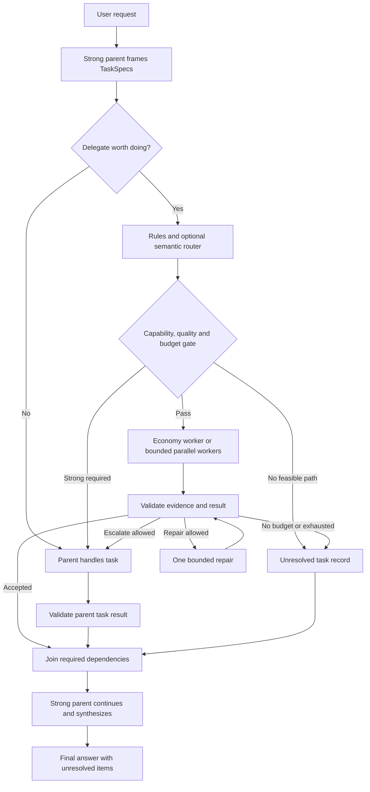

# Handbook authoring plan for multi-agent routing: a strong model coordinates economical workers

Date: **2026-09-16**. Equivalent edition: [Tiếng Việt](MULTI_AGENT_ROUTING_HANDBOOK_PLAN.vi.md). Status: **planning and research only; no runtime implementation, configuration changes, dependency installation, or model experiments**.

## 1. Objective and delivery scope

Produce two standalone, technically equivalent handbooks, one in Vietnamese and one in English, that help a user submit **one request** to a strong model. That model delegates suitable subtasks to workers using economical models, receives and verifies their results, and continues processing until it delivers the final answer. One request may involve multiple internal model/tool calls; this does not mean multiple models run inside a single inference call.

This plan defines the content to write, reference architecture, examples to prepare, work sequence, and handbook acceptance criteria. The prompts, graph, contracts, and limits below are **designs for handbook authoring**, not validated deployment configurations.

Start with a **strong supervisor + narrowly scoped workers + rule-based routing + verification + bounded escalation**. An embedding router adds task-family recognition; a model router selects a tier using quality evidence; a gateway is useful when centralized provider/deployment management is needed. The MVP does not require every component.

Prioritize successful task completion within budget. A low price per token, more agents, or parallel execution alone does not demonstrate savings. The handbook must also explain when to **keep a single agent**, use deterministic tools, or use a fixed DAG.

## 2. Verified starting point

| Current evidence | Implication for the handbook |
| --- | --- |
| Repository `D:\AI\token-context-mcp`, HEAD `86cea213c69d02209493451ff9cbb043fbfe246f` | Place the two plans in `docs/`, continuing the [token-efficiency plan](TOKEN_EFFICIENCY_IMPROVEMENT_PLAN.vi.md) |
| `src/token_context_mcp/server.py:24`, `:229`; `pyproject.toml:15` | The server reads code through MCP stdio; no model orchestrator, LangGraph, gateway, or embedding router was found in the reviewed source/dependencies |
| `src/token_context_mcp/retrieve/ranking.py:168` | Query expansion uses a deterministic vocabulary; it is not a semantic embedding router |
| MCP `list_repositories` → `get_index_status("token-context")` | Index `run_20260830T094015Z_7205d27a` remains stale; `server.py` and `retrieve/service.py` are pending. Do not use the old graph as evidence of new runtime behavior |
| Two code files were already dirty before this turn | Leave them unchanged; their current SHA-256 hashes start with `50dbdd983357` and `f219c3fb49e5`, matching the previous planning-turn snapshot |
| Binary found on PATH: `codex-cli 0.153.4` | Only this CLI version was verified; this does not establish that the running app uses the same binary or that every new configuration has taken effect |
| The working session exposes subagent tools | A native orchestration path exists; requested/effective/actual models and host policy still need verification before promoting a recipe |

Token-context MCP remains the **context provider with provenance** for supervisors/workers. Orchestration should live in the host or a separate application using an MCP client; do not add model calls, provider keys, or a graph engine to `RetrievalService` at this stage.

## 3. Planned documentation set and required contents

The two files created in this turn are `MULTI_AGENT_ROUTING_HANDBOOK_PLAN.vi.md` and `.en.md`. The following artifacts are **future deliverables**, not files created during this planning turn:

- `docs/handbook/MULTI_AGENT_ROUTING.vi.md` and `.en.md`: complete handbooks.
- `docs/handbook/recipes/{manual,hybrid,automatic,gateway,troubleshooting}.{vi,en}.md`: scenario-based procedures.
- `docs/handbook/templates/{task-spec,worker-result,route-policy,budget-ledger}.example.json`: contract templates labeled as examples, without credentials.
- `docs/handbook/CAPABILITY_MATRIX.md`, `SOURCE_REGISTER.md`, `BILINGUAL_PARITY.md`: compatibility, sources/versions, and equivalence checks.
- `docs/handbook/evaluation/PROTOCOL.{vi,en}.md`: evaluation methodology for the later implementation stage.

| Chapter ID | Required content | Required artifact/example | Chapter completion criterion |
| --- | --- | --- | --- |
| H01 | One prompt, multiple calls; supervisor/worker roles | Sequence diagram and an annotated trace | Distinguish prompt, run, task, attempt, and model call |
| H02 | Choosing a native host, SDK, or graph engine | Capability matrix and decision tree | Every path has conditions of use and limitations |
| H03 | Manual orchestration within one prompt | Prompt selecting role/model/scope; receiving results and continuing | Do not require users to copy between multiple chats when the host supports orchestration |
| H04 | Task decomposition and context packages | TaskSpec/WorkerResult, dependency DAG | Include a no-delegate branch and clear ownership |
| H05 | Rule-based routing | Task type → checks → permitted tier table | Configuration decisions precede similarity |
| H06 | Semantic/embedding task router | EN/VI route examples, unknown route, calibration | Do not call a cosine score a probability of correctness |
| H07 | Model router and cascade | Capability registry, quality/cost selector, escalation | Provide evidence for the actual model pair |
| H08 | Conditional Branching in Graphs | Node/edge table, fan-out/join, retry/resume | Explicit termination paths and budget guards |
| H09 | Optional LLM gateway | Direct SDK vs library router vs proxy; compatibility checklist | Separate transport fallback from quality escalation |
| H10 | Context, tokens, and caching | Minimal brief, artifact handles, scoped schemas | Include the supervisor's cost of reading results |
| H11 | Verification and failure handling | Decision table; timed-out, incorrect, incomplete, or conflicting workers | A worker reporting completed is not yet accepted |
| H12 | Measuring quality/cost | Baselines, locked holdout, reports by language | Include failed attempts in cost |
| H13 | Operations and access | Version/policy/data scope, cancellation, ledger | Worker prompts do not replace permission enforcement |
| H14 | Recipes and troubleshooting | Cases in §12, with expected traces | Label unexecuted recipes as unvalidated |
| H15 | Roadmap and terminology | Maturity ladder, glossary, changelog | EN and VI encode the same technical decisions |

Use one chapter template: **when to use → prerequisites → input/output → steps → example → result verification → common failures → cost/risks → sources/versions**. The handbook must go beyond concepts; each recipe needs a specific stop condition and recovery procedure.

## 4. Reference architecture decisions

Separate four decisions so that each can be verified:

| Layer | Question | Main input/output |
| --- | --- | --- |
| Task-family router | Which family does this subtask belong to? | TaskSpec → family/unknown, similarity/margin when embeddings are used |
| Model selector | Which permitted model has sufficient capability at an appropriate cost? | Family + constraints + quality evidence → model/effort |
| Graph controller | What happens next? | State/validation/budget → execute, join, repair, escalate, or stop |
| Gateway router | Which deployment/provider serves the selected request? | Model request → endpoint, usage, transport errors |

The supervisor retains final synthesis authority; workers provide bounded capabilities. The “agents as tools” pattern fits this case; use a handoff when intentionally transferring conversation control to a specialist. [OpenAI orchestration](https://developers.openai.com/api/docs/guides/agents/orchestration)

The handbook must cover three implementation paths:

| Path | When to choose it | Limitations to document |
| --- | --- | --- |
| A. Native host/Codex | Subagents and role-based model selection are already available | Prompts/configuration only work within host capabilities; use manual/rule routing if no semantic-routing hook exists |
| B. Small orchestrator + model SDK | You need direct control over policy, budget, and routing | You must manage state/tools/usage; a gateway process is not yet necessary |
| C. Graph engine + provider adapter, optional gateway | Multiple dependencies, branches, fan-out, and resume are needed | Adds complexity and version contracts; the graph owns retries/branches |

Choose **one owner for the outer orchestration loop**. With LangGraph, an SDK agent inside the graph is a bounded node; do not allow the graph, supervisor agent loop, and gateway to replan/retry without limits independently. If a native host does not support arbitrary router integration, document path B/C rather than promise that a prompt can install a routing engine.

## 5. Manual and semi-automatic workflows to document

### 5.1. Manual workflow M1

1. The user selects a strong parent model and specifies worker roles with verified model aliases.
2. The parent retains the objective/constraints and creates clearly scoped tasks; it keeps small or tightly coupled work itself.
3. Delegate to at most two independent workers in the pilot, each receiving its own brief and output contract.
4. The parent continues its independent work and waits for required dependencies before synthesis.
5. Check schema/evidence/scope; request bounded repairs or let the parent handle difficult parts.
6. The parent returns one integrated answer, identifies unverified parts, and records usage when the host provides it.

Example prompt for further development in the handbook; map the aliases before use:

```text
Remain the coordinator using MODEL_STRONG. Objective: [task].
If independent work is worth delegating, use at most 2 MODEL_ECONOMY_VERIFIED workers.
Worker A: [scope A]. Worker B: [scope B]. Give each worker only the context it needs.
Return: a concise result, evidence path/span/hash or URL, checks performed, and uncertainties.
Do not delegate dependent work before its inputs are complete. Do not spawn child agents.
Continue [parent's work], then verify the results and synthesize the final answer.
If a worker lacks sufficient capability, explain why and return that part to you within budget.
If the host does not support the requested model, say so; do not pretend it was changed.
```

Native Codex documentation describes subagent model/effort selection and custom agent configuration; actual selection is subject to precedence and runtime policy. Bind recipes to tested versions and record the requested model, the resolved model, and the provider-reported model when available. Do not infer that a role named `worker` is inexpensive. [Codex subagents](https://learn.chatgpt.com/docs/agent-configuration/subagents)

Do not invent configuration keys. When writing recipes, check fields such as `agents.default_subagent_model` and the model in a custom-agent file against the target host version, and verify context inheritance. A full-history fork may copy substantial context and restrict overrides; select a brief/context-isolation mechanism actually supported by the host.

### 5.2. Semi-automatic workflow M2

The parent decomposes the request into TaskSpecs; a rule table determines whether a task can be assigned to an economical worker. The operator configures allowlists/tiers before the run instead of selecting each task manually. Call the semantic router only for tasks that remain unclear; unknown cases return to the parent or a bounded classifier, without automatically lowering the tier to save money.

Initial routing table to develop:

| Example task | Prerequisite checks | Initial action |
| --- | --- | --- |
| Filter JSON, count symbols, join tables | A deterministic algorithm and valid data exist | Direct tool + validator; a worker LLM may be unnecessary |
| Find definitions/evidence within a small scope | Fresh source, clear scope, checkable output | Read-only economical worker |
| Summarize one artifact with provenance | Size fits the model; coverage must be preserved | Economical worker + omission checks |
| Draft tests/a local patch | Specification, file ownership, and validator exist | An evaluated worker; changes remain within the task's granted permissions |
| Cross-module design or conflicting data | Many dependencies; difficult to check automatically | Parent/strong specialist |
| Model lacks required tools/modality/context | Capability gate fails | Another capable model or unresolved; do not drop the constraint |

## 6. Semantic embedding router and automatic model selection

### 6.1. Proposed pipeline

```text
Validated TaskSpec
  -> deterministic capability/policy gates
  -> rule match; skip embeddings if clear
  -> semantic task-family candidates or unknown
  -> quality/cost selector among eligible models
  -> reserve budget -> worker -> verify
  -> accept / bounded repair / strong escalation / unresolved
  -> parent continues and synthesizes
```

Embed the **subtask description**, without automatically embedding the entire prompt, repository, or transcript. Decompose a multi-intent prompt into TaskSpecs first; routing signals must not override access rights, modality, context windows, or budget.

Each route stores `route_id`, a description, positive/negative EN–VI examples, allowed tool families, scope, route-index version, and encoder revision. Task families are `extract_evidence`, `summarize_source`, `translate`, `draft_tests`, `local_change`, `cross_file_design`, and `resolve_conflict`; model tier is a separate field.

Aurelio Semantic Router is a candidate for dense/hybrid matching and per-route thresholds. Calibrate thresholds for the actual encoder and data; do not treat a fixed cosine value as the definition of an “easy task.” [Aurelio routers](https://docs.aurelio.ai/docs/semantic-router/user-guide/components/routers), [threshold optimization](https://docs.aurelio.ai/docs/semantic-router/user-guide/features/threshold-optimization)

### 6.2. Calibration and abstention

- Separate **route exemplars/train**, **calibration**, and **locked test** data; group paraphrases and tasks from the same repository to prevent similar examples leaking across splits. A tutorial that fits/evaluates the same data is not held-out validation.
- Prepare Vietnamese with/without diacritics, English, code-mixed, long, negated, multi-intent, and out-of-domain inputs. Near-negatives matter: “list auth functions” differs from “redesign auth.”
- Select a route only when it meets its calibrated threshold and top-1/top-2 margin. Otherwise return `unknown`; report low coverage instead of forcing every task into a route.
- Record `route_similarity`, `route_margin`, `predicted_success_probability`, and `verification_status` separately. An uncalibrated probability must be null; a worker's self-reported “confidence 0.9” is not a measured probability.
- Choose a local or hosted encoder based on latency, language, cost, and data-transfer permissions. Local encoding still incurs CPU/RAM and startup costs; hosted embeddings also belong in the ledger.
- Cache embeddings by input hash + encoder/version/normalization; add policy, model registry, route index, and calibration version for decision caching. Re-evaluate when those components change.

### 6.3. Model selector and research options

The model registry must record role alias, provider/model revision, modality, tools, structured output, context/output limits, supported effort, measured quality by task family, pricing snapshot, and deployment availability. `MODEL_STRONG`, `MODEL_ECONOMY`, and `MODEL_STANDARD` are proposed aliases, not model IDs or price commitments. SDKs can assign models per agent, but adapter and feature support remain runtime-dependent. [OpenAI models/providers](https://developers.openai.com/api/docs/guides/agents/models)

For each eligible model, estimate **cost through an accepted result**, including retries/verification/escalation, not just the first-call price. Select an option whose quality evidence meets the threshold; with limited data, use conservative mappings or the parent. Hard tasks need not fail on an economical model before reaching a strong one.

RouteLLM is a candidate learned strong/weak router. A threshold that achieves a desired strong-call fraction does not guarantee correctness, and older pretrained pairs need evaluation against the actual models/subtasks. Keep it as an experiment after quality labels exist, not an MVP dependency. [RouteLLM repository](https://github.com/lm-sys/RouteLLM), [paper](https://arxiv.org/abs/2406.18665)

Do not train a router solely on supervisor decisions and treat those decisions as ground truth. Combine audited decisions with actual outcomes/validators; measure task-family accuracy separately from model-selection quality.

## 7. LLM Gateway: feasible with a clearly defined role

A gateway is feasible for the SDK/graph paths when API credentials and compatible provider/model adapters are available. It centralizes model aliases, key handling, quotas, usage, and availability routing; task decomposition, verification, and returning control to the parent remain the orchestrator's responsibilities. Do not assume that a chat subscription/native host grants access to every model/provider through a separate gateway.

| Option | Benefit | When not to choose it yet |
| --- | --- | --- |
| Direct SDK adapter | Fewer operational layers; clear visibility into actual requests/models | Multiple applications need unified quotas/keys/routing |
| In-process library router | Provider abstraction/fallback without a proxy service | Administrative isolation is needed across clients/teams |
| Proxy gateway, such as LiteLLM | Shared endpoint and centralized policy/usage | A single host already meets the need; operational cost exceeds the benefit |

LiteLLM supports routing/fallback and MCP integration; stdio runs on the gateway machine. A remote gateway cannot automatically read `D:\AI`; it needs a local orchestrator calling MCP or an intentional deployment/bridge. Do not turn the source repository into a network service merely to use multiple models. [LiteLLM routing](https://docs.litellm.ai/docs/routing), [MCP](https://docs.litellm.ai/docs/mcp)

LiteLLM's older semantic auto-routing documentation is marked deprecated; the newer auto-routing is Beta. The MVP therefore keeps semantic/model-selection policy in the orchestrator and passes the selected model alias to the gateway; optional adapters must pin versions and schemas. [Auto-routing](https://docs.litellm.ai/docs/proxy/auto_routing), [legacy semantic routing](https://docs.litellm.ai/docs/proxy/auto_routing_semantic)

Gateway recipes must check every capability: tools/structured output/streaming/cancel, context limits, model-effort mapping, token usage, authentication/data boundaries, rate-limit/backoff, deployment fallback, and feature/license availability. A gateway may provide budget reservation, but hard enforcement depends on storage/configuration; verify the pinned version's semantics. The orchestrator still owns the run budget and the reserve for parent synthesis; a reservation is not actual spending. [LiteLLM budgets](https://docs.litellm.ai/docs/proxy/users#budget-reservation)

Only one layer owns transport retries. When gateway fallback changes the model, record requested/resolved/actual models and the reason; recheck capability/policy and the cost allowance. Do not silently downgrade the strong parent to a model that fails the quality requirement. The graph decides quality escalation, which differs from fallback caused by 429/timeout/endpoint failure.

## 8. Conditional Branching in Graphs

### 8.1. Reference graph to include in the handbook



The graph is a design and has not been executed. Every node calling a model/tool has a deadline and budget guard, including `P`, `X`, and `S`. The `PV` check can also produce unresolved status; edges into the join carry checked terminal statuses and do not imply that every strong-model result is correct. Reserve synthesis budget from the start; when further calls are impossible, return the available status/error rather than issue another call beyond the cap.

### 8.2. Branch table

| Checked condition | Branch | Recovery/stop |
| --- | --- | --- |
| Deterministic task; a tool is sufficient | Run tool + validate | Failure → parent or unresolved |
| Broad scope, tight dependencies, or weak verifier | Parent/strong | Do not split into workers merely to obtain parallelism |
| Economy model meets capability/quality requirements and budget can be reserved | Dispatch worker | Track task_id, attempt, and deadline |
| Output has valid schema but incorrect evidence | Reject | Repair once if fixable; otherwise escalate |
| Worker timeout/transport failure | Retry through the transport owner | Share the overall deadline/attempt cap; do not reset counters |
| Worker reports partial/blocked or verification is inconclusive | Parent decides | Do not count it as success yet |
| Independent tasks have reached the required terminal states | Join | Order by task_id; do not synthesize as if missing dependencies were complete |
| Budget exhausted, user cancellation, or prompt revision changed | Cancel/stop/invalidate | Preserve usage and audit records; exclude stale results from synthesis |

LangGraph provides conditional edges, `Command` for state updates plus routing, and `Send` for fan-out. Concurrent shared state needs explicit reducers. Use one mechanism to determine a node's outgoing path to avoid accidentally executing additional branches. [LangGraph graph API](https://docs.langchain.com/oss/python/langgraph/graph-api)

Minimum state: `run_id`, `request_revision`, `task_specs`, `dependencies`, `pending/running/terminal`, `results_by_task_id`, `attempts`, `accepted_result_ids`, `budget_ledger`, `deadline`, `policy_version`, `cancelled`, and `final_status`. Reducers merge idempotently by `(task_id, attempt_id, result_revision)`; do not append duplicates on resume. The join knows the exact set of expected task IDs and distinguishes terminal failures from unfinished tasks.

Checkpoints preserve progress for resume; they do not guarantee exactly-once side effects. Artifact/write tools need an idempotency key or a single-owner commit; future recipes for parallel code edits need separate scopes/worktrees. Avoid checkpointing full secrets/transcripts unnecessarily. [LangGraph durable execution](https://docs.langchain.com/oss/python/langgraph/durable-execution)

Proposed pilot: `max_parallel_workers=2`, `max_delegation_depth=1`, at most one quality repair and one escalation per task, `max_generation_calls_per_run=8`, and an overall run deadline. Embedding/tool calls have separate counters/cost caps. These are **ceilings**, not required call counts; all branches compete for the same budget. SDK/gateway retries enter the ledger and must not multiply without bounds across layers.

## 9. Contracts, context, and verification

| Contract | Required fields |
| --- | --- |
| `TaskSpec` | IDs/revision, objective, allowed scope/files, dependency IDs, acceptance criteria, context/evidence refs, allowed tools, mutation rights, model-policy ID, budget/deadline, escalation conditions |
| `RouteDecision` | Family/unknown, rule reason, similarity/margin if present, calibrated probability or null, eligible models, selected model/effort, estimated cost, router/index/policy versions |
| `WorkerResult` | task/attempt/revision, status completed/partial/blocked/failed, bounded answer, evidence refs, artifacts/changes, checks actually run, unknowns, usage reference |
| `VerificationResult` | accepted/rejected/inconclusive, check IDs/outcomes, source freshness, conflicts, missing evidence, and next action |
| `UsageEvent` | run/task/attempt/provider-request IDs, requested/resolved/actual model, timestamps, input/output/cache usage, amount/currency/pricing revision, reservation/settlement, failure/cancel status |

Workers receive only their sub-objective, necessary constraints, narrow tools, and relevant context. Use token-context MCP for symbols/snippets whose freshness has been checked; artifact URIs must be accessible in the worker environment with a bounded-read mechanism. Do not send meaningless local URIs to hosted workers without the corresponding MCP client.

The parent receives a compact result plus evidence/unknowns, not every transcript by default. Preserve source hashes and spans for parent verification when needed. Partition by non-overlapping files/topics and use one index snapshot where feasible. Repository/tool content is data; it cannot change routing policy, the model allowlist, or write permissions.

Deterministic validators check schemas, paths/spans/hashes, calculations, test results from tests actually executed, and change scope. Call an LLM judge only when semantic criteria require it; judges also have biases and costs and need auditing. A worker reporting `completed` only states that it has finished processing; the graph accepts results after validation. For difficult-to-check work, the parent reads enough evidence rather than trusting an unsupported summary.

Handle user changes while workers are running: increment `request_revision`, cancel affected tasks or mark them obsolete, and reuse only results that still meet the constraints. Workers using old source snapshots must disclose this and must not silently combine them with new evidence.

## 10. Alternatives to include in the plan

| Option | When it may be better | How to evaluate it |
| --- | --- | --- |
| Deterministic tools before LLMs | Schema-based search/filter/format/join/extract | Compare equivalent quality and total task cost |
| One strong agent with compact context | Small tasks or substantial shared context | Required baseline; do not penalize it for fewer agents |
| Fixed workflow/DAG | Recurring procedures with known steps | Compare planner overhead and exception handling |
| Cheap-first cascade + verifier | Problems with reliable result checks | Include first attempt + verifier + expected escalation cost |
| Bounded map/reduce | Many independent chunks with clear aggregation | Measure duplication, merge cost, and latency |
| Selective review | Most outputs can be checked mechanically | Reserve strong review for uncertain cases; measure false acceptance |
| Learned/distilled router | Sufficient audited tasks/outcomes exist | Hold out by time/repository/language; compare with simple rules |
| Task-dependent reasoning/output budgets | Savings may not require changing models | Check effort support and resulting quality changes |

Chaining/routing/orchestrator-worker patterns provide references for choosing the simplest sufficient approach. Multi-agent systems also incur coordination/context overhead; do not use debate or majority voting by default. [Anthropic effective agents](https://www.anthropic.com/engineering/building-effective-agents), [multi-agent research system](https://www.anthropic.com/engineering/multi-agent-research-system)

FrugalGPT provides research grounding for quality/cost cascades; Self-REF studies trained confidence and is not equivalent to asking a model to score itself. Do not turn savings percentages from papers into forecasts for this system. [FrugalGPT](https://arxiv.org/abs/2305.05176), [Self-REF](https://proceedings.mlr.press/v267/chuang25b.html)

## 11. Cost and quality measurement methodology to document

```text
C_run = C_parent_plan + C_router_and_embeddings + sum(C_all_worker_attempts)
        + C_tools_and_gateway + C_validation + C_escalations + C_parent_continue/final
```

Separate **tokens**, **monetary cost**, **latency**, and **quality**. Parallelism can reduce latency while increasing tokens. Missing usage is unknown, not 0; follow provider semantics for cache reads/writes and reasoning tokens, avoiding double counting fields that already include one another. Shadow routing without executing workers can measure routing decisions/latency, but not counterfactual quality for models that were never called.

Illustrative break-even numbers: strong-only costs 100 units; the worker approach costs 70 for parent/router/worker/verifier/final; one escalation adds 60 with probability `p`. Expected cost `70 + 60p` is below 100 only when `p < 0.5`, assuming equivalent quality and complete accounting of overhead. These are not measurements or actual prices.

Before dispatch, reserve the call's cost in a central ledger, including concurrent calls; set aside the parent's completion reserve. Reconcile actual usage when available and retain reservations for in-flight requests. Operators set specific monetary/latency limits before real execution; the handbook must not choose a paid budget on their behalf. A hard bound must account for maximum output, tool fees, and fallback; if it is only an estimate, call it a soft budget.

Required baselines: reasonably optimized strong-only; economy-only; manual/static delegation; rule routing; semantic-family routing; learned model routing; cheap-first cascade; and the proposed hybrid. Ablate individual components before combining them, using the same tasks/source/model revisions/tool policy and target quality. Do not add savings percentages from separate improvements.

Metrics: end-to-end success, cost and tokens across all assigned tasks, cost per accepted task, parent token share, p50/p95 latency, retry/escalation rate, route abstention, wrong-economy assignment, verifier false acceptance, duplicate work, and evidence coverage. Cost per accepted task = total cost of all attempts / number of accepted tasks; it is undefined when no tasks are accepted. Report usage completeness.

Evaluate EN and VI separately, including Vietnamese without diacritics/code-mixed inputs; many EN tasks must not hide VI regressions. Split train/calibration/test by task groups and retain a confirmation set unused for tuning. Bootstrap/compute confidence intervals over independent tasks and report n; limited repositories/tasks do not support broad generalization. Evaluate semantic thresholds with precision/recall/coverage and probability predictors separately with calibration/Brier/reliability measures.

Proposed gates to agree **before** benchmarking: mandatory contract cases pass 100%; no new correctness regression on the golden pilot; an intended production quality non-inferiority margin of 2 percentage points with sufficient evidence/confidence intervals; a target reduction of at least 15% in cost per accepted task; and no more than a 10% increase in p95 latency when latency is a constraint. These are experimental targets, not savings commitments; label under-supported slices inconclusive. Roll out only when both whole-set completion rate and language-specific gates pass.

## 12. Recipes and failure drills to develop

| ID | Scenario | Required workflow and demonstrated result |
| --- | --- | --- |
| R01 | One-prompt repository audit | Parent assigns scoped retrieval/evaluation/documentation work to workers, receives evidence, and continues synthesis |
| R02 | Task too small | No-delegate branch; only one tool or the parent |
| R03 | Independent batch | Bounded fan-out, join on correct IDs, parent avoids reading full transcripts |
| R04 | Dependent tasks | B starts only after artifact A is accepted |
| R05 | Ambiguous semantic route | Unknown/abstain; do not choose economy from cosine alone |
| R06 | Incorrect worker/missing evidence | Reject, bounded repair/escalation; include failure costs |
| R07 | Provider 429/timeout | One retry owner, shared deadline, record actual model on fallback |
| R08 | Budget exhaustion/cancel/steering | Stop spawning; exclude obsolete results; parent reports the correct status |
| R09 | Stale index or inaccessible URI | Intentional bounded source fallback/refresh workflow; do not fabricate evidence |
| R10 | Resume after a crash | Deduplicate results/usage; do not repeat committed side effects |
| R11 | Equivalent EN/VI prompts | Compare routing, model selection, and accepted quality by language |
| R12 | Two workers propose changes to the same file | Scope ownership or isolated patches; parent resolves conflicts |

Each recipe includes equivalent EN/VI prompts, a version-correct configuration template, expected trace/branch, validator, budget, and rollback. Label synthetic traces `illustrative`; use `validated` only after verification runs. Do not publish an unexecuted example as copy-paste production-ready.

## 13. Handbook phases and later implementation work

### 13.1. Authoring work packages

| Phase | Work | Deliverable / gate |
| --- | --- | --- |
| W0 | Freeze scope, audience, and host/version; verify sources | H01–H02, SOURCE_REGISTER, capability matrix; distinguish verified/planned/unknown |
| W1 | Write the manual recipe and contracts first | H03–H05; M1 is actionable as instructions, without implicitly inherited model mappings |
| W2 | Write the graph and policy rules | H08/H11; complete node/branch table, terminal states, and dependency/cancel/retry budgets |
| W3 | Write semantic/model routing | H06–H07; dataset splits, calibration, abstention, versioning, and evaluation hooks |
| W4 | Assess gateway feasibility | H09; direct/library/proxy decision, provider/protocol/license matrix; proxy remains optional |
| W5 | Write context/cost/evaluation/operations | H10/H12/H13; all-attempt ledger and quality gates |
| W6 | Complete recipes and bilingual review | H14–H15; R01–R12, glossary, parity checklist; sources adjacent to claims |
| W7 | Review feasibility and publish documentation | No fabricated measurements; each recipe has a maturity label and limitations |

W1 and source research for W3/W4 can proceed in parallel; W2 establishes state contracts before automatic examples. First publish reviewed manual + rule-based guidance. Runtime validation comes later and is outside this planning turn. Manual delegation does not depend on completing every server improvement in the previous plan; each recipe depends only on the features it actually uses.

### 13.2. Potential runtime files for a later implementation

Prefer a separate orchestration package/demo; these illustrative paths are relative to a runtime workspace selected later and are **not files to create while authoring the handbook**:

| Component | Potential files | Responsibility |
| --- | --- | --- |
| Contracts/config | `orchestrator/contracts.py`, `model_registry.py`, `policy.py` | Task/result schemas, capabilities, and validated effective configuration |
| Routing | `routing/rules.py`, `semantic.py`, `model_selector.py` | Keep the four decision layers separate |
| Execution | `graph.py`, `workers.py`, `verification.py` | Branches, scoped jobs, terminal outcomes |
| Providers | `providers/direct.py`, `providers/gateway.py` | Authentication/model/usage normalization; one retry owner |
| Context | `context/mcp_client.py`, `context/packet.py` | Token-context retrieval, source identity, and bounded packets |
| Accounting/state | `budget.py`, `usage.py`, `state_store.py` | Atomic reservation, reconciliation, deduplication/resume |
| Evaluation | `evals/route_cases.jsonl`, `evals/run.py`, `evals/grade.py` | Locked workloads, all-attempt traces, and blind grading |

Proposed configuration precedence for this runtime: **hard organizational/host policy → validated operator run overrides → route/role profile → application defaults**. “Precedence” does not authorize overrides beyond hard policy. Map every key to its consumer and test; record requested/effective/actual models separately. Do not present this precedence as a claim about every SDK/Codex version.

## 14. Bilingual QA and plan/handbook acceptance criteria

Both plans have sections 1–15, chapters H01–H15, recipes R01–R12, and phases W0–W7. Preserve contract keys, formulas, thresholds, URLs, code identifiers, file paths, and status names across EN/VI; translate prose and prompt instructions without translating API fields.

Consistent glossary: supervisor = bộ điều phối; worker = tác nhân thực thi; task-family routing = định tuyến nhóm tác vụ; model selection = lựa chọn mô hình; conditional branching = rẽ nhánh có điều kiện; abstention = không quyết định; escalation = chuyển lên model mạnh hơn; verification = kiểm chứng; accepted = đã đạt kiểm chứng; completed = worker đã hoàn tất phần xử lý.

Delivery checklist:

- [ ] Both languages fully cover manual, hybrid, automatic, gateway feasibility, and graphs; EN is not an abstract.
- [ ] Include a path without multi-agent orchestration, a rule-first baseline, and bounded escalation.
- [ ] Do not equate similarity with difficulty/probability or a gateway with an orchestrator.
- [ ] Sequences/graphs/recipes clearly show the parent receiving results and continuing; dependency joins account for failures.
- [ ] Check scope, credentials, data sent to providers, effective models, and host capabilities.
- [ ] Budgets include routing/embedding, parent, workers, verifiers, failed attempts, and fallback.
- [ ] Review EN/VI meaning, not just heading counts; validate UTF-8, links, code fences, and identifiers.
- [ ] Distinguish documentation review, runnable examples, and runtime/scientific validation; make no unmeasured savings claims.

## 15. Researched sources and how to use them

Online sources were checked on 2026-09-16. The future handbook must record versions/access dates and recheck sources before using commands/configuration. Designs/gates/pilot limits in this plan are proposals for this use case.

| Source | Purpose |
| --- | --- |
| [Codex subagents](https://learn.chatgpt.com/docs/agent-configuration/subagents) | Native recipes and capability/version checks |
| [OpenAI orchestration](https://developers.openai.com/api/docs/guides/agents/orchestration) | Manager retains response authority; agents-as-tools/handoffs |
| [OpenAI models/providers](https://developers.openai.com/api/docs/guides/agents/models) | Per-agent models and adapter constraints |
| [LangGraph graph API](https://docs.langchain.com/oss/python/langgraph/graph-api) | Conditional edges, state, reducers, Send/Command |
| [LangGraph durable execution](https://docs.langchain.com/oss/python/langgraph/durable-execution) | Resume and idempotency |
| [Aurelio routers](https://docs.aurelio.ai/docs/semantic-router/user-guide/components/routers) | Semantic/hybrid matching |
| [Aurelio threshold optimization](https://docs.aurelio.ai/docs/semantic-router/user-guide/features/threshold-optimization) | Threshold-tuning API; a separate holdout is required |
| [RouteLLM repo](https://github.com/lm-sys/RouteLLM), [paper](https://arxiv.org/abs/2406.18665) | Learned-routing experiment |
| [LiteLLM routing](https://docs.litellm.ai/docs/routing), [MCP](https://docs.litellm.ai/docs/mcp) | Optional gateway adapters |
| [LiteLLM auto-routing](https://docs.litellm.ai/docs/proxy/auto_routing), [legacy](https://docs.litellm.ai/docs/proxy/auto_routing_semantic) | Version/maturity caveat |
| [LiteLLM budgets](https://docs.litellm.ai/docs/proxy/users#budget-reservation) | Reservation/enforcement checks |
| [Anthropic effective agents](https://www.anthropic.com/engineering/building-effective-agents), [multi-agent research](https://www.anthropic.com/engineering/multi-agent-research-system) | Patterns and coordination trade-offs |
| [FrugalGPT](https://arxiv.org/abs/2305.05176), [Self-REF](https://proceedings.mlr.press/v267/chuang25b.html) | Research alternatives |

This planning turn does not install dependencies, connect providers, launch gateways, create embeddings, train routers, or conduct additional provider/API experiments.
