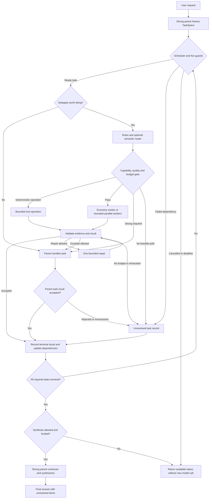

# Kế hoạch biên soạn cẩm nang multi-agent: model mạnh điều phối worker tiết kiệm

Ngày nghiên cứu: **2026-09-16**. Rà soát tài liệu: **2026-09-17**. Bản tương đương: [English](MULTI_AGENT_ROUTING_HANDBOOK_PLAN.en.md). Trạng thái: **chỉ lập kế hoạch và nghiên cứu; không viết runtime, sửa cấu hình, cài dependency hay chạy thử model để thực hiện plan này**.

## 1. Mục tiêu và phạm vi bàn giao

Biên soạn hai cẩm nang độc lập nhưng tương đương kỹ thuật, một tiếng Việt và một tiếng Anh, giúp người dùng gửi **một yêu cầu** cho model mạnh; model này giao các tác vụ con phù hợp cho worker dùng model tiết kiệm, nhận kết quả, kiểm chứng và tiếp tục xử lý đến câu trả lời cuối. Một yêu cầu có thể tạo nhiều lời gọi model/tool nội bộ; đây không phải nhiều model cùng chạy bên trong một inference call.

Plan này xác định nội dung cần viết, kiến trúc tham chiếu, ví dụ cần chuẩn bị, thứ tự công việc và tiêu chí nghiệm thu cẩm nang. Các prompt, graph, contract và giá trị giới hạn bên dưới là **bản thiết kế để biên soạn**, chưa phải cấu hình triển khai đã kiểm chứng.

Đề xuất bắt đầu bằng **supervisor mạnh + worker có nhiệm vụ hẹp + rule-based routing + kiểm chứng + escalation có giới hạn**. Embedding router bổ sung khả năng nhận diện nhóm tác vụ; model router chọn tier theo dữ liệu chất lượng; gateway dùng khi có nhu cầu quản lý provider/deployment tập trung. Không yêu cầu đủ mọi thành phần ngay từ MVP.

Ưu tiên thành công đúng nhiệm vụ trong ngân sách. Giá mỗi token thấp, số agent nhiều hoặc chạy song song chưa đủ để chứng minh tiết kiệm. Cẩm nang phải hướng dẫn cả trường hợp **giữ một agent**, dùng tool xác định hoặc DAG cố định.

## 2. Điểm xuất phát đã kiểm tra ngày 2026-09-16

| Bằng chứng tại snapshot khảo sát | Ý nghĩa cho cẩm nang |
| --- | --- |
| Repo `D:\AI\token-context-mcp`, HEAD `86cea213c69d02209493451ff9cbb043fbfe246f` | Đặt hai plan trong `docs/`, nối tiếp [plan token efficiency](TOKEN_EFFICIENCY_IMPROVEMENT_PLAN.vi.md) |
| `src/token_context_mcp/server.py:24`, `:229`; `pyproject.toml:15` | Server đọc code qua MCP stdio; chưa có orchestrator model, LangGraph, gateway hay embedding router trong các source/dependency đã rà |
| `src/token_context_mcp/retrieve/ranking.py:168` | Query expansion là vocabulary xác định; không phải semantic embedding router |
| MCP `list_repositories` → `get_index_status("token-context")` | Index `run_20260830T094015Z_7205d27a` vẫn stale; pending `server.py` và `retrieve/service.py`. Không dùng graph cũ làm bằng chứng runtime mới |
| Hai file code đã dirty trước lượt này | Không thay đổi; SHA-256 hiện tại bắt đầu `50dbdd983357` và `f219c3fb49e5`, khớp snapshot của lượt plan trước |
| Binary tìm được trên PATH: `codex-cli 0.153.4` | Chỉ xác minh version CLI này; chưa khẳng định app đang chạy cùng binary hoặc mọi config mới đã có hiệu lực |
| Phiên làm việc có công cụ subagent | Có đường native để điều phối; vẫn phải xác minh model requested/effective/actual và policy của host trước khi quảng bá recipe |

Token-context MCP giữ vai trò **cấp context có provenance** cho supervisor/worker. Orchestration nên ở host hoặc một ứng dụng riêng dùng MCP client; chưa đưa model calls, provider keys hoặc graph engine vào `RetrievalService`.

Lúc rà soát tài liệu ngày 2026-09-17, HEAD của repo đã chuyển sang `a88a6936eb9a79d7ae9818a3f01356eaa450f681`, gồm thay đổi server và các module context/projection/serialization/workflow mới. Bảng trên giữ snapshot khảo sát ban đầu; plan này không audit hay xác nhận runtime của các implementation mới đó. Cần đối chiếu source và wiring lại trước khi viết recipe chạy được. Lượt rà soát này chỉ sửa hai file plan cẩm nang.

## 3. Bộ tài liệu dự kiến và mục lục bắt buộc

Hai file được tạo trong lượt này là `MULTI_AGENT_ROUTING_HANDBOOK_PLAN.vi.md` và `.en.md`. Các artifact dưới đây là **đầu ra tương lai**, chưa tạo trong lượt plan:

- `docs/handbook/MULTI_AGENT_ROUTING.vi.md` và `.en.md`: cẩm nang đầy đủ.
- `docs/handbook/recipes/{manual,hybrid,automatic,gateway,troubleshooting}.{vi,en}.md`: quy trình theo tình huống.
- `docs/handbook/templates/{task-spec,worker-result,route-policy,budget-ledger}.example.json`: mẫu contract có nhãn minh họa; không chứa credential.
- `docs/handbook/CAPABILITY_MATRIX.md`, `SOURCE_REGISTER.md`, `BILINGUAL_PARITY.md`: compatibility, nguồn/version và kiểm tra tương đương.
- `docs/handbook/evaluation/PROTOCOL.{vi,en}.md`: phương pháp đánh giá cho giai đoạn triển khai sau.

| ID chương | Nội dung phải viết | Artifact/ví dụ cần có | Điều kiện hoàn tất chương |
| --- | --- | --- | --- |
| H01 | Một prompt, nhiều lời gọi; vai trò supervisor/worker | Sequence diagram và một trace có chú thích | Phân biệt prompt, run, task, attempt, model call |
| H02 | Chọn native host, SDK hoặc graph engine | Capability matrix và cây quyết định | Mỗi đường có điều kiện dùng và giới hạn |
| H03 | Điều phối thủ công trong cùng prompt | Prompt chọn role/model/scope, cách đọc kết quả rồi tiếp tục | Không yêu cầu người dùng tự copy giữa nhiều chat nếu host hỗ trợ |
| H04 | Chia việc và context package | TaskSpec/WorkerResult, dependency DAG | Có no-delegate branch và ownership rõ |
| H05 | Rule-based routing | Bảng loại task → kiểm tra → tier được phép | Cấu hình quyết định trước similarity |
| H06 | Semantic/embedding task router | Route examples EN/VI, unknown route, calibration | Không gọi cosine score là xác suất đúng |
| H07 | Model router và cascade | Capability registry, quality/cost selector, escalation | Có bằng chứng cho cặp model thực tế |
| H08 | Conditional Branching trong Graph | Node/edge table, fan-out/join, retry/resume | Đường kết thúc và budget guard rõ |
| H09 | LLM gateway tùy chọn | Direct SDK vs library router vs proxy; compatibility checklist | Tách transport fallback khỏi quality escalation |
| H10 | Context, token và cache | Brief tối thiểu, artifact handles, schema scope | Tính cả chi phí supervisor đọc kết quả |
| H11 | Kiểm chứng và xử lý lỗi | Decision table; worker bị timeout, sai, thiếu hoặc mâu thuẫn | Worker tự báo completed chưa phải accepted |
| H12 | Đo chất lượng/chi phí | Baselines, locked holdout, báo cáo theo ngôn ngữ | Không loại các attempt thất bại khỏi cost |
| H13 | Vận hành và quyền truy cập | Version/policy/data scope, cancellation, ledger | Không thay quyền bằng prompt của worker |
| H14 | Recipes và troubleshooting | Các ca ở §12, kèm expected trace | Recipe chưa chạy phải ghi chưa kiểm chứng |
| H15 | Lộ trình và thuật ngữ | Maturity ladder, glossary, changelog | EN và VI cùng quyết định kỹ thuật |

Mỗi chương theo một template: **khi nào dùng → prerequisites → input/output → các bước → ví dụ → cách kiểm kết quả → lỗi thường gặp → chi phí/rủi ro → nguồn/version**. Cẩm nang không chỉ mô tả khái niệm; mỗi recipe cần stop condition và recovery cụ thể.

## 4. Quyết định kiến trúc tham chiếu

Tách bốn quyết định để dễ kiểm chứng:

| Lớp | Câu hỏi | Input/output chính |
| --- | --- | --- |
| Task-family router | Tác vụ con thuộc nhóm nào? | TaskSpec → family/unknown, similarity/margin nếu dùng embedding |
| Model selector | Model nào được phép và đủ năng lực với chi phí phù hợp? | Family + constraints + evidence chất lượng → model/effort |
| Graph controller | Bước tiếp theo là gì? | State/validation/budget → execute, join, repair, escalate hoặc stop |
| Gateway router | Deployment/provider nào phục vụ request đã chọn? | Model request → endpoint, usage, lỗi transport |

Supervisor giữ quyền tổng hợp cuối; worker là bounded capability. Pattern “agents as tools” phù hợp trường hợp này; handoff dùng khi chủ đích chuyển quyền hội thoại cho specialist. [OpenAI orchestration](https://developers.openai.com/api/docs/guides/agents/orchestration)

Ba đường thực hiện cần có trong cẩm nang:

| Đường | Khi chọn | Hạn chế cần ghi |
| --- | --- | --- |
| A. Native host/Codex | Đã có subagent và chọn model theo role | Prompt/config chỉ có tác dụng trong khả năng host; chưa có hook semantic routing thì dùng manual/rules |
| B. Orchestrator nhỏ + model SDK | Cần policy, budget và routing do mình kiểm soát | Phải quản lý state/tools/usage; chưa cần gateway process |
| C. Graph engine + provider adapter, gateway optional | Có nhiều dependency, branch, fan-out, resume | Thêm complexity và version contract; graph là owner của retry/branch |

Chọn **một nơi sở hữu vòng điều phối ngoài cùng**. Nếu dùng LangGraph, SDK agent bên trong là một node có giới hạn; không để cả graph, supervisor agent loop và gateway tự replan/retry không giới hạn. Native host không hỗ trợ gắn router tùy ý thì cẩm nang phải đưa đường B/C thay vì hứa một prompt có thể cài routing engine.

## 5. Luồng thủ công và bán tự động cần hướng dẫn

### 5.1. Luồng thủ công M1

1. Người dùng chọn model mạnh cho parent và chỉ định role worker cùng model alias đã xác minh.
2. Parent giữ mục tiêu/constraints, chia việc có scope rõ; việc nhỏ hoặc phụ thuộc chặt được giữ lại.
3. Giao tối đa hai worker độc lập trong pilot, mỗi worker nhận brief riêng và output contract.
4. Nếu host hỗ trợ worker chạy nền/asynchronous, parent tiếp tục phần việc độc lập của mình; nếu lời gọi subagent đồng bộ thì parent đợi kết quả rồi tiếp tục. Luôn đợi đủ dependency trước bước tổng hợp.
5. Kiểm schema/evidence/scope; yêu cầu sửa có giới hạn hoặc parent xử lý phần khó.
6. Parent trả câu trả lời thống nhất, nêu phần chưa xác minh và ghi usage khi host cung cấp.

Prompt mẫu để cẩm nang phát triển, các alias phải được map trước khi dùng:

```text
Giữ vai trò điều phối bằng MODEL_STRONG. Mục tiêu: [nhiệm vụ].
Nếu có việc độc lập đáng giao, dùng tối đa 2 worker MODEL_ECONOMY_VERIFIED.
Worker A: [scope A]. Worker B: [scope B]. Mỗi worker chỉ nhận context cần thiết.
Trả: kết quả ngắn, evidence path/span/hash hoặc URL, kiểm tra đã làm, phần chưa chắc.
Không giao tác vụ phụ thuộc khi đầu vào chưa hoàn tất. Các worker không được tạo thêm agent con.
Bạn tiếp tục [phần việc của parent], rồi kiểm kết quả và tổng hợp câu trả lời cuối.
Nếu worker không đủ năng lực, báo lý do và chuyển phần đó về bạn trong ngân sách.
Nếu model yêu cầu không được host hỗ trợ, báo rõ; không giả lập là đã đổi model.
```

Native Codex docs có model/effort cho subagents và custom agent configuration; lựa chọn thực tế chịu precedence và runtime policy. Cẩm nang sẽ gắn recipe với version đã thử, ghi model được yêu cầu, được resolve và được provider báo nếu có. Không suy từ tên `worker` rằng nó rẻ. [Codex subagents](https://learn.chatgpt.com/docs/agent-configuration/subagents)

Không ghi khóa config đoán mò. Giai đoạn viết recipe phải đối chiếu các field như `agents.default_subagent_model` và model trong custom-agent file với version host mục tiêu, đồng thời kiểm việc kế thừa context. Bản full-history fork có thể copy nhiều context và có hạn chế override; chọn cách gửi brief/context isolation mà host thực sự hỗ trợ.

### 5.2. Luồng bán tự động M2

Parent tự phân rã TaskSpec; bảng rules quyết định task có được giao worker economy hay không. Operator chỉnh allowlist/tier bằng cấu hình trước run, không cần chọn tay từng task. Chỉ gọi semantic router ở những task chưa phân loại rõ; unknown quay về parent hoặc một classifier giới hạn, không tự hạ tier để tiết kiệm.

Bảng routing ban đầu cần biên soạn:

| Task mẫu | Kiểm tra trước | Hành động khởi đầu |
| --- | --- | --- |
| Lọc JSON, đếm symbol, ghép bảng | Có thuật toán xác định và dữ liệu hợp lệ | Tool trực tiếp + validator; có thể không cần worker LLM |
| Tìm definition/evidence trong phạm vi nhỏ | Source fresh, scope rõ, output kiểm được | Worker economy read-only |
| Tóm tắt một artifact có provenance | Kích thước vừa model, cần giữ coverage | Worker economy + kiểm bỏ sót |
| Soạn test/draft patch cục bộ | Đã có specification, file ownership, validator | Worker đã qua đánh giá; thay đổi chỉ trong quyền task được cấp |
| Thiết kế xuyên module hoặc dữ liệu mâu thuẫn | Nhiều dependency, khó kiểm tự động | Parent/strong specialist |
| Model thiếu tool/modality/context cần thiết | Capability gate fail | Model khác đủ năng lực hoặc unresolved, không bỏ constraint |

## 6. Semantic embedding router và lựa chọn model tự động

### 6.1. Pipeline đề xuất

```text
TaskSpec đã validate
  -> deterministic capability/policy gates
  -> rule match; nếu rõ thì bỏ qua embedding
  -> semantic task-family candidates hoặc unknown
  -> quality/cost selector trong tập model hợp lệ
  -> reserve budget -> worker -> verify
  -> accept / bounded repair / strong escalation / unresolved
  -> parent tiếp tục và tổng hợp
```

Embedding dùng mô tả **tác vụ con**, không mặc định embed toàn bộ prompt, repo hoặc transcript. Một prompt nhiều ý phải được tách TaskSpec trước; tín hiệu route không được lấn quyền access, modality, context window hay budget.

Mỗi route lưu `route_id`, mô tả, ví dụ dương/âm EN–VI, allowed tool families, scope, route index version và encoder revision. Task-family là `extract_evidence`, `summarize_source`, `translate`, `draft_tests`, `local_change`, `cross_file_design`, `resolve_conflict`; model tier là trường riêng.

Aurelio Semantic Router là ứng viên cho dense/hybrid matching và ngưỡng theo route. Cần hiệu chỉnh ngưỡng trên encoder và dữ liệu mình dùng, không lấy một cosine cố định làm chuẩn “task dễ”. [Aurelio routers](https://docs.aurelio.ai/docs/semantic-router/user-guide/components/routers), [threshold optimization](https://docs.aurelio.ai/docs/semantic-router/user-guide/features/threshold-optimization)

### 6.2. Calibration và abstention

- Tách **route exemplars/train**, **calibration**, **locked test**; nhóm paraphrase và task cùng repo để tránh lọt mẫu tương tự qua các split. Ví dụ tutorial fit/evaluate cùng dữ liệu không phải kiểm định held-out.
- Chuẩn bị câu tiếng Việt có dấu/không dấu, tiếng Anh, code-mixed, prompt dài, phủ định, đa ý và out-of-domain. Near-negative quan trọng: “liệt kê hàm auth” khác “thiết kế lại auth”.
- Chọn route khi đạt ngưỡng riêng của route và margin top-1/top-2 đã hiệu chỉnh. Không đạt thì `unknown`; coverage thấp được báo, không ép mọi task vào route.
- Ghi riêng `route_similarity`, `route_margin`, `predicted_success_probability`, `verification_status`. Probability chưa calibrated phải null; lời tự nhận “confidence 0.9” của worker không được dùng như xác suất thực.
- Chọn encoder local hoặc hosted theo latency, ngôn ngữ, chi phí và quyền gửi dữ liệu. Encoder local vẫn có chi phí CPU/RAM và startup; hosted embedding cũng nằm trong ledger.
- Cache embedding theo input hash + encoder/version/normalization; decision cache thêm policy, model registry, route index và calibration version. Thay các thành phần đó phải re-evaluate.

Decision cache chỉ lưu classification/route hints, không cấp quyền dispatch. Mỗi lần dùng lại vẫn kiểm request revision, identity/scope, capabilities, availability, cancellation, deadline và budget hiện tại.

### 6.3. Model selector và các lựa chọn nghiên cứu

Model registry phải ghi role alias, provider/model revision, modality, tools, structured output, context/output limits, supported effort, measured quality theo task family, pricing snapshot và deployment availability. `MODEL_STRONG`, `MODEL_ECONOMY`, `MODEL_STANDARD` là alias đề xuất, chưa phải model ID hay cam kết giá. Các model có thể được đặt riêng theo agent trong SDK, nhưng adapter và feature support vẫn phụ thuộc runtime. [OpenAI models/providers](https://developers.openai.com/api/docs/guides/agents/models)

Với mỗi model hợp lệ, ước tính **cost đến accepted result**, gồm retry/verifier/escalation, không chỉ giá first call. Chọn phương án có evidence chất lượng đáp ứng ngưỡng; dữ liệu ít thì dùng mapping conservative hoặc parent. Hard tasks không cần đi qua economy rồi thất bại mới được lên strong.

RouteLLM là ứng viên learned router strong/weak. Ngưỡng đạt tỷ lệ gọi strong mong muốn không bảo đảm correctness, và pretrained pair cũ cần đánh giá lại trên cặp model/subtask hiện tại. Đưa vào nhánh thử nghiệm sau khi đã có labels chất lượng, không làm dependency MVP. [RouteLLM repository](https://github.com/lm-sys/RouteLLM), [paper](https://arxiv.org/abs/2406.18665)

Không huấn luyện router chỉ bằng quyết định của supervisor rồi xem đó là ground truth. Kết hợp quyết định được audit với outcome thực/validator; đo riêng route-family accuracy và chất lượng chọn model.

## 7. LLM Gateway: khả thi nhưng cần đúng vai trò

Khả thi ở đường SDK/graph khi có API credentials và provider/model adapter tương thích. Gateway tập trung model aliases, key handling, quotas, usage và availability routing; việc chia task, kiểm chứng và quay lại parent vẫn do orchestrator thực hiện. Không mặc định một thuê bao chat/native host cho phép mọi model/provider qua gateway riêng.

| Lựa chọn | Lợi ích | Khi chưa nên chọn |
| --- | --- | --- |
| Direct SDK adapter | Ít lớp vận hành, dễ nhìn request/model thực | Nhiều ứng dụng cần quota/key/routing thống nhất |
| Library router trong process | Có provider abstraction/fallback, chưa cần proxy service | Cần isolation quản trị giữa nhiều client/team |
| Proxy gateway, ví dụ LiteLLM | Endpoint chung, policy và usage tập trung | Một host đơn lẻ đã đáp ứng; chi phí vận hành lớn hơn lợi ích |

LiteLLM có routing/fallback và MCP integration; stdio chạy ở máy gateway. Gateway remote không tự đọc được `D:\AI`; cần orchestrator local gọi MCP hoặc triển khai/bridge có chủ đích. Không biến source repo thành network service chỉ để dùng nhiều model. [LiteLLM routing](https://docs.litellm.ai/docs/routing), [MCP](https://docs.litellm.ai/docs/mcp)

Tài liệu semantic auto-routing cũ của LiteLLM hiện được đánh dấu deprecated; auto-routing mới là Beta. Vì vậy MVP giữ policy semantic/model selection ở orchestrator, gateway nhận model alias đã chọn; adapter optional phải pin version và schema. [Auto-routing](https://docs.litellm.ai/docs/proxy/auto_routing), [legacy semantic routing](https://docs.litellm.ai/docs/proxy/auto_routing_semantic)

Recipe gateway phải kiểm từng khả năng: tools/structured output/streaming/cancel, context limits, model-effort mapping, token usage, auth/data boundaries, rate-limit/backoff, deployment fallback và feature/license availability. Gateway có thể có budget reservation nhưng hard enforcement phụ thuộc storage/config; xác minh semantics bản pin. Orchestrator vẫn giữ ngân sách run và phần dự phòng cho parent tổng hợp; không tính reservation là chi tiêu thực. [LiteLLM budgets](https://docs.litellm.ai/docs/proxy/users#budget-reservation)

Chỉ một lớp sở hữu transport retry. Fallback allowlist phải được thẩm định capability/policy và reserve cost **trước khi dispatch**; nếu gateway không enforce được thì orchestrator sở hữu quyết định fallback. Khi fallback đổi model, record requested/resolved/actual model và lý do để audit. Không âm thầm fallback strong parent xuống model không đạt chất lượng. Quality escalation do graph quyết định, khác fallback khi 429/timeout/endpoint hỏng.

## 8. Conditional Branching trong Graph

### 8.1. Graph tham chiếu cần đưa vào cẩm nang



Graph là thiết kế, chưa chạy. Mọi node gọi model/tool đều có deadline và budget guard, kể cả `P`, `X`, `S`. Scheduler chỉ dispatch task ready chưa chạy; khi đang chờ worker thì await event, không busy-loop hoặc spawn trùng. Dependency lỗi được xử lý thành terminal blocked/unresolved theo policy, không chạy task con thiếu input. Budget dành riêng cho synthesis phải được giữ từ đầu; khi không thể gọi tiếp, trả status/error đã có thay vì sinh thêm call vượt trần.

Trước scheduling phải kiểm dependency graph không có cycle, task ID trùng hoặc dependency ID không tồn tại. Nếu còn task pending nhưng không có task ready/running, trả deadlock/unresolved thay vì chờ vô hạn.

### 8.2. Branch table

| Điều kiện đã kiểm | Nhánh | Recovery/stop |
| --- | --- | --- |
| Task xác định, tool đủ | Chạy tool + validate | Fail → parent hoặc unresolved |
| Scope lớn, dependency chặt hoặc verifier yếu | Parent/strong | Không tách thành nhiều worker chỉ để có parallelism |
| Economy đáp ứng capability/quality và reserve được budget | Dispatch worker | Theo dõi task_id, attempt, deadline |
| Output đúng schema nhưng sai evidence | Reject | Repair một lần nếu sửa được, nếu không escalate |
| Worker timeout/lỗi transport | Retry theo owner transport | Cùng tổng deadline/attempt cap; không reset counter |
| Worker báo partial/blocked hoặc verifier không kết luận | Parent quyết định | Chưa coi là success |
| Task độc lập đã đủ terminal state | Join | Sắp theo task_id; thiếu dependency thì không synthesis như đã đủ |
| Budget hết, user cancel hoặc prompt revision đổi | Cancel/stop/invalidate | Giữ usage và audit; không nhận kết quả stale vào synthesis |

LangGraph cung cấp conditional edges, `Command` cho state update kèm routing và `Send` cho fan-out. Concurrent shared state cần reducer rõ ràng. Dùng một cơ chế quyết định outgoing path của node để tránh chạy thêm nhánh ngoài ý muốn. [LangGraph graph API](https://docs.langchain.com/oss/python/langgraph/graph-api)

State tối thiểu: `run_id`, `request_revision`, `task_specs`, `dependencies`, `pending/running/terminal`, `results_by_task_id`, `attempts`, `accepted_result_ids`, `budget_ledger_ref`, `deadline`, `policy_version`, `cancelled`, `final_status`. Reducer merge idempotent theo `(task_id, attempt_id, result_revision)`; không append trùng khi resume. Join biết đúng tập expected task IDs, phân biệt lỗi terminal với task chưa hoàn tất. Ledger reservation/settlement và call counters authoritative nằm ngoài state có thể rewind; graph chỉ giữ reference/snapshot. Resume phải reconcile request in-flight và chi tiêu đã ghi trước khi cấp budget mới.

Checkpoint lưu tiến độ để resume; replay có thể chạy lại lời gọi sau checkpoint và không bảo đảm exactly-once side effects. Artifact/write tools cần idempotency key hoặc single-owner commit; code edits song song cần scope riêng/worktree riêng trong recipe tương lai. Demo phục hồi sau process restart phải dùng persistent checkpointer; in-memory state không đủ. Không checkpoint full secret/transcript nếu không cần. [LangGraph checkpointers](https://docs.langchain.com/oss/python/langgraph/checkpointers)

Recipe node timeout/error handler phải pin API tương thích; tài liệu hiện nêu feature tương ứng cần `langgraph>=1.2` và node timeout áp dụng async nodes. Đây là compatibility check cho lúc viết example, không phải chỉ thị nâng dependency repo hiện tại. [LangGraph fault tolerance](https://docs.langchain.com/oss/python/langgraph/fault-tolerance)

Pilot đề xuất: `max_parallel_workers=2`, `max_delegation_depth=1`, tối đa một quality repair và một escalation mỗi task, `max_generation_calls_per_run=8`, deadline toàn run. Embedding/tool calls có counters/cost caps riêng. Đây là **trần**, không phải số call phải dùng; tất cả nhánh cạnh tranh cùng budget. Retry của SDK/gateway được tính vào ledger, không nhân vô hạn giữa các lớp.

## 9. Contract, context và kiểm chứng

| Contract | Trường cần có |
| --- | --- |
| `TaskSpec` | IDs/revision, objective, allowed scope/files, dependency IDs, acceptance criteria, context/evidence refs, allowed tools, mutation rights, model-policy ID, budget/deadline, escalation conditions |
| `RouteDecision` | Family/unknown, rule reason, similarity/margin nếu có, calibrated probability hoặc null, eligible models, selected model/effort, estimated cost, router/index/policy versions |
| `WorkerResult` | task/attempt/revision, status completed/partial/blocked/failed, bounded answer, evidence refs, artifacts/changes, checks actually run, unknowns, usage reference |
| `VerificationResult` | accepted/rejected/inconclusive, check IDs/outcomes, source freshness, conflicts, missing evidence và next action |
| `UsageEvent` | run/task/attempt/provider-request IDs, requested/resolved/actual model, timestamps, input/output/cache usage, amount/currency/pricing revision, reservation/settlement, failure/cancel status |

Worker chỉ nhận mục tiêu con, constraints cần thiết, tools hẹp và context có liên quan. Dùng token-context MCP cho symbol/snippet đã kiểm freshness; artifact URI phải truy xuất được trong môi trường worker, có cơ chế bounded read. Không gửi URI local vô nghĩa cho hosted worker không có MCP client tương ứng.

Parent nhận compact result + evidence/unknowns, không mặc định nhận mọi transcript. Giữ source hashes và span để parent kiểm lại khi cần. Chia theo file/topic không chồng lắp, dùng một index snapshot khi khả thi. Nội dung repo/tool là dữ liệu; nó không được phép thay route policy, model allowlist hoặc quyền ghi.

Validator xác định kiểm schema, path/span/hash, phép tính, kết quả test thực sự được chạy và scope thay đổi. Chỉ gọi LLM judge khi tiêu chí ngữ nghĩa cần nó; judge cũng có sai lệch, chi phí và phải được audit. Worker báo `completed` chỉ xác nhận worker đã dừng; graph chỉ accept sau validator. Với việc khó kiểm, parent đọc đủ evidence thay vì tin vào summary trơn.

Phải có cơ chế xử lý người dùng đổi yêu cầu trong khi worker đang chạy: tăng `request_revision`, cancel hoặc gắn obsolete cho task bị ảnh hưởng, chỉ tái dùng kết quả còn đúng constraints. Worker dùng source snapshot cũ phải báo, không tự nối với evidence mới.

## 10. Các hướng thay thế cần đưa vào plan

| Phương án | Khi có thể tốt hơn | Cách đánh giá |
| --- | --- | --- |
| Tool xác định trước LLM | Search/filter/format/join/extract theo schema | So chất lượng tương đương và cost toàn task |
| Một strong agent với context gọn | Task nhỏ hoặc cần nhiều context chung | Baseline bắt buộc; không phạt vì ít agent |
| Workflow/DAG cố định | Quy trình lặp lại đã biết các bước | So overhead planner và khả năng xử lý ngoại lệ |
| Cheap-first cascade + verifier | Bài toán có kiểm tra kết quả đáng tin | Tính first attempt + verifier + escalation kỳ vọng |
| Bounded map/reduce | Nhiều khối độc lập, aggregate rõ | Đo phần trùng, merge cost và latency |
| Selective review | Phần lớn output kiểm được máy móc | Chỉ dùng review mạnh cho ca bất định; đo false acceptance |
| Learned/distilled router | Có đủ task/outcome đã audit | Held-out theo thời gian/repo/ngôn ngữ, so với rules đơn giản |
| Reasoning/output budget theo task | Không nhất thiết đổi model để giảm cost | Kiểm model hỗ trợ effort và quality thay đổi |

Các pattern chaining/routing/orchestrator-workers là nguồn tham khảo để chọn cách đơn giản đủ dùng. Multi-agent còn phát sinh coordination/context overhead; không dùng debate hoặc majority voting mặc định. [Anthropic effective agents](https://www.anthropic.com/engineering/building-effective-agents), [multi-agent research system](https://www.anthropic.com/engineering/multi-agent-research-system)

FrugalGPT là căn cứ nghiên cứu cascade theo chất lượng/chi phí; Self-REF là nhánh nghiên cứu confidence đã huấn luyện, không tương đương hỏi model tự cho điểm. Không chuyển các phần trăm tiết kiệm trong paper thành dự báo của hệ thống này. [FrugalGPT](https://arxiv.org/abs/2305.05176), [Self-REF](https://proceedings.mlr.press/v267/chuang25b.html)

## 11. Phương pháp đo chi phí và chất lượng cần viết

```text
C_run = C_parent_plan + C_router_and_embeddings + sum(C_all_worker_attempts)
        + C_tools_and_gateway + C_validation + C_parent_continue/final
```

Các bucket phải loại trừ nhau: worker attempts bao gồm strong-worker escalation; phần escalation parent tự xử lý nằm trong parent continuation, không cộng lần hai. Cách tính authoritative là cộng mỗi billable provider/tool request ID đúng một lần, rồi gắn role/attempt tags để phân tích. Reservation chưa settle không phải usage đã thanh toán.

Tách **tokens**, **chi phí tiền**, **latency** và **quality**. Parallelism có thể giảm latency nhưng tăng tokens. Usage thiếu là unknown, không là 0; cache read/write và reasoning tokens dùng semantics provider, tránh cộng hai lần field đã bao gồm nhau. Shadow routing không chạy worker có thể đo quyết định/latency router, chưa đo được chất lượng counterfactual của model không gọi.

Ví dụ số giả để giải thích break-even: strong-only cost 100 đơn vị; phương án worker gồm parent/router/worker/verifier/final cost 70; một lần escalation phát sinh thêm 60 với xác suất `p`. Kỳ vọng `70 + 60p` chỉ rẻ hơn 100 khi `p < 0.5`, với giả định chất lượng tương đương và mọi overhead đã được tính. Đây không phải phép đo hay bảng giá thật.

Trước dispatch phải reserve chi phí của call trong ledger trung tâm, kể cả concurrent calls; để riêng phần parent hoàn tất. Reconcile actual khi có usage, giữ reserve cho request còn in-flight. Hạn mức tiền/latency cụ thể do operator đặt trước chạy thật; không tự chọn ngân sách trả phí trong cẩm nang. Hard bound cần tính output maximum, tool fees và fallback; nếu chỉ ước lượng thì phải gọi là soft budget.

Baselines cần có: strong-only tối ưu hợp lý; economy-only; manual/static delegation; rule routing; semantic-family routing; learned model router; cheap-first cascade; hybrid đề xuất. Làm ablation từng thành phần trước tổ hợp; cùng task/source/model revision/tool policy và chất lượng mục tiêu. Không cộng các phần trăm của từng cải tiến.

Metrics: end-to-end success, cost và tokens trên mọi assigned task, cost per accepted task, parent token share, p50/p95 latency, retry/escalation rate, route abstention, wrong-economy assignment, verifier false acceptance, duplicate work và evidence coverage. Cost per accepted task = tổng cost mọi attempt / số task accepted; không task nào accepted thì undefined. Báo completeness của usage.

Tách đánh giá EN và VI, gồm VI không dấu/code-mixed; không để nhiều task EN che regression VI. Phân chia train/calibration/test theo task groups; giữ một tập confirmation chưa dùng tuning. Bootstrap/CI theo task độc lập, báo n; ít repo/task thì không claim tổng quát. Semantic thresholds đo precision/recall/coverage; probability predictor đo calibration/Brier/reliability riêng.

Gates đề xuất để chốt **trước** benchmark: contract cases bắt buộc đạt 100%; không có correctness regression mới trên golden pilot; production quality non-inferiority margin dự kiến 2 điểm phần trăm với đủ evidence/CI; mục tiêu cost per accepted task giảm ít nhất 15%, p95 latency không tăng quá 10% nếu latency là constraint. Đây là mục tiêu thử nghiệm, không cam kết savings; slice thiếu dữ liệu ghi inconclusive. Chỉ rollout nếu completion rate toàn tập và gate theo ngôn ngữ đều đạt.

## 12. Bộ recipes và failure drills cần biên soạn

| ID | Tình huống | Luồng và kết quả cần chứng minh |
| --- | --- | --- |
| R01 | Một prompt audit repo | Parent chia retrieval/eval/docs cho worker theo scope; nhận evidence và tiếp tục tổng hợp |
| R02 | Tác vụ quá nhỏ | No-delegate branch; chỉ một tool hoặc parent |
| R03 | Batch độc lập | Bounded fan-out, join đúng IDs, parent không đọc toàn transcript |
| R04 | Tác vụ phụ thuộc | B chỉ bắt đầu sau artifact A accepted |
| R05 | Semantic route mơ hồ | Unknown/abstain; không chọn economy từ cosine đơn lẻ |
| R06 | Worker sai/thiếu evidence | Reject, bounded repair/escalation; tính cả cost thất bại |
| R07 | Provider 429/timeout | Một retry owner, deadline chung, record actual model nếu fallback |
| R08 | Budget hết/cancel/steering | Dừng spawn; không tiếp tục kết quả obsolete; parent trả trạng thái đúng |
| R09 | Index stale hoặc URI không truy cập được | Bounded source fallback/refresh workflow có chủ đích; không bịa evidence |
| R10 | Resume sau crash | Dedupe result/usage; không lặp side effect đã commit |
| R11 | Prompt cùng ý EN/VI | So route, model selection và accepted quality theo ngôn ngữ |
| R12 | Hai worker đề xuất thay cùng file | Scope ownership hoặc isolated patches; parent giải quyết xung đột |

Mỗi recipe có prompt EN/VI tương đương, config template đúng phiên bản, expected trace/branch, validator, budget và rollback. Trace giả dùng nhãn `illustrative`; chỉ sau chạy xác minh mới ghi `validated`. Không phát hành một ví dụ chưa chạy dưới nhãn copy-paste production-ready.

## 13. Các giai đoạn viết cẩm nang và công việc triển khai sau

### 13.1. Work packages biên soạn

| Phase | Công việc | Deliverable / gate |
| --- | --- | --- |
| W0 | Freeze phạm vi, audience và host/version; kiểm nguồn | H01–H02, SOURCE_REGISTER, capability matrix; tách verified/planned/unknown |
| W1 | Viết manual recipe và contracts trước | H03–H05; M1 chạy được về mặt hướng dẫn, model mapping không bị ngầm kế thừa |
| W2 | Viết graph và policy rules | H08/H11; node/branch table, terminal states, dependency/cancel/retry budget đầy đủ |
| W3 | Viết semantic/model routing | H06–H07; dataset split, calibration, abstention, versioning và evaluation hooks |
| W4 | Đánh giá gateway feasibility | H09; direct/library/proxy decision, provider/protocol/license matrix; không bắt buộc proxy |
| W5 | Viết context/cost/evaluation/operations | H10/H12/H13; all-attempt ledger và quality gates |
| W6 | Hoàn thiện recipes, bilingual review | H14–H15; R01–R12, glossary, parity checklist; nguồn đặt cạnh claim |
| W7 | Review khả năng thực hiện và publish docs | Không có fake measured results; mỗi recipe có maturity label và giới hạn |

W1 và source research cho W3/W4 có thể song song; W2 quyết định state contracts trước ví dụ tự động. Đầu tiên phát hành manual + rules ở mức hướng dẫn đã review. Runtime validation là công việc sau, không nằm trong lượt viết plan hiện tại. Không cần hoàn thành toàn bộ cải tiến server ở plan trước để bắt đầu manual delegation; chỉ phụ thuộc feature nào recipe thực sự sử dụng.

### 13.2. File runtime dự kiến nếu triển khai sau

Ưu tiên package/demo orchestration riêng; các đường dẫn là minh họa dưới một workspace runtime được chọn sau, **không phải file cần tạo lúc biên soạn**:

| Thành phần | File dự kiến | Trách nhiệm |
| --- | --- | --- |
| Contracts/config | `orchestrator/contracts.py`, `model_registry.py`, `policy.py` | Task/result schemas, capability và validated effective config |
| Routing | `routing/rules.py`, `semantic.py`, `model_selector.py` | Bốn lớp quyết định không trộn lẫn |
| Execution | `graph.py`, `workers.py`, `verification.py` | Branch, scoped jobs, terminal outcomes |
| Providers | `providers/direct.py`, `providers/gateway.py` | Auth/model/usage normalization; một retry owner |
| Context | `context/mcp_client.py`, `context/packet.py` | Token-context retrieval, source identity và bounded packets |
| Accounting/state | `budget.py`, `usage.py`, `state_store.py` | Atomic reservation, reconciliation, dedupe/resume |
| Evaluation | `evals/route_cases.jsonl`, `evals/run.py`, `evals/grade.py` | Locked workloads, all-attempt traces và blind grading |

Config precedence đề xuất cho runtime này: **hard organizational/host policy → validated operator run overrides → route/role profile → application defaults**. “Ưu tiên” không cho phép override vượt hard policy. Mọi key phải map tới consumer và test; requested/effective/actual model được ghi riêng. Không áp precedence này như khẳng định về mọi SDK/Codex version.

## 14. QA song ngữ và tiêu chí bàn giao plan/cẩm nang

Hai plan có cùng section 1–15, chapter H01–H15, recipe R01–R12 và phase W0–W7. Contract keys, formulas, thresholds, URLs, code identifiers, file paths và tên status giữ nguyên giữa EN/VI; dịch prose và prompt instructions, không dịch field của API.

Glossary thống nhất: supervisor = bộ điều phối; worker = tác nhân thực thi; task-family routing = định tuyến nhóm tác vụ; model selection = lựa chọn mô hình; conditional branching = rẽ nhánh có điều kiện; abstention = không quyết định; escalation = chuyển lên model mạnh hơn; verification = kiểm chứng; accepted = đã đạt kiểm chứng; completed = worker đã hoàn tất phần xử lý.

Checklist bàn giao:

- [ ] Hai ngôn ngữ đều đầy đủ manual, hybrid, automatic, gateway feasibility và graph; không dùng bản EN như abstract.
- [ ] Có đường không dùng multi-agent, rule-first baseline và escalation có giới hạn.
- [ ] Không đánh đồng similarity với difficulty/probability hoặc gateway với orchestrator.
- [ ] Parent nhận kết quả và tiếp tục rõ trong sequence/graph/recipe; dependency join có trạng thái lỗi.
- [ ] Kiểm scope, credentials, dữ liệu ra provider, effective model và khả năng host.
- [ ] Ngân sách tính router/embedding, parent, worker, verifier, failed attempts và fallback.
- [ ] EN/VI parity được review về nghĩa, không chỉ số heading; UTF-8, links, code fences và identifiers hợp lệ.
- [ ] Phân biệt documentation review, runnable examples và runtime/scientific validation; không có claim savings chưa đo.

## 15. Nguồn đã nghiên cứu và cách sử dụng

Nguồn online kiểm tra ngày 2026-09-16. Cẩm nang tương lai phải ghi version/access date và kiểm lại trước khi dùng command/config. Thiết kế/gates/giới hạn pilot trong plan là đề xuất áp dụng vào nhu cầu này.

| Nguồn | Mục đích |
| --- | --- |
| [Codex subagents](https://learn.chatgpt.com/docs/agent-configuration/subagents) | Recipe native và capability/version checks |
| [OpenAI orchestration](https://developers.openai.com/api/docs/guides/agents/orchestration) | Manager giữ quyền trả lời, agents-as-tools/handoffs |
| [OpenAI models/providers](https://developers.openai.com/api/docs/guides/agents/models) | Model theo agent và adapter constraints |
| [LangGraph graph API](https://docs.langchain.com/oss/python/langgraph/graph-api) | Conditional edges, state, reducers, Send/Command |
| [LangGraph checkpointers](https://docs.langchain.com/oss/python/langgraph/checkpointers), [fault tolerance](https://docs.langchain.com/oss/python/langgraph/fault-tolerance) | Resume/replay, idempotency và timeout compatibility |
| [Aurelio routers](https://docs.aurelio.ai/docs/semantic-router/user-guide/components/routers) | Semantic/hybrid matching |
| [Aurelio threshold optimization](https://docs.aurelio.ai/docs/semantic-router/user-guide/features/threshold-optimization) | Threshold tuning API; cần held-out riêng |
| [RouteLLM repo](https://github.com/lm-sys/RouteLLM), [paper](https://arxiv.org/abs/2406.18665) | Learned routing experiment |
| [LiteLLM routing](https://docs.litellm.ai/docs/routing), [MCP](https://docs.litellm.ai/docs/mcp) | Optional gateway adapters |
| [LiteLLM auto-routing](https://docs.litellm.ai/docs/proxy/auto_routing), [legacy](https://docs.litellm.ai/docs/proxy/auto_routing_semantic) | Version/maturity caveat |
| [LiteLLM budgets](https://docs.litellm.ai/docs/proxy/users#budget-reservation) | Kiểm reservation/enforcement |
| [Anthropic effective agents](https://www.anthropic.com/engineering/building-effective-agents), [multi-agent research](https://www.anthropic.com/engineering/multi-agent-research-system) | Pattern và coordination trade-offs |
| [FrugalGPT](https://arxiv.org/abs/2305.05176), [Self-REF](https://proceedings.mlr.press/v267/chuang25b.html) | Alternatives nghiên cứu |

Không cài dependency, cấu hình kết nối provider, khởi chạy gateway, tạo embedding, huấn luyện router hoặc thực hiện thí nghiệm model/API của hệ thống đề xuất trong lượt viết plan này. Các tác vụ hỗ trợ nghiên cứu và biên soạn không phải validation runtime của kiến trúc đề xuất.
