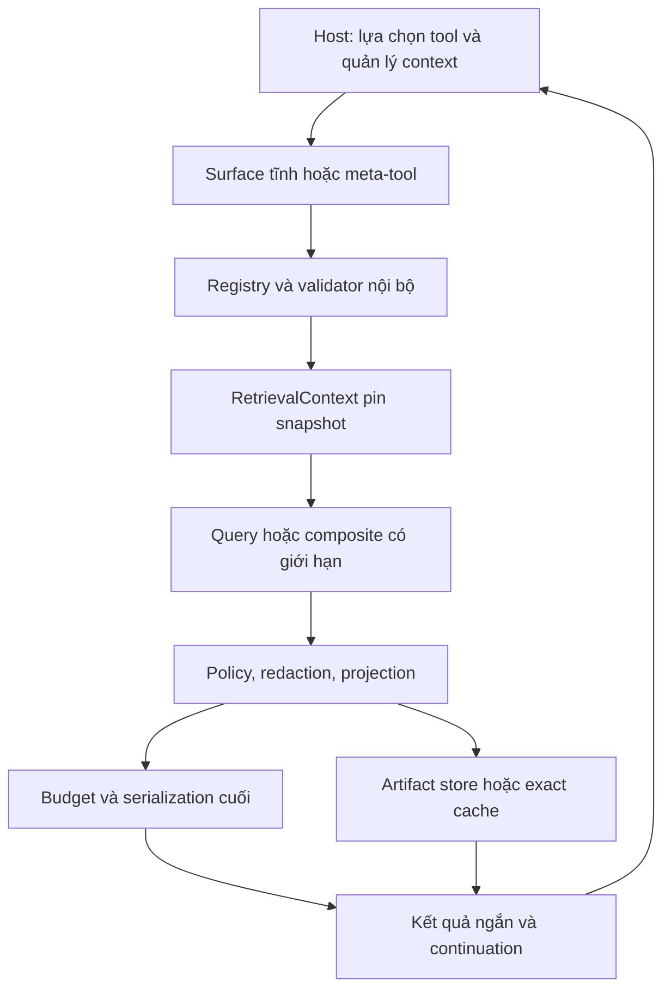

# Kế hoạch cải thiện hiệu quả token cho token-context-mcp

Ngày khảo sát: **2026-09-16**. Trạng thái: **kế hoạch dựa trên source và tài liệu đã đọc; chưa hiện thực, chưa chạy test hoặc benchmark mới**.

Repo: `D:\AI\token-context-mcp`; tên package `token-context-mcp`; MCP `repo_id="token-context"`. Mục tiêu là giảm tổng token để hoàn thành đúng tác vụ đọc code, đồng thời giữ bằng chứng nguồn, freshness, khả năng tiếp tục và tính tương thích client.

## 1. Quyết định đề xuất

Ưu tiên theo thứ tự: **đo đúng tầng → xử lý output lặp và budget → projection → composite retrieval → resource/cursor → deterministic cache → thử nghiệm discovery → sandbox nếu còn lợi ích**. Schema minification và đánh giá serialization đi cùng các bước đầu. Không lấy số lượng tool làm thước đo duy nhất: repo hiện có chín tool, nên một vòng discovery thêm có thể đắt hơn phần schema tiết kiệm được.

| Hướng người dùng đề xuất | Hiện trạng trong repo | Quyết định cho kế hoạch |
| --- | --- | --- |
| 1. Dynamic Tool Discovery | Chín tool được đăng ký tĩnh; chưa có discovery dispatcher | Giữ surface hiện tại để tương thích; thử mode hai meta-tool hoặc adapter deferred loading sau khi đo schema thực tế |
| 2. Offloading & Batching | Có thao tác retrieval tương đối cao cấp nhưng chưa gộp workflow nhiều bước | Làm composite cho đọc symbol/impact trước; DAG giới hạn trước arbitrary code sandbox |
| 3. Projection & Filtering | Có compact map, elide body, snippet và budget packing | Mở rộng preset output, fields allowlist, deduplicate evidence; giữ root và continuation |
| 4. Resources & State | Có SQLite index; chưa có artifact resources/cursor ứng dụng | Artifact đã lọc + URI + manifest nhỏ; cursor gắn snapshot, lifecycle rõ ràng |
| 5. Schema & Serialization | Mô tả chung dài; map đã dùng tuple; output text hiện pretty-print lại JSON | Đo schema sau host transformation; compact JSON là baseline; TSV chỉ cho bảng phù hợp |
| 6. Caching | Có reuse khi index và cache config; chưa có result cache | Cache chính xác theo snapshot/effective args; prompt cache ở host; semantic cache chỉ hỗ trợ tìm candidate |

Các ngưỡng tiết kiệm trong phần nghiệm thu là **mục tiêu đề xuất**, không phải kết quả đã đo. Số liệu lịch sử được ghi riêng cùng tên report và giới hạn diễn giải. Con số GitHub MCP 15.000–20.000 token trong đề bài không phải baseline của repo này.

## 2. Phạm vi và bằng chứng khảo sát

### 2.1. Snapshot làm căn cứ

| Mục | Giá trị quan sát |
| --- | --- |
| Git HEAD | `86cea213c69d02209493451ff9cbb043fbfe246f` |
| Working tree trước khảo sát | Đã sửa `src/token_context_mcp/server.py` và `src/token_context_mcp/retrieve/service.py` |
| MCP index | `run_20260830T094015Z_7205d27a`, tạo `2026-08-30T09:40:15.102095+00:00` |
| Index status | `stale`; 107 files, 330 symbols, 1.248 lexical edges; hai pending paths chính là hai file trên |
| Git provenance trong index | `commit_sha=null`; không coi HEAD hiện tại là commit của index |
| Package/SDK | Project 0.1.0; `pyproject.toml` yêu cầu `mcp>=2.0.0`; `uv.lock:389` và `:414` pin `mcp`/`mcp-types` 2.0.0 |
| Giới hạn token | Tool metadata trong phiên này hướng dẫn 32–4096; default source `ServerConfig.max_result_tokens=8192`. Không đồng nhất config mặc định với config của process đang chạy |

Hash SHA-256 đầy đủ của các file quan trọng tại lúc đọc:

```text
src/token_context_mcp/server.py
50dbdd983357e5185118ca5824663e7a6f97dade2a695555f0a5377dc654530f
src/token_context_mcp/retrieve/service.py
f219c3fb49e553ffe0ebb65952141e2400dd220ed8be8a687b29990b55cfc7b7
src/token_context_mcp/retrieve/token_budget.py
3b37bea9453bfcc32cc37ff789979c42a940c9b5056b9eb22d2687fd54f9c86c
src/token_context_mcp/index/freshness.py
5b2534ab44afe66781bb993d820492d989251825b688fe5e7e34d22e5e10e3e3
src/token_context_mcp/index/sqlite_store.py
18023bf05c45e8dcced0cafc4fd1b71c87ebaa06345d8535f3e318bf6273b4b5
```

Đã dùng chính MCP theo trình tự `list_repositories` → `get_index_status` → `get_repo_map`/`find_symbols` → `get_file_skeleton`/`get_symbol_context` → `get_impact_slice`. Ví dụ `build_server` có short ID `0f5a223c`; `_result` có ID `9ce134e5` trong index này. `get_symbol_context(build_server)` trả `stale_content_unavailable`, vì vậy nội dung hai file pending được đọc trực tiếp và đối chiếu hash. Các short ID và line của index cũ chỉ dùng định vị; bảng dưới dùng line source hiện tại.

Không refresh index, sửa code/config, cài dependency, chạy test/benchmark hoặc thay đổi hai file dirty. Phạm vi đọc tập trung vào transport, retrieval, budgeting, freshness/state và evaluation; đây không phải chứng nhận đã audit mọi dòng của toàn repo.

### 2.2. Bản đồ source liên quan

Các đường dẫn dưới đây tương đối với repo; số dòng là mốc tại snapshot khảo sát.

| Source anchor | Hiện trạng đã đọc | Hệ quả cho thiết kế |
| --- | --- | --- |
| `src/token_context_mcp/server.py:24`, `:45`, `:223` | `MCPServer`, chín tool đọc, transport stdio | Chưa có gateway đa-server, shell runner hoặc resources API của dự án |
| `src/token_context_mcp/server.py:32` | Instructions chung gồm repo ID, budget, profiles, freshness và lexical caveat | Trong metadata tool nhìn thấy ở phiên này, instructions được lặp trước từng mô tả; cần đo host serialization, chưa quy lỗi toàn bộ cho server |
| `src/token_context_mcp/server.py:278`, `:294` | `_result` trả cả text và structured; `_summarize` hiện dump gần toàn payload có indent | Trùng dữ liệu trên transport; docstring summary-only không còn khớp implementation |
| `tests/test_server.py:16`, `:83` | Test kỳ vọng đúng chín tool và text summary dưới 200 ký tự, không chứa symbols | Source hiện tại mâu thuẫn contract test khi đọc tĩnh; chưa chạy để tuyên bố test fail |
| `src/token_context_mcp/retrieve/token_budget.py:10`, `:18` | Ước lượng `ceil(UTF8 bytes/4)`; pack nguyên item | Không phải tokenizer model; item lớn có thể bị bỏ nguyên khối |
| `src/token_context_mcp/retrieve/service.py:950`, `:980` | Map tuple/short ID/file digests; lặp fit toàn service envelope | Đã có compression và envelope-aware packing; cần mở rộng tới serialization cuối |
| `src/token_context_mcp/retrieve/service.py:725`, `:1033` | Dựng packet trước pack; từng symbol đọc/hash file; evidence ở nhiều nơi | Có thể dùng request context chung và bảng evidence tham chiếu |
| `src/token_context_mcp/retrieve/service.py:1300` | Snippet một dòng, cắt 1.200 ký tự | Chưa có continuation tương ứng phần bị cắt |
| `src/token_context_mcp/retrieve/service.py:75`, `:127`, `:934` | Config reload theo mtime; freshness xét file đã index, dùng size/mtime shortcut | Cache phải có invalidation cho file mới, thay policy và nội dung thay nhưng giữ metadata |
| `src/token_context_mcp/index/sqlite_store.py:98`, `:259`, `:374` | Connection mở theo method; search dùng LIMIT | Chưa có paging snapshot nhất quán; composite cần pin một read context |
| `src/token_context_mcp/index/runner.py:194`, `:219`, `:472` | Manifest/run ID; thay database đích khi index | Cursor không được lặng lẽ trộn kết quả hai index run |
| `src/token_context_mcp/models.py:21`, `src/token_context_mcp/config.py:76`, `:221` | Server caps và budget profile được load từ TOML | Mỗi config mới phải có validation, consumer và precedence rõ ràng |
| `schemas/mcp-result.schema.json:6` | V1 bắt buộc freshness/budget/warnings/evidence/data; chặn extra properties | Projection không tùy tiện phá envelope; cursor/metadata mới cần versioned contract |
| `evals/measure_context_cost.py:45`, `:72` | Đếm serialized result bằng bytes/4; so với naive full-source read | Không đủ để kết luận chi phí model cho cùng một task |
| `evals/run_c3.py:116`, `:164`, `:253`; `src/token_context_mcp/telemetry/benchmark.py:37` | Có provider usage và paired report nhưng còn thiếu all-attempt accounting/identity gates | Ưu tiên sửa thiết kế phép đo trước headline savings |

### 2.3. Các vấn đề ưu tiên từ source

1. **Output lặp và compatibility chưa được giải quyết đồng thời.** `_summarize` hiện dùng `json.dumps(..., indent=2)` rồi `_result` gửi lại dict ở `structured_content`; live MCP result cũng chứa hai bản. Đếm số byte lặp là khả thi, nhưng không suy ra model bị tính tiền hai lần nếu chưa biết host đưa những phần nào vào context. Đo cả client chỉ dùng text, chỉ dùng structured, và dùng cả hai.
2. **Truncation text có thể mất tính parseable.** Cắt chuỗi ở 32.000 ký tự có thể cắt giữa JSON/source; nhãn “bytes” đang dùng `len(str)`, tức ký tự. Chuyển sang cắt theo record/source span trước serialize; không cắt giữa JSON đã render.
3. **Budget mới bảo vệ một tầng.** `_pack_to_budget` đã fit service envelope, nhưng wrapper, text duplicate, schema, argument và history replay thuộc chi phí khác. `status` còn ghi estimate bằng 0 dù có output. Một trường `estimated_tokens` không đại diện tổng chi phí.
4. **Root lớn có thể biến mất.** Theo control flow `pack_by_budget`, body root lớn có thể bị bỏ trong khi edge nhỏ vẫn còn. Giữ root identity/evidence bắt buộc; body chia chunk hoặc trả handle. Đây là rủi ro suy ra từ source, cần fixture xác nhận khi triển khai.
5. **Freshness và snapshot chưa đủ cho cache/cursor an toàn.** Vòng freshness chỉ duyệt file đã index; file mới có thể bị bỏ sót. Size/mtime không phải bằng chứng nội dung bất biến. Nhiều SQL method mở connection riêng có thể gặp database replacement giữa request. Cần kiểm thử concurrency, không tuyên bố đã quan sát race.
6. **Benchmark chưa có căn cứ cho tiết kiệm phổ quát.** Report lịch sử `evals/reports/c3-validated-content-summary-x1.json:39` có ba cặp B0/B1, median giảm retrieved-content 8,56%, CI95 từ −45,68% đến +59,70%; median giảm provider-total −0,32%. Tác vụ callers/impact từng tăng 39.404 → 57.404 estimated content tokens. Không dùng các số lịch sử làm validation cho working tree hiện tại.

## 3. Định nghĩa “tiết kiệm token” trước khi thay đổi

| Tầng đo | Thu thập gì | Dùng để kết luận gì |
| --- | --- | --- |
| Service | Semantic payload, serializer version, byte estimate, tokenizer nếu có | Packing có tuân thủ contract nội bộ |
| MCP wire | Bytes thực, JSON-RPC/SDK wrapper, text, structured, resource link | Transport có phình/lặp; không gọi đây là token billing |
| Host/model input | Tool schemas thực sự inject, instructions, arguments, outputs, resource reads, replay | Context model thực nhận; nếu host không expose thì ghi unknown |
| Provider | Input/output, cached read/write nếu provider có, usage của mọi attempt | Tokens/cost theo provider; tránh double count trường cumulative |
| Task | Độ đúng, evidence coverage, số lượt, retry/fallback, thời gian, chi phí đến completion | Có làm cùng việc với chất lượng tương đương và ít chi phí hơn |

Phép đo chính: tổng chi phí đến khi hoàn thành đúng task, kèm completion rate của toàn bộ task. Báo riêng model-visible schema tokens, retrieved tokens và provider usage. Cache hit phía server chủ yếu tiết kiệm CPU/latency; chỉ giảm token khi tránh được việc gửi/đọc lại nội dung.

Đăng ký trước số retry tối đa, timeout từng attempt/toàn task, điều kiện dừng và cancellation; dùng cùng policy giữa các arms. Báo ba đại lượng: tổng tokens mọi attempt của từng assigned task; completion rate = số task đạt rubric / số task được giao; amortized tokens per successful task = tổng tokens mọi attempt, kể cả thất bại / số task đạt rubric. Nếu không task nào thành công thì đại lượng cuối là undefined. Chi phí tiền được tính riêng từ usage và pricing snapshot phù hợp provider, gồm cache/tool charges khi có; không coi một cached token có giá bằng một uncached token. Paired savings theo task vẫn phải đi cùng kết quả toàn tập để không che failure cost.

Đối với mỗi model/host, ghi tokenizer/version và cách chuẩn hóa payload. Nếu chưa có tokenizer tương ứng, giữ tên `utf8-bytes-div-4-v1` và nhãn estimate; không biến thành hard cap của tokenizer thật. Khi có tokenizer, budget phải tính trên biểu diễn cuối dành cho model. Wire bytes vẫn có hard cap độc lập.

Mô hình break-even của discovery:

```text
Lợi ích = schema tĩnh tránh nạp
          - bootstrap schema
          - search arguments/results và schema được chọn
          - token của lượt model thêm, retry và context replay liên quan
```

Phải đo cold/warm prefix và nhiệm vụ ngắn/dài. Việc gỡ tool khỏi context cũ có thể phá cache; không coi “nạp 2–3 tool rồi tự gỡ” là hành vi sẵn có của MCP.

## 4. Kiến trúc mục tiêu và ranh giới trách nhiệm



Thiết kế trên là đề xuất. Hiện repo chưa có các module registry/context/artifact/cache tương ứng. “Read-only” tiếp tục nghĩa là không sửa source repo được đăng ký; artifact/cache có thể ghi trong vùng dữ liệu riêng có quota. Không mở rộng sang git write, build/test runner, log collector hoặc database connector chỉ để minh họa tiết kiệm token.

Spec hiện hành đã kiểm tra là MCP **2026-07-28**; thế hệ này dùng giao thức stateless và explicit application handles. Local SDK source có cả revision legacy và modern, nhưng chưa xác minh revision thật của kết nối hiện tại. Phải giữ ma trận compatibility và không nâng SDK chỉ để thực hiện plan. [MCP changelog](https://modelcontextprotocol.io/specification/2026-07-28/changelog)

## 5. Thiết kế chi tiết cho sáu hướng

### 5.1. Dynamic Tool Discovery — giữ catalog ổn định

MCP catalog và model tool context là hai lớp khác nhau. Spec không cho `tools/list` biến đổi theo connection hoặc như side effect của request khác; `listChanged` thông báo thay đổi catalog, không điều khiển lịch sử model. Vì vậy `search_tools` không đăng ký/gỡ tool tạm thời trên server theo từng lượt. [MCP tools](https://modelcontextprotocol.io/specification/2026-07-28/server/tools)

Thử nghiệm ba mode, chọn đúng một surface tại lúc khởi động:

| Mode đề xuất | Surface | Trường hợp dùng |
| --- | --- | --- |
| `static` | Chín tool hiện hữu; composite mới chỉ opt-in khi qua gate | Baseline và client không hỗ trợ deferred loading |
| `meta` | `search_tools(query, limit, max_tokens)` và `invoke_tool(tool_id, arguments, schema_revision)` | Client chỉ hiểu tool chuẩn; hai schema nhỏ cố định |
| `host_deferred` | Catalog server ổn định; adapter host/provider tự chọn schema | Chỉ bật khi có integration đã kiểm thử cho host cụ thể |

Registry là nguồn chuẩn duy nhất cho tool ID, category, version, schema, read-only policy và handler. Dispatcher validate arguments theo schema đầy đủ nội bộ; không dùng `eval`, reflection tùy ý hoặc arbitrary method name. Meta schema không được nhét union đầy đủ của mọi tool vào `arguments`, vì sẽ tái tạo schema bloat.

`search_tools` mặc định trả tối đa ba candidate; mỗi candidate gồm ID, một câu mô tả phân biệt và schema vừa đủ để gọi. Nếu schema không vừa budget, trả descriptor và continuation; `invoke_tool` có operation đọc schema chi tiết được allowlist. Catalog có capability liệt kê repo để model đi từ discovery tới repo ID mà không biết trước ID. Tool không tìm thấy trả lỗi ngắn cùng category gợi ý; không dump toàn catalog.

OpenAI Responses hỗ trợ `tool_search`/`defer_loading` cho model được tài liệu liệt kê, hiện là GPT-5.4 trở lên; điều này không chứng minh GPT-4o hoặc ứng dụng Codex đang dùng có cùng khả năng. Tài liệu mô tả schema được thêm cuối context và có thể còn dùng ở lượt sau; sửa loaded set có thể phá cache. Adapter là công việc riêng, không phải chỉ thêm field vào MCP tool. [OpenAI tool search](https://developers.openai.com/api/docs/guides/tools-tool-search)

Anthropic cũng phân biệt định nghĩa gửi qua API với schema model nhìn thấy; deferred reference trong history có thể được dùng lại. Chưa có lý do để giả định schema tự bị gỡ khi task kết thúc. [Anthropic tool search](https://platform.claude.com/docs/en/agents-and-tools/tool-use/tool-search-tool)

Gate: thử cùng chín tool thật trước, sau đó synthetic catalog lớn để nghiên cứu scaling; báo hai loại kết quả riêng. Với task một tool, meta mode có thể thua static. Chỉ chọn làm default nếu tổng workflow có lợi và tool-selection/argument validity đạt gate chất lượng.

### 5.2. Offloading Loop & Batching — composite trước, sandbox sau

Tác vụ phù hợp server đọc code là `inspect_symbol` hoặc `inspect_change_impact`, thay vì thêm một API chuyên route HTTP khi repo chưa có router resolver ngữ nghĩa.

| Composite đề xuất | Các bước server thực hiện | Kết quả cho model |
| --- | --- | --- |
| `inspect_symbol(repo_id, query, view, max_tokens)` | Resolve candidate → kiểm freshness → signature/body cần thiết → edges liên quan | Root, source evidence, ambiguity, context nhỏ và bước tiếp theo |
| `inspect_change_impact(repo_id, symbol_id, depth, max_tokens)` | Symbol context + lexical callers/callees + import dependents + test candidates | Nhóm affected candidates có loại quan hệ; không khẳng định complete blast radius |
| `inspect_index_health(repo_id, max_tokens)` | Trạng thái index + pending summary + khả năng trả body | Lý do stale và phạm vi có thể tin cậy; pending paths dài có cursor |

MVP cần một composite có tần suất sử dụng cao trước. Resolve ra nhiều symbol thì trả top candidates và trạng thái cần chọn, không đoán một identity. “Test candidate” lấy bằng import/name/path evidence vẫn chỉ là candidate, chưa chứng minh coverage. Không sinh thêm LLM summary ở server trong MVP: dùng template/grouping/deduplication xác định được, để không chuyển token cost sang một model ẩn.

`RetrievalContext` dùng chung trong một request: repo identity, effective config, snapshot/read transaction, lookup map, source hash/read cache và deadline. Mỗi file chỉ đọc/hash một lần trong context khi semantics cho phép. Tổng budget là của composite, không phải 4 bước × 4096; allocate cho root/evidence trước rồi các nhánh phụ. Bước độc lập có thể chạy song song với giới hạn; bước phụ thuộc chạy theo DAG. Hủy request phải hủy bước con và dọn state.

Sau composite, có thể thêm plan DSL giới hạn thay code tùy ý:

```json
{
  "repo_id": "token-context",
  "max_tokens": 1800,
  "steps": [
    {"id": "s", "op": "find_symbols", "args": {"pattern": "build_server", "limit": 3}},
    {"id": "c", "op": "symbol_context", "symbol_from": "s.unique", "include_body": false},
    {"id": "i", "op": "impact_slice", "symbol_from": "s.unique", "depth": 1}
  ],
  "return": ["c", "i"]
}
```

Đây là contract minh họa, chưa callable. `s.unique` phải lỗi rõ nếu không duy nhất. MVP giới hạn tám bước, depth graph ≤3, bounded fan-out, internal byte cap và output budget chung; reject cycle, unknown op và reference sai. Không trả mọi intermediate envelope: chỉ projection của `return`, kèm lỗi từng nhánh khi kết quả partial.

Code Mode có thể giữ intermediate data ngoài context, nhưng cần runtime cô lập thực sự và API hẹp. Cloudflare mô tả nhiều pattern, trong đó search/execute giúp tránh nạp tất cả declaration vào prompt. [Cloudflare Code Mode](https://developers.cloudflare.com/agents/model-context-protocol/codemode/)

Chỉ nghiên cứu sandbox sau khi composite/DSL vẫn còn workflow phổ biến cần script. PoC tách khỏi process retrieval, chỉ expose callable read API đã validate; không mount source tùy ý, không shell/network/env credentials, có CPU/memory/time/call/output caps và cancellation. Phải chứng minh isolation trên Windows hoặc môi trường triển khai được chọn; Python `exec` hoặc subprocess thông thường không tự là sandbox. Token của script, discovery, lỗi và retry đều tính vào phép đo.

### 5.3. Server-side Projection & Filtering

Bắt đầu bằng `view="minimal|normal|full"`, sau đó mới `fields` nếu workload cần. Preset giúp schema nhỏ và dễ cache hơn việc mọi tool nhận một query language tùy ý.

| View | Nội dung chính |
| --- | --- |
| `minimal` | ID, path/span, loại symbol/relation, evidence ref, status cần thiết |
| `normal` | Minimal + signature/snippet và lý do ranking ngắn khi có ích |
| `full` | Metadata chi tiết có budget; body vẫn phải yêu cầu rõ và có chunk |

`fields` chỉ chọn từ allowlist theo operation; reject field lạ thay vì trả thiếu lặng lẽ. Chưa thêm arbitrary JQ/JSONPath evaluator. Các filter thiết thực: `path_prefix`, `kind`, `direction`, `include_tests`, source line range. Chuẩn hóa path bằng policy có sẵn, không nối chuỗi để gọi shell.

Trình tự: authorize/validate → chọn dữ liệu → redact → projection → deduplicate → pack → serialize → kiểm budget cuối. Pushdown filter trước đọc dữ liệu khi an toàn; mọi đường output vẫn qua policy/redaction.

Mandatory metadata không cho `fields` bỏ: phiên bản contract, repo/snapshot, freshness với scope rõ, warnings ảnh hưởng quyết định, truncation/has_more và evidence đủ truy nguyên. Thiết kế envelope V2 cho evidence table + refs; V1 giữ schema cũ. Dùng hash đầy đủ nội bộ, chỉ rút gọn khi hiển thị và có cơ chế kiểm collision/resolution.

Root metadata và evidence được dành chỗ trước; body lớn chia theo definition/line boundaries. Trang có item lớn nhất vẫn phải tiến được hoặc trả lỗi `item_too_large` cùng handle, không tạo cursor lặp vô hạn. Khi minimum envelope vượt request budget rất nhỏ, trả lỗi `budget_too_small` và `minimum_required` trong error cap độc lập đã tài liệu hóa; không báo rằng đã thỏa budget 32 token một cách giả tạo.

Với log/build/database trong đề bài: repo hiện không thu thập các loại dữ liệu này. Nếu sau này có artifact log đã đăng ký, filter ERROR/WARN, group stack trace, context trước/sau năm dòng và count dropped là adapter tùy chọn. Không xóa toàn bộ dòng INFO mặc định vì nguyên nhân lỗi có thể ở đó. Diff cần base/current full hash và scope; không có base thì trả snapshot bình thường. Không bổ sung tool chạy test/build trong MVP này.

### 5.4. MCP Resources, explicit handles và cursor

Tool nặng tạo artifact đã qua policy và trả summary + resource link. Host quyết định đọc thêm; nếu host tự đọc hết resource thì lợi ích cần đo lại. Resource URI chỉ có ích khi có handler truy xuất thật, không phải đường dẫn trang trí. [MCP resources](https://modelcontextprotocol.io/specification/2026-07-28/server/resources)

Contract minh họa cho V2:

```json
{
  "schema_version": "2.0",
  "repo_id": "token-context",
  "index_run_id": "run_example",
  "freshness": "fresh",
  "truncated": true,
  "warnings": [],
  "data": {
    "artifact_uri": "token-context://artifact/opaque-id/manifest",
    "item_count": 120,
    "returned_count": 12,
    "has_more": true,
    "next_cursor": "opaque-cursor"
  }
}
```

Ví dụ lược bỏ evidence/budget để minh họa handle; implementation phải tuân thủ envelope đầy đủ. Thêm `ResourceLink` block khi host hỗ trợ. Manifest luôn nhỏ và liệt kê chunk URI đã bounded; `resources/read` một chunk không được trả toàn artifact lớn. Với host không consume resources, expose thao tác `read_artifact` qua dispatcher hoặc static tool opt-in dùng cùng policy, không tạo cơ chế đọc path tùy ý.

Pagination chuẩn MCP áp dụng các phương thức list; không tự paginate kết quả `tools/call` hoặc `resources/read`. Cursor cho search, symbol body và artifact là contract ứng dụng phải tự thiết kế. [MCP pagination](https://modelcontextprotocol.io/specification/2026-07-28/server/utilities/pagination)

Cursor opaque tham chiếu: workspace/principal scope, repo identity, pinned snapshot, canonical effective query, view/fields/sort, vị trí cuối, page-budget contract, serializer version, expiry. Nếu caller đổi query hoặc snapshot không còn thì trả `cursor_mismatch`/`cursor_expired`; không bắt đầu lại trang 1 mà vẫn báo continuation. Dùng stable sort có tie-breaker ID; `has_more` tính theo phần còn lại thật, tách khỏi `truncated` do budget. Không cần exact total count nếu đắt; cho phép unknown.

MVP dùng materialized ordered result/artifact hoặc pinned immutable snapshot được giữ tới expiry. Nếu index cũ bị thay và không có bản pin, invalidate cursor rõ ràng. Pin index không biến working-tree body thành immutable: copy phần source đã verify/redact vào artifact hoặc kiểm lại hash khi đọc chunk. Freshness của index snapshot và freshness so với worktree hiện tại phải phân biệt.

Handle có TTL, quota theo workspace và process, cleanup khi hết hạn, recovery sau restart. Application state được truyền bằng handle rõ ràng; không dựa ngầm vào connection. Với stdio local, scope theo OS user + registry/repo policy; nếu sau này có auth thì kiểm principal mỗi lần đọc. Handle không chứa absolute path, token hoặc source thô. Thiết kế này không yêu cầu lưu hội thoại model.

### 5.5. Schema Minification & Token-aware Serialization

Tách ba mục độc lập: mô tả/schema tool, biểu diễn payload, và host renderer. Rút gọn mô tả vẫn giữ khác biệt giữa `find_symbols` và `search_source`, repo ID, giới hạn quan trọng, lexical/freshness semantics. Không xóa enum, required, type, constraints hoặc output schema để lấy số token đẹp. Giữ thứ tự ổn định; docs dài đi qua resource/on-demand guide khi có consumer.

`mcp-compressor` có repo của Atlassian Labs, là proxy bên thứ ba. Pattern chính là progressive discovery với `get_tool_schema`/`invoke_tool` và chế độ bổ sung `list_tools`; tool được chọn vẫn có full schema. Dùng làm thiết kế tham khảo/đối chứng, không coi là component bắt buộc hay chuẩn MCP. [Atlassian Labs mcp-compressor](https://github.com/atlassian-labs/mcp-compressor), [cơ chế hoạt động](https://atlassian-labs.github.io/mcp-compressor/concepts/how-it-works/)

So sánh format trên **cùng semantic data**:

| Format | Phù hợp | Ràng buộc |
| --- | --- | --- |
| Compact JSON | Baseline, nested structure, machine consumer | Serialize một lần nhất quán; bỏ pretty indent nếu host không cần |
| JSON tuples + columns | Danh sách symbol/edge đồng nhất | Cần columns/version; không biến mọi field thành mã khó hiểu |
| TSV | Bảng phẳng nhiều dòng | Escape tab/newline/null; có header; giữ path/hash nguyên nghĩa |
| Markdown table | Bảng ngắn người/model đọc | Pipes, code multiline và hàng rộng dễ gây overhead |
| YAML/TOML | Chỉ nghiên cứu nếu task cụ thể có lợi | Không mặc định ít token; indentation, types, nesting phải round-trip |

Không có format tối ưu cho mọi model/task; response preset và lựa chọn format phải đánh giá cùng chất lượng sử dụng tool. [Anthropic: Writing effective tools](https://www.anthropic.com/engineering/writing-tools-for-agents)

MCP vẫn dùng JSON-RPC; TSV/YAML là nội dung text hoặc resource, không thay toàn bộ wire protocol. Phải giải quyết việc text và structured cùng xuất hiện. Chuẩn khuyến nghị serialized JSON text để tương thích structured output, nên không bỏ text cho mọi client một cách mặc định. [MCP structured content](https://modelcontextprotocol.io/specification/2026-07-28/server/tools#structured-content)

Ba output mode dự kiến: `legacy_dual` giữ compatibility; `structured` gửi payload + summary ngắn khi host đã chứng minh dùng structured; `text` gửi representation đầy đủ cho host text-only, không quảng cáo outputSchema yêu cầu structured bị thiếu. Chọn bằng cấu hình integration rõ ràng, không suy đoán từ tên client. Mode structured là optimization có compatibility contract riêng. Nếu không điều khiển host, giữ mode tương thích và ưu tiên giảm semantic payload ở cả hai bản.

### 5.6. Caching & Semantic Memoization

**Prompt cache thuộc host/provider.** Giữ schema và static prefix có thứ tự ổn định; đưa snapshot/timestamp/query thay đổi ra phần dynamic phù hợp. Đừng bỏ thông tin freshness để giữ prefix. Tài liệu OpenAI khuyên giữ definitions/order ổn định và dùng cơ chế deferred append khi được hỗ trợ. Theo dõi cached read/write theo model, không hard-code retention hay giá của GPT-4o cho model khác. [OpenAI prompt caching](https://developers.openai.com/api/docs/guides/prompt-caching)

**Request cache trước, cross-request cache sau.** Request cache tránh lặp đọc/hash source trong composite. Deterministic result cache ưu tiên phần tính toán từ immutable index; freshness hiện tại và policy phải được kiểm riêng trước khi trả kết quả.

```text
cache_key = hash(
  repo_identity + snapshot_id + snapshot_hash + tool/implementation_version
  + canonical_effective_arguments_after_profile_resolution
  + source_hashes_when_worktree_is_read
  + policy/redactor/config_revision
  + view/fields/format/serializer_revision + tokenizer/budget_contract
  + authorization_scope
)
```

Không chỉ dùng `repo_id + query` hoặc Git SHA: repo có dirty files và index `commit_sha=null`. Canonicalization chỉ chuẩn hóa semantics đã chứng minh tương đương; không tự lower-case query/path trên mọi platform. Cache item có TTL/LRU/quota, negative-result TTL ngắn và hit/miss/invalidation counters. Config reload theo mtime hiện hữu chưa phải cache invalidation đủ; dùng effective config fingerprint và policy revision.

Các event invalidation: reindex, add/edit/delete/rename file, thay root/allowlist, thay redactor, view/format/budget/tokenizer thay đổi, identity khác. Không cache “fresh” lâu hơn khả năng quan sát thay đổi; manifest scan/watch chỉ là tối ưu sau khi có test cho miss event. Kết quả lỗi policy không được dùng để lộ dữ liệu cache cũ.

Chuẩn MCP 2026-07-28 có caching hints cho một số phương thức discovery/list/read, không phải giấy phép cache tùy ý mọi tool call. TTL là hint; dữ liệu private phải theo cùng authorization context. Result cache cho retrieval vẫn là logic riêng của dự án. [MCP caching](https://modelcontextprotocol.io/specification/2026-07-28/server/utilities/caching)

**Semantic memoization hoãn khỏi MVP.** Có thể dùng similarity để đề xuất tool/query/artifact candidate, nhưng trước khi dùng fact phải xác minh repo/snapshot/symbol/hash/policy như exact cache. Hai câu “callers của save” ở hai file khác nhau không được dùng chung answer. Embedding/model/API phát sinh cost mới phải được tính.

**Không suppress payload chỉ vì server đã trả trước đó.** Model có thể đã compact mất dữ liệu. Chỉ trả `unchanged`/delta khi caller đưa `known_result_id` còn hợp lệ và có đường đọc lại full/chunk. Cơ chế acknowledgment này cần host integration; cache hit thông thường vẫn trả payload thì chỉ claim lợi ích latency/compute.

## 6. Các giai đoạn thực hiện

Tất cả file “tạo mới” dưới đây là đề xuất, chưa tồn tại do plan này. Ước lượng theo engineer-day cho một người đã quen repo, chưa gồm thời gian đợi API/grading; dùng để chia work package, không phải cam kết lịch.

| Giai đoạn | Việc làm cụ thể | File sửa / tạo mới | Phụ thuộc, effort và điều kiện ra |
| --- | --- | --- | --- |
| **P0 — baseline và measurement contract** | Freeze HEAD + dirty diff + full hashes; xác định runtime/protocol/host renderer; ghi schema và output ở từng tầng; sửa thiết kế C3 identity/grading/attempt accounting | Sửa `evals/measure_context_cost.py`, `evals/run_c3.py`, `evals/run_c3_matrix.py`, `src/token_context_mcp/telemetry/benchmark.py`, `evals/c3_protocol.md`, `docs/BENCHMARK.md`; tạo `evals/measure_schema_cost.py`, `evals/grade_c3.py` | Đầu tiên; 2–4 ngày. Có manifest tái lập, missing metric không bị đổi thành 0; lịch sử được giữ nguyên |
| **P1 — transport, budget, projection** | Chọn output mode theo client; finalizer nhất quán; không cắt JSON; giữ root; presets và evidence refs V2; rút gọn descriptions có kiểm soát | Sửa `server.py`, `retrieve/service.py`, `retrieve/token_budget.py`, `models.py`, `config.py` trong package; tạo `retrieve/serialization.py`, `retrieve/projection.py`, `schemas/mcp-result-v2.schema.json`, `evals/measure_serialization_cost.py` | Sau P0; 3–5 ngày. Text-only/structured/both đều nhận đủ nội dung theo mode; mandatory metadata và budget contracts pass |
| **P2 — composite và request context** | Pin snapshot/read transaction; memo file reads; một composite phục vụ inspect symbol/impact; một budget và error partial; DSL chỉ khi composite thiếu | Sửa `retrieve/service.py`, `index/sqlite_store.py`, `server.py`; tạo `retrieve/context.py`, `retrieve/workflows.py`; DSL dự kiến `retrieve/query_plan.py` sau gate riêng | Sau contract P1; 3–5 ngày. Kết quả tương đương primitive, ít lượt model trên task mục tiêu, không trộn snapshot |
| **P3 — artifacts/resources/cursors** | Store artifact redacted; manifest/chunk URI; opaque continuation; quotas/TTL/ownership; fallback đọc artifact cho host thiếu resources | Sửa `server.py`, `models.py`, `config.py`, V2 schema; tạo `resources/__init__.py`, `resources/artifact_store.py`, `resources/handlers.py`, `retrieve/pagination.py` | Sau P1 + snapshot contract P2; 3–5 ngày. Traverse đủ không trùng/thiếu, reindex/expiry xử lý rõ, tổng workflow có lợi |
| **P4 — exact cache** | Cache query/ranking/slices theo key đầy đủ; freshness tách biệt; invalidation và hit/miss; delta chỉ opt-in có acknowledgment | Sửa `retrieve/service.py`, `index/freshness.py`, `config.py`; tạo `retrieve/cache.py`; mở rộng telemetry | Sau P2; kết hợp P3 nếu cache artifact; 2–4 ngày. Không replay nguồn/policy cũ; báo latency và token riêng |
| **P5 — discovery adapter** | Registry dùng chung; hai meta-tool hoặc provider adapter; catalog ổn định; tool search ranking đơn giản; per-host comparison | Sửa `server.py`, `config.py`; tạo `tools/__init__.py`, `tools/catalog.py`, `tools/discovery.py`, `tools/dispatch.py`; adapter độc lập `integrations/` nếu có host API được hỗ trợ | Sau P0; có thể nghiên cứu song song P2–P4, rollout sau P1; 3–5 ngày. Tính đủ discovery overhead, không giảm tool-selection quality |
| **P6 — sandbox nghiên cứu** | So sánh DSL và code mode; isolation prototype; API allowlist; resource/cancellation limits; red-team output/escape cases | Tạo thư mục thí nghiệm riêng `experiments/code_mode/` và design review; chưa thêm dependency sandbox vào core | Chỉ mở khi P2 không đáp ứng workflow có giá trị; timebox 3–5 ngày để quyết định tiếp hay dừng |
| **P7 — validation và rollout** | Paired ablations, quality grading, cold/warm cache, small/large repo, client matrix; viết findings và migration hướng dẫn | Sửa `docs/BENCHMARK_FINDINGS.vi.md`, `.en.md`, `docs/PROMPTING.vi.md`, `.en.md`, `README.md`, `CHANGELOG.md`; report mới đặt tên experiment/revision rõ | Mỗi phase có gate riêng; rollout tổng cuối, khoảng 2–4 ngày phân tích ngoài thời gian chạy |

Lô đầu nên dừng ở **P0 + P1**, rồi đo lại trước khi phân bổ thời gian cho discovery hoặc sandbox. Có thể giảm phần output lặp mà chưa cần thêm một lớp gateway. Không cộng phần trăm của các phase vì chúng có thể cùng loại bỏ một phần token.

### 6.1. Module và interface cần thống nhất trước code

| Interface đề xuất | Trách nhiệm | Không được làm |
| --- | --- | --- |
| `ToolCatalog.resolve(tool_id, revision)` | Schema canonical, callable allowlist, metadata | Tự nạp plugin/code từ repo content |
| `RetrievalContext` | Pin snapshot, effective policy, deadline và request memo | Chia sẻ worktree freshness qua request mà không kiểm lại |
| `OutputProjector` | Preset/fields và evidence refs sau redaction | Bỏ warnings/provenance để vừa budget |
| `ResultFinalizer` | Serialize đúng mode, count, fit; cursor nếu thiếu | Cắt raw JSON hoặc sửa estimated_tokens cho đẹp |
| `ArtifactStore` | Manifest/chunk bất biến, bounded read, TTL/quota | Lưu unredacted source/log hoặc expose absolute paths |
| `CursorStore` | Resolve continuation theo query/snapshot/scope | Tiếp tục trên index mới mà không báo |
| `ResultCache` | Exact identity, invalidation, LRU/metrics | Dùng semantic similarity thay source identity |
| `HostAdapter` | Tool injection/rendering, resource policy, usage ledger | Tuyên bố khả năng native chưa được host hỗ trợ |

Không tạo framework rộng trước khi có consumer. Có thể bắt đầu với helper nhỏ và tách module khi interface đã rõ. Nine-tool static mode vẫn gọi cùng handler/validator với meta/composite, tránh hai implementation cho cùng semantics.

### 6.2. Config dự kiến và wiring

Các tên/default sau là **đề xuất**, chưa có hiệu lực. Tránh thêm tất cả thành parameter cho từng tool vì schema cũng có chi phí.

| Key dự kiến | Default khi phát hành thử | Consumer và precedence |
| --- | --- | --- |
| `server.tool_surface` | `static` | `build_server` chọn surface lúc startup; đổi cần restart, không hot-mutate catalog theo request |
| `server.output_mode` | `legacy_dual` cho host chưa kiểm chứng | `ResultFinalizer`; integration config rõ ràng quyết định, tool không tự override |
| `server.result_schema_version` | V1 cho surface legacy; V2 opt-in | Catalog/output schema/finalizer đồng bộ, không dùng một version cho hai shape |
| `retrieval.default_view` | `normal` | Explicit request → selected profile → repo/server default; server cap luôn giới hạn trên |
| `retrieval.tokenizer` | Byte estimator hiện hữu, tên rõ | Finalizer + benchmark; tokenizer thật opt-in cùng revision, không tự tải model |
| `workflows.max_steps` | 8, nếu DSL được bật | Validator/DAG runner; client có thể yêu cầu ít hơn, không vượt server cap |
| `artifacts.enabled` | `false` cho tới khi P3 pass | Artifact handlers và catalog surface phải nhất quán |
| `artifacts.ttl_seconds` | 900 trong pilot | Store/cursor; returned manifest ghi expiry; quota áp dụng dù TTL chưa hết |
| `artifacts.max_total_bytes` | 64 MiB trong pilot | Store eviction; manifest lỗi expired thay đọc thiếu dữ liệu |
| `cache.enabled` | `false` cho cross-request pilot đầu | Exact cache; request-local memo bật riêng sau P2 gate |
| `cache.max_entries`, `cache.max_bytes` | 256 / 32 MiB trong pilot | LRU, riêng từng process/scope; không tính là giới hạn toàn máy |
| `cache.semantic_reuse` | Không có trong MVP | Nếu nghiên cứu thêm phải có design/gate riêng |

Giá trị 900 giây, 64 MiB, 256 entries là điểm khởi đầu để đo, không suy ra tối ưu cho máy hiện tại. Mỗi key phải xuất hiện trong model, loader, validator, example config, consumer và test. Với profile, resolve effective args trước cache key; schema revision/catalog changes không theo hot reload config mtime một cách ngầm định. Chính sách access phải có hiệu lực khi resource/cache được đọc lại.

## 7. Kế hoạch kiểm thử và đánh giá

Phần này là công việc **sau khi triển khai**. Không có test/benchmark nào dưới đây đã chạy trong lượt lập plan.

### 7.1. Sửa phép đo hiện hữu trước

1. `measure_context_cost.py:50` không còn mô tả byte-estimate của wire như bound cho billed tokens. `wire_tokens` đang dùng JSON escaping khác service; ghi serializer rõ hoặc đo exact bytes captured, không tái serialize rồi gọi đó là wire thực.
2. `run_c3_matrix.py:31`, `:62` đang truyền một `--task-success` có sẵn cho các answer chưa chạy. Thay bằng grading sau thu thập, theo từng answer, blind với arm/cost.
3. `telemetry/benchmark.py:37` không overwrite baseline trùng identity. Reject duplicate/missing identity, prompt/source/model/host mismatch; hai prompt hashes cùng thiếu không được xem là match.
4. `run_c3.py:116` và `:253` cần xác định usage là per-turn hay cumulative và lưu mọi failed/retried/cancelled attempt. Không loại token của attempt lỗi khỏi tổng cost. Khi provider không trả usage thì ghi missing/partial, không suy 0.
5. `run_c3.py:164` bổ sung accounting cho discovery, schema, arguments, resource reads và fallback; MCP `isError=true` cũng phải được nhận diện ngoài envelope error dict.
6. `telemetry/benchmark.py:54` hiện tính reduction cả khi quality fail. Báo all-task outcome/cost cùng quality-qualified paired effect; không chọn mỗi run thành công để che regression. Nếu quality gate fail, không claim release tiết kiệm dù subset rẻ hơn.

### 7.2. Bộ contract tests cần có

| Nhóm | Trường hợp bắt buộc | File test dự kiến |
| --- | --- | --- |
| Transport | Text-only, structured-only, both; error `isError`; outputSchema hợp mode; không raw slicing | Mở rộng `tests/test_server.py`; tạo `tests/test_output_contract.py` |
| Token/budget | EN/VI/CJK, Unicode escaping, multiline code, long path; 32/511/512/4096 và configured cap; minimum envelope | Mở rộng `tests/test_index_retrieval.py`, `tests/test_global_config_and_limits.py` |
| Projection | Unknown fields; mandatory metadata; null vs empty; root rất lớn; evidence refs resolve được | Tạo `tests/test_projection.py` |
| Composite | Primitive-equivalence, ambiguous symbol, stale source, partial branch error, cancellation, budget tổng, giới hạn DAG | Tạo `tests/test_workflows.py` |
| Snapshot | Concurrent reindex giữa các bước, edit body sau pin, rename/add/delete, cùng size+mtime nhưng khác bytes | Mở rộng retrieval/freshness tests; tạo `tests/test_snapshot_context.py` |
| Cursor/resource | Union các trang bằng full expected set, không duplicate, tiến khi item lớn, query/scope mismatch, expiry, restart, quota | Tạo `tests/test_resources_and_pagination.py` |
| Cache | Cold/warm equivalence, invalidation theo profile/policy/root/source/tokenizer; khác principal; unknown acknowledgment | Tạo `tests/test_retrieval_cache.py` |
| Discovery | Static/meta semantics tương đương; schema revision sai; unknown ID; invalid args; no catalog side effects | Tạo `tests/test_tool_discovery.py` |
| Serialization | Round-trip data/evidence; tab/newline/pipe/backslash/Unicode/null/nested/error | Tạo `tests/test_serialization.py` |
| Evaluation | Duplicate/missing pairing, usage cumulative, failure cost, missing metrics, per-answer grade | Mở rộng `tests/test_c3_runner.py`, `tests/test_benchmark_and_release.py` |

Tiếp tục các test policy hiện hữu `test_path_policy.py`, `test_local_privacy.py`, `test_semantic_boundary.py` khi feature chạm những đường đó. Test mới kiểm semantic contract và failure behavior; không viết snapshot test chỉ khóa mọi ký tự mô tả để rồi cản tối ưu.

### 7.3. Ma trận benchmark có thể tái lập

Freeze ít nhất repo `token-context` và một repo khác đã đăng ký; thêm fixture nhỏ và output lớn kiểm corner case. Với mỗi repo ghi snapshot/index/full-source manifest, dirty diff hash, config, implementation commit, SDK/protocol, host version/render mode, model/tokenizer, prompt/rubric hash, timeout và tool caps. Index dùng cho benchmark tương lai cần được cập nhật trên snapshot cô lập đã chốt; không lấy index stale đang khảo sát để làm baseline fresh.

Task families: orientation; locate symbol; public surface một file; search body; callers/impact; trace có evidence; body vượt budget; truy vấn phân trang; đọc artifact một nhánh; lặp query; thêm/sửa file gây invalidation; discovery một tool và discovery nhiều nhóm. Đầu ra mong đợi phải xác định trước; đừng chỉ so với đọc toàn repo khi task chỉ cần một function.

Các arms:

- `B-native`: agent native đã tối ưu hợp lý cho cùng task, có quyền/fallback được mô tả.
- `B-current`: working tree đã freeze, bao gồm behavior duplicate hiện tại.
- `B-compatible`: behavior serialization đã sửa và được host xác nhận; làm baseline tiếp theo để không gán mọi lợi ích cho feature mới.
- `V-projection`, `V-composite`, `V-resource`, `V-cache`, `V-discovery`, `V-format`: từng feature so với baseline tương thích.
- `V-combined`: tổ hợp đã qua gate; không cộng số của single-feature arms.

Pilot trước trên tập nhỏ, sau đó tối thiểu **5 task nền × 3 replicate × các arms được chọn** cho mỗi repo; đây là mức thăm dò, không tự đủ lực thống kê. Discovery/resource/cache có task riêng. “Seed” chỉ là replicate ID nếu provider không hỗ trợ hoặc chưa xác minh RNG seed. Randomize/balance thứ tự arm; cold và warm server cache tách khỏi cold/warm provider prefix; chạy một cách không làm warm arm sau bằng arm trước ngoài thiết kế.

Grade evidence correctness, task success, relevant-symbol coverage, stale/ambiguous caveat, số lần phải đọc bổ sung. Khi pooling repo/task/replicate, báo số task độc lập; dùng paired bootstrap phù hợp và cluster theo task/repo, không coi mọi token/chunk là sample độc lập. Không có đủ sample thì báo chưa kết luận.

Với chỉ hai repo, báo effect riêng từng repo hoặc phân tầng theo repo và bootstrap task pairs; không dùng hai repo clusters để suy rộng toàn hệ sinh thái. Muốn claim tổng quát cần thêm repo độc lập và workload đại diện. Giữ một tập task xác nhận không tham gia tuning; sau pilot chốt feature/default/gates rồi chạy confirmation trên tập đó trước khi đổi mặc định.

### 7.4. Gates nghiệm thu đề xuất

| Gate | Ngưỡng / tiêu chí cần kiểm chứng |
| --- | --- |
| **G0 Reproducibility** | Mọi paired run có đủ identity; không silent overwrite/missing=0; all-attempt usage có coverage report |
| **G1 Contract** | 100% fixture bắt buộc qua; mandatory evidence/freshness/truncation không mất; không lộ nguồn bị policy chặn; serializer/parser tương đương |
| **G2 Quality** | Pilot không có correctness regression mới trên golden tasks. Mở rộng phải khai báo non-inferiority margin trước; đề xuất 2 điểm phần trăm success rate, CI phải hỗ trợ kết luận, không chỉ nhìn mean |
| **G3 Projection/format** | Mục tiêu median model-visible result giảm ≥20% trên workload phù hợp, p95 không tăng >10%, đồng thời không tăng follow-up đủ để mất lợi ích toàn task |
| **G4 Composite** | Task thực sự cần nhiều bước giảm ít nhất một model turn; cùng evidence/quality; tổng workflow token/cost không tăng; internal work/cancellation vẫn bounded |
| **G5 Discovery** | Mục tiêu initial visible schema giảm ≥30%; tổng token đến completion có paired CI theo hướng có lợi; task ngắn không bị regression >5% nếu định bật default |
| **G6 Resources** | Task đọc một nhánh có lợi sau tính mọi `read_resource`; task cần toàn dữ liệu vẫn complete và không tăng cost ngoài ngưỡng đã đăng ký; URI-only response ban đầu không đủ để pass |
| **G7 Cache** | Exact equality/semantic equivalence khi hit; invalidation fixtures 100%; cold/warm latency báo riêng. Chỉ claim token saving khi host tránh resend/replay được chứng minh |
| **G8 Rollout** | Ít nhất host đang dùng thực tế + text-only fallback qua compatibility; quality gate pass trước cost claim; flag rollback và migration doc có sẵn |

Các ngưỡng 20%/30%/5%/10% và margin 2 điểm phần trăm là quyết định sản phẩm đề xuất để bắt đầu, cần chốt trước experiment và không sửa sau khi thấy kết quả. Với chín tool hiện tại, G5 có thể fail hợp lý; khi đó giữ static. Nếu CI chưa đủ rõ thì giữ feature opt-in, không đổi tên pilot thành “validated savings”.

## 8. Rollout, rollback và giới hạn

Giữ V1/static mặc định qua P0. P1 thử trên cấu hình host riêng; không âm thầm đổi text summary khi host chỉ đọc text. V2 có schema riêng và migration adapter rõ; consumer cần biết field/evidence ref mới. Mỗi feature có flag độc lập và report theo flag set; rollback về static/legacy compatibility phải không cần xóa index hoặc sửa source repo.

Artifact/cursor trả sau rollout có version; rollback không hỗ trợ version đó thì trả lỗi recoverable và cho phép chạy lại query. Cache là disposable derived data; eviction không được làm hỏng retrieval. Không tự xóa vùng cache/index không thuộc feature chỉ để dọn thí nghiệm.

| Rủi ro | Dấu hiệu theo dõi | Xử lý trong plan |
| --- | --- | --- |
| Schema ngắn quá khiến gọi sai | Tool selection/argument error tăng | Giữ mô tả phân biệt và on-demand schema; rollback minification |
| Projection làm mất bằng chứng | Answer đúng tên nhưng sai span/hash; reread tăng | Mandatory provenance và quality grader; full/chunk continuation |
| Discovery phá prefix cache | Initial schema giảm nhưng uncached/write cost tăng | Stable catalog/deferred append; benchmark cả warm và cold |
| Artifact chỉ chuyển bloat sang lượt sau | Auto-read nhiều URI, tổng retrieval không giảm | Manifest nhỏ, selective chunk read, host policy được kiểm chứng |
| Cache trả code cũ | Freshness stale nhưng cache báo fresh | Snapshot/source/policy keys; validate current state riêng |
| Sandbox tăng complexity hơn lợi ích | Nhiều script lỗi, isolate startup/retry cost cao | Giữ composite/DSL; P6 có quyền dừng sau timebox |
| Benchmark chọn lọc thành công | Failure usage thiếu; grade được gán trước | Attempt ledger bất biến và blind grading |
| Hai file dirty thay đổi trong lúc làm | Hash lệch snapshot tài liệu | Re-audit phần thay đổi trước implementation; không tự rollback công việc có sẵn |

## 9. Checklist bàn giao cho lượt triển khai

- [ ] Chốt host cần hỗ trợ và output mode bằng captured consumption; ghi protocol revision thật.
- [ ] Freeze working tree/diff/manifest; reconcile index trên bản dùng benchmark.
- [ ] P0 đo schema, service, wire, host và provider tách biệt; hoàn thiện grading/all-attempt ledger.
- [ ] P1 xử lý duplicate, truncation và budget; đo lại trước gateway/sandbox.
- [ ] Chọn một composite có lợi nhất và thiết kế pinned `RetrievalContext`.
- [ ] V2 projection/evidence/cursor contract review xong; legacy V1 giữ tương thích.
- [ ] Resource/chunk và exact cache có lifecycle, invalidation và policy tests.
- [ ] Discovery pass break-even trên catalog thật trước khi bật mặc định.
- [ ] Format và prompt cache được đo bằng tokenizer/usage phù hợp; không suy từ bytes đơn thuần.
- [ ] Report mới ghi rõ quality, effect uncertainty, cold/warm, host/model và phạm vi claim.
- [ ] P6 chỉ mở khi còn nhu cầu đã chứng minh sau composite/DSL.

## 10. Nguồn kỹ thuật đã đối chiếu

Các nguồn online được kiểm tra ngày 2026-09-16; cần kiểm tra lại version khi hiện thực. Khuyến nghị thiết kế trong plan là tổng hợp áp dụng vào source repo, không phải cam kết tỷ lệ tiết kiệm của nhà cung cấp.

| Nguồn | Dùng để đối chiếu |
| --- | --- |
| [MCP 2026-07-28 tools](https://modelcontextprotocol.io/specification/2026-07-28/server/tools) | Catalog, structured/text compatibility và state handles |
| [MCP changelog](https://modelcontextprotocol.io/specification/2026-07-28/changelog) | Ranh giới legacy/modern, stateless protocol |
| [MCP resources](https://modelcontextprotocol.io/specification/2026-07-28/server/resources) | Resource URI và vai trò host |
| [MCP pagination](https://modelcontextprotocol.io/specification/2026-07-28/server/utilities/pagination) | Các phương thức list có cursor chuẩn |
| [MCP caching](https://modelcontextprotocol.io/specification/2026-07-28/server/utilities/caching) | TTL/scope/identity và giới hạn consistency |
| [OpenAI tool search](https://developers.openai.com/api/docs/guides/tools-tool-search) | Provider/client deferred schemas và cache trade-off |
| [OpenAI prompt caching](https://developers.openai.com/api/docs/guides/prompt-caching) | Stable prefix, usage và model-specific cache behavior |
| [Anthropic tool search](https://platform.claude.com/docs/en/agents-and-tools/tool-use/tool-search-tool) | Deferred definitions và references trong history |
| [Cloudflare Code Mode](https://developers.cloudflare.com/agents/model-context-protocol/codemode/) | Code execution/search patterns và isolation |
| [Anthropic effective tools](https://www.anthropic.com/engineering/writing-tools-for-agents) | Response design và đánh giá format theo task |
| [Atlassian Labs mcp-compressor](https://github.com/atlassian-labs/mcp-compressor) | Proxy pattern tham khảo, không phải dependency đã chọn |

Các artifact benchmark cũ được đọc để nhận diện giới hạn hiện có; chưa chạy lại. Không sửa hoặc đổi nhãn các report lịch sử trong lượt viết plan này.
