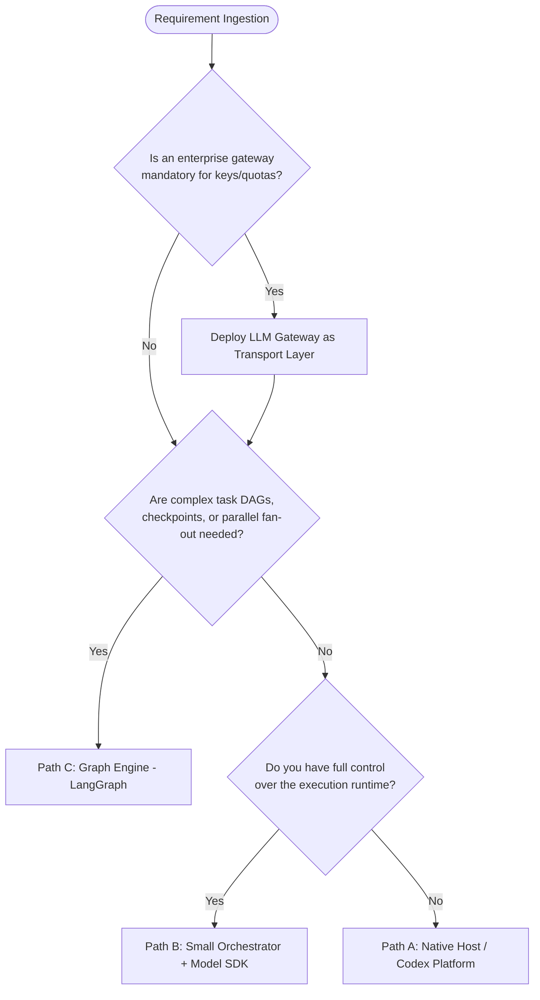

# Capability & Implementation Matrix

This matrix establishes the definitive architectural comparison across the three primary implementation paths and the optional gateway layer described in the Multi-Agent Routing Handbook. It distinguishes verified capabilities, host-dependent constraints, and operational trade-offs for coordinating strong supervisor models with economical worker models.

---

## 1. Architectural Paths Overview

| Dimension | Path A: Native Host / Codex | Path B: Small Orchestrator + SDK | Path C: Graph Engine (LangGraph) | Optional Layer: LLM Gateway (LiteLLM) |
| :--- | :--- | :--- | :--- | :--- |
| **Primary Owner** | Native Host / Agent Platform | Custom Script / Application Runtime | Declarative State Graph Engine | Centralized Reverse Proxy / Middleware |
| **Outer Loop Control** | Host-managed agent loop | Direct application code (`asyncio`) | Graph scheduler (`StateGraph`) | Transport layer only (No orchestration) |
| **Model Assignment** | Role-based or host config | Per-request dynamic model parameter | Per-node worker configuration | Route/alias mapping on proxy |
| **Context Isolation** | Host-dependent (brief or full copy) | Explicit context packet injection | Scoped node state passing | Pass-through of caller context |
| **State Persistence** | Host transcript/session store | Custom application state store | Pluggable checkpointer (SQLite/Postgres) | Ephemeral request/response proxy |
| **Budget Enforcement** | Host quota / soft prompts | In-process pre-dispatch ledger | State-guarded conditional branches | Centralized budget reservation API |
| **Complexity Level** | Minimal (Prompt & host configuration) | Low-to-Medium (Custom Python logic) | Medium-to-High (State schemas & reducers) | Operational (Separate service deployment) |

---

## 2. Granular Capability Comparison

| Feature / Capability | Path A: Native Host | Path B: SDK Orchestrator | Path C: Graph Engine | LLM Gateway Proxy |
| :--- | :---: | :---: | :---: | :---: |
| **Fine-Grained Role Prompting** | ✅ High | ✅ High | ✅ High | ➖ N/A (Transparent) |
| **Dynamic Subagent Spawning** | ⚠️ Host-limited | ✅ Programmatic | ✅ Programmatic (`Send`) | ➖ N/A |
| **Background / Async Execution** | ⚠️ Host-dependent | ✅ Native `asyncio` | ✅ Async nodes / fan-out | ➖ Transport async |
| **Strict Context Sanitization** | ❌ Often leaks history | ✅ Strict packet injection | ✅ Strict state isolation | ➖ N/A |
| **Mechanical Output Validation** | ⚠️ Prompt-only unless host hooks | ✅ Direct JSON Schema / Pydantic | ✅ Node validator in graph | ➖ Endpoint response schema |
| **Deterministic Tool Delegation** | ⚠️ Model decides tool call | ✅ Bypasses LLM before worker | ✅ Dedicated tool execution node | ➖ MCP client routing |
| **Bounded Quality Escalation** | ⚠️ Prompt-based escalation | ✅ Explicit retry/escalation loop | ✅ Conditional graph edges | ❌ Transport fallback only |
| **Transport Retry vs Escalation Separation** | ❌ Mixed in host | ✅ Distinct retry / model switch | ✅ Graph handles escalation | ✅ Manages 429/5xx retries |
| **Deadlock & Cycle Detection** | ❌ Host timeout only | ✅ Explicit DAG validation | ✅ Static graph validation | ➖ N/A |
| **Atomic Budget Reservation** | ❌ Post-facto billing | ✅ In-process atomic lock | ✅ Authoritative ledger node | ⚠️ Soft reservation API |
| **Crash Recovery & Replay** | ⚠️ Host-dependent | ❌ Manual unless implemented | ✅ Checkpoint resume / replay | ➖ Stateless |
| **Local MCP Integration** | ✅ Native stdio | ✅ Direct stdio / client adapter | ✅ Direct stdio / client adapter | ⚠️ Requires local bridge |

**Legend**:
- ✅ **Supported natively**: Implemented and enforceable directly by the component.
- ⚠️ **Conditional / Limited**: Feasible only with specific host configurations, versions, or explicit caveats.
- ❌ **Not supported**: Component cannot safely guarantee this capability.
- ➖ **Not applicable**: Capability belongs to an orchestration layer, outside this component's domain.

---

## 3. Decision Matrix: Selecting Your Architecture

### Path A: Native Host / Codex (Recommended for Quick Pilots & Interactive Work)
- **When to choose**: Working within an interactive AI workspace (e.g. Codex, Antigravity) that provides native subagent spawning and role assignment.
- **Key Limitations**:
  - Subagents may inherit conversation history or system context unless strict brief isolation is enforced.
  - Model aliases (e.g. `MODEL_ECONOMY`) must be resolved by the host platform; prompts cannot synthesize unconfigured model connections.
  - Verification relies on prompt-based instructions unless the platform provides native schema assertion hooks.

### Path B: Small Orchestrator + Model SDK (Recommended for Targeted Utilities)
- **When to choose**: Building a standalone CLI, background worker, or automation script requiring explicit control over tokens, prompts, and tool calls.
- **Key Limitations**:
  - Application code must implement state management, dependency resolution, and cancellation listeners.
  - Not suited for long-running workflows with multi-step human-in-the-loop approvals without custom persistence.

### Path C: Graph Engine / LangGraph (Recommended for Production Workflows)
- **When to choose**: Enterprise workflows featuring multi-stage dependencies, parallel task fan-out, robust error repair cycles, checkpointed crash recovery, and multi-worker join barriers.
- **Key Limitations**:
  - Higher initial implementation overhead: requires defining formal state models, reducer logic, and graph boundaries.
  - Checkpoint replays must account for external side-effects (e.g., file writes, API mutations) using idempotency keys.

### Supplementary: LLM Gateway / LiteLLM (Transport Management Only)
- **When to choose**: Centralizing team API keys, managing cross-provider quotas, providing automated failover on HTTP 429/500 errors, or routing to private deployments.
- **Critical Caveat**: A gateway is **never** an orchestrator. It does not decompose tasks, evaluate worker evidence, or maintain state. Quality escalation remains the exclusive responsibility of the supervisor/graph.

---

## 4. Source & Version Grounding

All capabilities described above are grounded in verified documentation and baseline capabilities:
- **Codex Subagents**: [learn.chatgpt.com/docs/agent-configuration/subagents](https://learn.chatgpt.com/docs/agent-configuration/subagents) (Checked 2026-09-16).
- **LangGraph Fault Tolerance & Checkpointers**: LangGraph `>=1.2` specification for async node timeouts and persistent state stores.
- **LiteLLM Routing & Budgets**: LiteLLM documentation on proxy budget reservations and transport fallback mechanisms.
