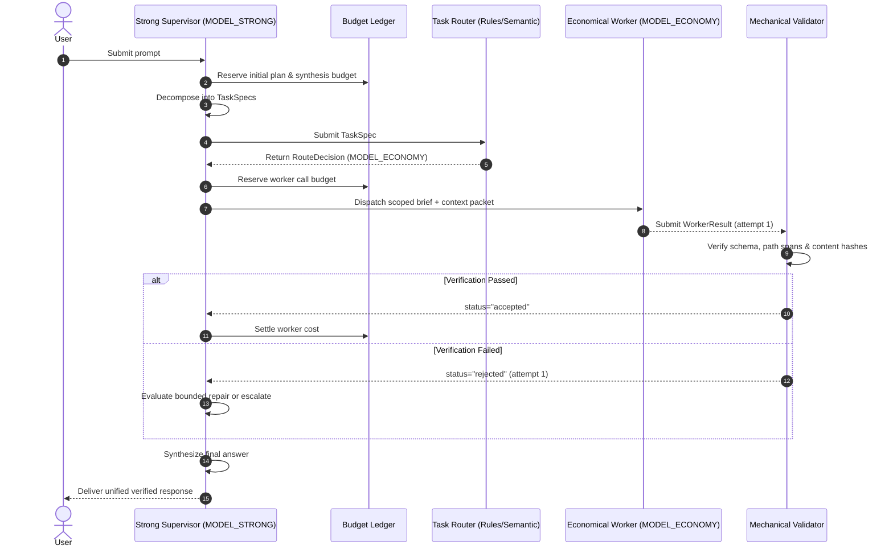
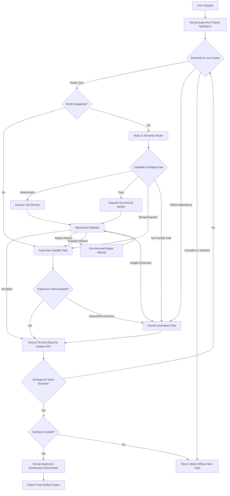

# Multi-Agent Routing Handbook: Coordinating Economical Workers with a Strong Supervisor

Research Date: **2026-09-16** | Documentation Reviewed: **2026-09-17** | Equivalent Edition: [Tiếng Việt](MULTI_AGENT_ROUTING.vi.md)  
Status: **Comprehensive Architecture Handbook & Operational Reference**

---

## Executive Summary & Design Principles

This handbook provides an end-to-end technical guide for architecting systems where a user submits **a single prompt** to a strong model (`MODEL_STRONG`). The coordinator decomposes the request, delegates scoped subtasks to economical worker models (`MODEL_ECONOMY`), verifies the returned evidence mechanically, and synthesizes the final answer.

### Core Architectural Axioms
1. **Coordination Overhead Must Not Exceed Task Savings**: Parallel execution or cheap token prices do not inherently lower costs. If coordinating workers consumes more tokens than single-agent execution, the architecture fails economically.
2. **Deterministic Operations Before LLMs**: Simple filtering, symbol counting, and lexical searches must execute via deterministic tools without invoking an LLM.
3. **Mechanical Verification Before Acceptance**: A worker declaring `status="completed"` merely indicates execution finished. Results enter the graph as `accepted` only after mechanical verification of schemas, file paths, line spans, and content hashes.
4. **Strict Isolation of Context Packets**: Workers receive minimal, task-specific context briefs and artifact handles, preventing quadratic transcript accumulation.
5. **Separation of Concerns**: Transport failover (HTTP 429/5xx retries) belongs strictly to the gateway or transport client. Quality escalation belongs strictly to the graph controller or supervisor.

---

## Master Table of Contents

- [Chapter H01: One Prompt, Multiple Calls; Supervisor and Worker Roles](#chapter-h01-one-prompt-multiple-calls-supervisor-and-worker-roles)
- [Chapter H02: Selecting Native Host, SDK, or Graph Engine](#chapter-h02-selecting-native-host-sdk-or-graph-engine)
- [Chapter H03: Manual Orchestration Within One Prompt (Path A / M1)](#chapter-h03-manual-orchestration-within-one-prompt-path-a--m1)
- [Chapter H04: Task Decomposition & Context Packaging](#chapter-h04-task-decomposition--context-packaging)
- [Chapter H05: Rule-Based Routing Baseline](#chapter-h05-rule-based-routing-baseline)
- [Chapter H06: Semantic Embedding Task Router](#chapter-h06-semantic-embedding-task-router)
- [Chapter H07: Model Selector & Cascade Strategies](#chapter-h07-model-selector--cascade-strategies)
- [Chapter H08: Conditional Branching in Graphs](#chapter-h08-conditional-branching-in-graphs)
- [Chapter H09: Optional LLM Gateway Layer](#chapter-h09-optional-llm-gateway-layer)
- [Chapter H10: Context, Tokens, and Caching](#chapter-h10-context-tokens-and-caching)
- [Chapter H11: Verification & Deterministic Failure Handling](#chapter-h11-verification--deterministic-failure-handling)
- [Chapter H12: Measuring Quality, Latency, and Cost](#chapter-h12-measuring-quality-latency-and-cost)
- [Chapter H13: Operations, Security & Access Boundaries](#chapter-h13-operations-security--access-boundaries)
- [Chapter H14: Production Recipes & Failure Drills](#chapter-h14-production-recipes--failure-drills)
- [Chapter H15: Roadmap, Maturity Ladder & Terminology](#chapter-h15-roadmap-maturity-ladder--terminology)

---

## Chapter H01: One Prompt, Multiple Calls; Supervisor and Worker Roles

### 1. When to Use
Use this topology when a user task involves both high-level reasoning (planning, conflict resolution, synthesis) and mechanical subtasks (source file extraction, formatting, local testing) that can be executed more cheaply by smaller models.
- **Anti-pattern**: Multi-agent debate or majority voting for deterministic coding tasks, which inflates token consumption without improving correctness.

### 2. Conceptual Taxonomy
- **User Prompt**: The external user prompt initiating the run.
- **Run (`run_id`)**: The lifecycle of executing a single user prompt to final synthesis.
- **Task (`task_id`)**: A discrete, bounded unit of work defined by a `TaskSpec`.
- **Attempt (`attempt_id`)**: An individual execution instance of a task (including initial dispatch, repair, or retry).
- **Model Call**: A single billable inference request to a provider API.

### 3. Architecture Sequence



---

## Chapter H02: Selecting Native Host, SDK, or Graph Engine

### 1. When to Use
Choosing the appropriate implementation path depends on organizational infrastructure, deployment constraints, and the complexity of task dependencies.
Refer to [CAPABILITY_MATRIX.md](CAPABILITY_MATRIX.md) for detailed feature-by-feature comparisons.

### 2. Path Selection Overview
1. **Path A: Native Host / Codex Platform**:
   - Best for interactive developer workflows within IDEs or platforms supporting native subagent spawning.
   - Constrained by host context inheritance rules and lack of arbitrary router hooks.
2. **Path B: Small Orchestrator + Model SDK**:
   - Best for targeted CLI tools and automated batch scripts requiring direct programmatic control over tokens and pre-dispatch gating.
   - Application code directly implements the scheduling loop using `asyncio`.
3. **Path C: Graph Engine (LangGraph)**:
   - Best for enterprise production workflows featuring complex dependency DAGs, asynchronous fan-out, persistent checkpointing, and human-in-the-loop resume.
   - The graph owns the outer execution loop and state transitions.
4. **Supplementary Layer: LLM Gateway (LiteLLM)**:
   - Manages centralized API keys, provider failover, and transport retries. A gateway is never an orchestrator.

---

## Chapter H03: Manual Orchestration Within One Prompt (Path A / M1)

### 1. When to Use
Use when working interactively in a subagent-enabled host session without deploying custom Python graph infrastructure.
Detailed recipes: [recipes/manual.en.md](recipes/manual.en.md).

### 2. Orchestration Blueprint
The coordinator prompt must enforce:
- Bounded delegation: `max_parallel_workers=2`.
- Minimal context packets: Only file paths and specific instructions; no conversation history.
- Explicit contracts: Enforce return of line spans, hashes, and executed checks.
- Prohibition of recursive subagents: Workers must not spawn child subagents.
- Parent synthesis ownership: The supervisor verifies citations and delivers the unified answer.

---

## Chapter H04: Task Decomposition & Context Packaging

### 1. When to Use
Every delegated subtask must be framed as a formal contract before dispatch to prevent context leakage and ambiguous requirements.
Reference schema instances: [templates/task-spec.example.json](templates/task-spec.example.json) and [templates/worker-result.example.json](templates/worker-result.example.json).

### 2. TaskSpec & WorkerResult Contracts

```text
TaskSpec:
  task_id: string
  run_id: string
  request_revision: int
  objective: string
  allowed_scope_files: list[string]
  dependency_task_ids: list[string]
  acceptance_criteria: list[string]
  context_evidence_refs: list[EvidenceRef]
  allowed_tool_families: list[string]
  mutation_rights: "read_only" | "write_scoped"
  model_policy_id: string
  budget_reserve: BudgetReserve
  deadline_ms: int
  escalation_conditions: list[string]

WorkerResult:
  task_id: string
  attempt_id: int
  result_revision: int
  status: "completed" | "partial" | "blocked" | "failed"
  bounded_answer: string
  evidence_refs: list[EvidenceRef]
  artifacts_or_changes: list[ArtifactChange]
  checks_actually_run: list[CheckResult]
  unknowns: list[string]
  usage_event_ref: UsageEventRef
```

---

## Chapter H05: Rule-Based Routing Baseline

### 1. When to Use
Before applying vector embeddings or learned classifiers, evaluate a deterministic if-else rules table. Deterministic rules execute in microseconds, incur zero token overhead, and handle unambiguous cases reliably.

### 2. Canonical Routing Table

| Subtask Characterization | Prerequisite Checks | Initial Action / Target Tier |
| :--- | :--- | :--- |
| **Deterministic Data Manipulation** | Pure string search, JSON formatting, symbol counting | **Tool Execution Node** (Zero LLM tokens) |
| **Narrow Evidence Extraction** | Specific file identified, read-only scope, mechanical check | **MODEL_ECONOMY** (Scoped read-only worker) |
| **Single Artifact Summarization** | Single file within model context, known provenance | **MODEL_ECONOMY** (With omission validator) |
| **Local Scoped Patch / Test Draft** | Specific file ownership, test harness available | **MODEL_ECONOMY** (Subject to strict patch check) |
| **Cross-Module Architectural Design** | Multiple interdependent files, ambiguous interfaces | **MODEL_STRONG** (Retained in supervisor) |
| **Capability Gate Failure** | Task requires tool/modality unsupported by economy tier | **MODEL_STRONG** (Bypass economy tier) |

---

## Chapter H06: Semantic Embedding Task Router

### 1. When to Use
When subtasks cannot be classified by static rules alone, deploy dense embedding classification (e.g. Aurelio Semantic Router).
Detailed recipes: [recipes/automatic.en.md](recipes/automatic.en.md).

### 2. Router Pipeline & Calibration
1. **Embed Subtask Objective**: Vectorize only the specific subtask description, not the entire conversation or repository.
2. **Dual-Language Route Index**: Index contains both English and Vietnamese positive and near-negative exemplars.
3. **Threshold & Margin Gates**:
   - Cosine similarity must exceed the calibrated route threshold (e.g. $\ge 0.82$).
   - Margin between top-1 and top-2 candidate routes must exceed the margin threshold (e.g. $\ge 0.08$).
4. **Safe Abstention**: If either condition fails, output `selected_route_family="unknown"`. Route directly to `MODEL_STRONG` rather than forcing an uncertain economical assignment.

---

## Chapter H07: Model Selector & Cascade Strategies

### 1. When to Use
Selecting the actual model deployment for an assigned route requires balancing measured capability, token pricing, and the risk of costly escalation.
Reference configuration: [templates/route-policy.example.json](templates/route-policy.example.json).

### 2. Cost-Aware Cascade Mechanics
- **Expected Cost Formula**:
  $$E[C_{task}] = C_{economy} + C_{verify} + p_{fail} \cdot (C_{repair} + C_{strong})$$
- **Break-Even Principle**: As proven in [PROTOCOL.en.md](evaluation/PROTOCOL.en.md), if $p_{fail} \ge 0.50$, cascading through economical models increases total cost. Hard tasks must bypass the economy tier entirely.

---

## Chapter H08: Conditional Branching in Graphs

### 1. Complete Reference Graph (LangGraph)



### 2. Graph State & Reducer Requirements
- Graph state must be strictly serializable.
- State updates use idempotent keys: `(task_id, attempt_id, result_revision)`.
- LangGraph persistent checkpointer (SQLite or Postgres) preserves progress across host process restarts.

---

## Chapter H09: Optional LLM Gateway Layer

### 1. When to Use
Deploy a gateway proxy (such as LiteLLM) when your organization requires centralized credential management, cross-provider rate-limit handling, and unified budget tracking.
Detailed recipes: [recipes/gateway.en.md](recipes/gateway.en.md).

### 2. Gateway Boundaries
- **Gateway Owns**: HTTP 429/5xx retries, provider connection pooling, token usage normalization.
- **Orchestrator Owns**: Task decomposition, semantic routing, evidence validation, quality escalation.
- **Critical Caveat**: A gateway must never silently downgrade `MODEL_STRONG` to a weaker model during failover.

---

## Chapter H10: Context, Tokens, and Caching

### 1. Context Minimization
- Never pass full conversation histories to worker subagents.
- Pass compact context packets containing only target file paths, line ranges, and essential constraints.
- Token-Context MCP serves as the context provider with provenance, delivering fresh snippets and symbol graphs on demand.

### 2. Accounting for Supervisor Ingestion Costs
The cost of delegating to a worker includes the tokens consumed by the supervisor when reading the worker's output:
$$C_{delegation} = C_{worker\_input} + C_{worker\_output} + C_{supervisor\_reading\_worker\_output}$$
If a worker returns a 5,000-token verbose summary for a 100-token task, the supervisor's ingestion cost negates the worker's savings.

---

## Chapter H11: Verification & Deterministic Failure Handling

### 1. Multi-Stage Verification Pipeline
1. **Schema Check**: Validates JSON structure against `WorkerResult` schema.
2. **Scope Check**: Confirms worker accessed only files in `allowed_scope_files`.
3. **Evidence Hash Check**: Verifies line spans and SHA-256 digests against disk files.
4. **Tool Execution Check**: Confirms unit tests or linters actually executed and exited with code 0.

### 2. Failure Handling Table

| Failure Type | Initial Action | Max Attempts | Fallback Action |
| :--- | :--- | :---: | :--- |
| **Schema Invalidation** | Request bounded repair with schema error | 1 | Escalate to strong model |
| **Fabricated Line Span/Hash** | Request bounded repair with file check | 1 | Escalate to strong model |
| **Provider HTTP 429 / Timeout** | Gateway retries with exponential backoff | 2 | Switch to fallback provider |
| **Task Dependency Failure** | Mark dependent tasks `blocked` | 0 | Abort downstream calls |
| **Budget Limit Reached** | Cancel all running/pending workers | 0 | Return honest partial answer |

---

## Chapter H12: Measuring Quality, Latency, and Cost

### 1. Authoritative Accounting
Follow the complete evaluation protocol specified in [PROTOCOL.en.md](evaluation/PROTOCOL.en.md):
$$C_{run} = C_{parent\_plan} + C_{router} + \sum C_{worker\_attempts} + C_{tools} + C_{verify} + C_{parent\_synthesis}$$
All failed, timed-out, and rejected attempts remain permanently in the total cost denominator.

### 2. Mandatory Baselines & Rollout Gates
Benchmark against 8 standardized baselines (B01 through B08) and enforce the 5 pre-established production rollout gates (100% schema compliance, zero regressions, $\ge 15\%$ cost reduction, $\le 10\%$ latency increase).

---

## Chapter H13: Operations, Security & Access Boundaries

### 1. Security & Prompt Injection
Repository content, tool outputs, and worker responses must be treated as untrusted data. Tool outputs must never override routing policies, mutate model allowlists, or alter file permissions.

### 2. Authoritative Budget Ledger
- Reservations are temporary holds; settlements reflect billed usage.
- Always earmark an immutable synthesis reserve ($C_{parent\_synthesis}$) from the moment the run begins, guaranteeing the strong model can deliver an orderly closing response.
Reference schema: [templates/budget-ledger.example.json](templates/budget-ledger.example.json).

---

## Chapter H14: Production Recipes & Failure Drills

This chapter indexes the 12 targeted operational recipes provided across the modular recipe guides:

- **R01**: [One-Prompt Repository Audit](recipes/manual.en.md#recipe-r01-one-prompt-repository-audit) (M1 Flow)
- **R02**: [Task Too Small / No-Delegate Branch](recipes/manual.en.md#recipe-r02-task-too-small--no-delegate-branch) (Deterministic Tool Bypass)
- **R03**: [Independent Batch Fan-Out](recipes/hybrid.en.md#recipe-r03-independent-batch-fan-out) (Bounded Concurrency & Join)
- **R04**: [Dependent Task DAG Execution](recipes/hybrid.en.md#recipe-r04-dependent-task-dag-execution) (Sequential Dependency Gating)
- **R05**: [Ambiguous Semantic Route & Abstention](recipes/automatic.en.md#recipe-r05-ambiguous-semantic-route--abstention) (Threshold & Margin Gates)
- **R06**: [Worker Failure & Bounded Escalation](recipes/automatic.en.md#recipe-r06-worker-failure--bounded-escalation) (Mechanical Verification & Fallback)
- **R07**: [Provider 429/Timeout Retry & Fallback](recipes/gateway.en.md#recipe-r07-provider-429timeout-retry--fallback) (Transport Failover)
- **R08**: [Budget Exhaustion, Cancellation & Steering](recipes/troubleshooting.en.md#recipe-r08-budget-exhaustion-user-cancellation--steering) (Circuit Breaker)
- **R09**: [Stale Index or Inaccessible URI Fallback](recipes/troubleshooting.en.md#recipe-r09-stale-index-or-inaccessible-uri-fallback) (Freshness Fallback)
- **R10**: [Crash Recovery & Idempotent Resume](recipes/troubleshooting.en.md#recipe-r10-crash-recovery--idempotent-resume) (Checkpointer Replay)
- **R11**: [Cross-Lingual Parity Failure Drills](recipes/troubleshooting.en.md#recipe-r11-cross-lingual-parity-failure-drills) (Dual-Language Alignment)
- **R12**: [Multi-Worker Conflicting Edits Isolation](recipes/troubleshooting.en.md#recipe-r12-multi-worker-conflicting-edits-isolation) (Patch Isolation)

---

## Chapter H15: Roadmap, Maturity Ladder & Terminology

### 1. Organizational Maturity Ladder
- **Stage 0 (Single Agent Baseline)**: Single strong model performs all tasks with compact context.
- **Stage 1 (Manual Prompt Orchestration - M1)**: Supervisor delegates up to 2 independent subtasks via prompts within an interactive host session.
- **Stage 2 (Semi-Automatic Rules & Batching - M2)**: Deterministic rules table, bounded fan-out, and sequential DAGs managed by an application script.
- **Stage 3 (Automatic Routing & Graphs - M3)**: Calibrated semantic embedding router, LangGraph conditional branching, persistent checkpointers, and bounded repair/escalation loops.
- **Stage 4 (Enterprise Gateway & Fleet Management)**: Centralized reverse proxy managing provider failover, team quotas, and distributed MCP bridge tunnels.

### 2. Canonical Terminology Alignment
Refer to [BILINGUAL_PARITY.md](BILINGUAL_PARITY.md) for the complete terminology ledger and invariant contract identifiers.
