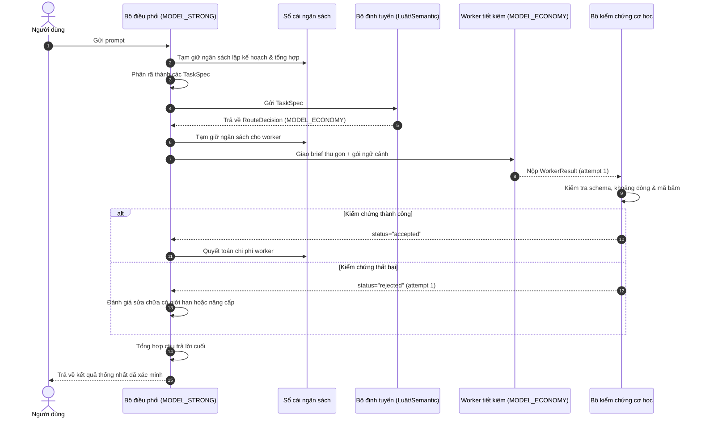
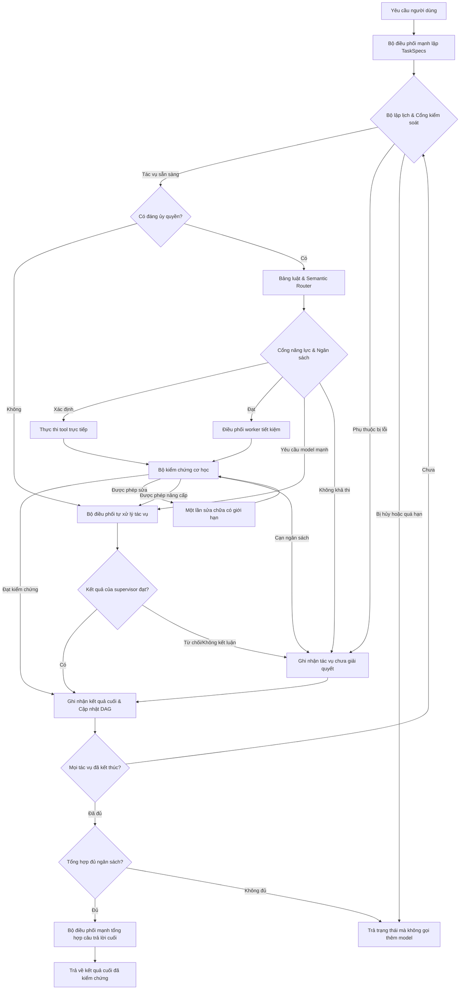

# Cẩm Nang Định Tuyến Multi-Agent: Model Mạnh Điều Phối Worker Tiết Kiệm

Ngày nghiên cứu: **2026-09-16** | Rà soát tài liệu: **2026-09-17** | Bản tương đương: [English](MULTI_AGENT_ROUTING.en.md)  
Trạng thái: **Cẩm Nang Kiến Trúc Toàn Diện & Tài Liệu Vận Hành Chuẩn**

---

## Tóm Tắt Điều Hành & Các Nguyên Lý Thiết Kế

Cẩm nang này cung cấp hướng dẫn kỹ thuật toàn diện để xây dựng hệ thống nơi người dùng gửi **một yêu cầu duy nhất** tới mô hình mạnh (`MODEL_STRONG`). Bộ điều phối sẽ phân rã yêu cầu, giao các tác vụ con có phạm vi hẹp cho các mô hình worker tiết kiệm (`MODEL_ECONOMY`), kiểm chứng bằng chứng thu thập được bằng các công cụ cơ học và tổng hợp thành câu trả lời cuối cùng.

### Các Tiên Đề Kiến Trúc Cốt Lõi
1. **Chi Phí Điều Phối Không Được Vượt Quá Phần Tiết Kiệm**: Chạy song song hay giá token rẻ không đồng nghĩa với việc tiết kiệm chi phí. Nếu chi phí token điều phối worker lớn hơn chi phí chạy một agent đơn lẻ, kiến trúc đó thất bại về mặt kinh tế.
2. **Thực Hiện Thao Tác Xác Định Trước Khi Gọi LLM**: Các tác vụ lọc chuỗi đơn giản, đếm symbol hay tìm kiếm từ vựng phải được thực hiện bằng công cụ xác định mà không cần gọi LLM.
3. **Kiểm Chứng Cơ Học Trước Khi Chấp Nhận**: Worker báo `status="completed"` chỉ có nghĩa là nó đã chạy xong. Kết quả chỉ được đưa vào đồ thị ở trạng thái `accepted` sau khi vượt qua kiểm chứng cơ học về schema, đường dẫn file, khoảng dòng và mã băm nội dung.
4. **Cách Ly Nghiêm Ngặt Các Gói Ngữ Cảnh**: Worker chỉ nhận bản tóm tắt thu gọn theo đúng tác vụ và handle của artifact, ngăn chặn tình trạng phình to lịch sử hội thoại bậc hai.
5. **Tách Biệt Trách Nhiệm Rõ Ràng**: Việc thử lại lỗi truyền tải (HTTP 429/5xx) thuộc trách nhiệm duy nhất của gateway hoặc client truyền tải. Việc nâng cấp bậc mô hình do suy giảm chất lượng thuộc thẩm quyền duy nhất của bộ điều khiển đồ thị hoặc bộ điều phối.

---

## Mục Lục Tổng Thể

- [Chương H01: Một Prompt, Nhiều Lời Gọi; Vai Trò Bộ Điều Phối và Worker](#chương-h01-một-prompt-nhiều-lời-gọi-vai-trò-bộ-điều-phối-và-worker)
- [Chương H02: Lựa Chọn Native Host, SDK hoặc Graph Engine](#chương-h02-lựa-chọn-native-host-sdk-hoặc-graph-engine)
- [Chương H03: Điều Phối Thủ Công Trong Cùng Một Prompt (Đường A / M1)](#chương-h03-điều-phối-thủ-công-trong-cùng-một-prompt-đường-a--m1)
- [Chương H04: Phân Rã Tác Vụ & Đóng Gói Ngữ Cảnh](#chương-h04-phân-rã-tác-vụ--đóng-gói-ngữ-cảnh)
- [Chương H05: Định Tuyến Dựa Trên Luật (Baseline)](#chương-h05-định-tuyến-dựa-trên-luật-baseline)
- [Chương H06: Định Tuyến Tác Vụ Bằng Semantic Embedding](#chương-h06-định-tuyến-tác-vụ-bằng-semantic-embedding)
- [Chương H07: Bộ Chọn Mô Hình & Chiến Lược Phân Tầng](#chương-h07-bộ-chọn-mô-hình--chiến-lược-phân-tầng)
- [Chương H08: Rẽ Nhánh Có Điều Kiện Trong Graph](#chương-h08-rẽ-nhánh-có-điều-kiện-trong-graph)
- [Chương H09: Tầng LLM Gateway Tùy Chọn](#chương-h09-tầng-llm-gateway-tùy-chọn)
- [Chương H10: Ngữ Cảnh, Quản Lý Token & Cơ Chế Cache](#chương-h10-ngữ-cảnh-quản-lý-token--cơ-chế-cache)
- [Chương H11: Kiểm Chứng & Xử Lý Lỗi Xác Định](#chương-h11-kiểm-chứng--xử-lý-lỗi-xác-định)
- [Chương H12: Đo Lường Chất Lượng, Độ Trễ & Chi Phí](#chương-h12-đo-lường-chất-lượng-độ-trễ--chi-phí)
- [Chương H13: Vận Hành, Bảo Mật & Ranh Giới Truy Cập](#chương-h13-vận-hành-bảo-mật--ranh-giới-truy-cập)
- [Chương H14: Các Recipe Vận Hành & Kịch Bản Ứng Phó](#chương-h14-các-recipe-vận-hành--kịch-bản-ứng-phó)
- [Chương H15: Lộ Trình Phát Triển, Thang Đo & Thuật Ngữ](#chương-h15-lộ-trình-phát-triển-thang-đo--thuật-ngữ)

---

## Chương H01: Một Prompt, Nhiều Lời Gọi; Vai Trò Bộ Điều Phối và Worker

### 1. Khi Nào Dùng
Áp dụng mô hình này khi yêu cầu của người dùng bao gồm cả suy luận cấp cao (lập kế hoạch, giải quyết xung đột, tổng hợp) lẫn các tác vụ cơ học (trích xuất file nguồn, định dạng, chạy test cục bộ) có thể giao cho model nhỏ hơn với chi phí thấp.
- **Anti-pattern**: Dùng mô hình tranh luận đa tác nhân (multi-agent debate) hoặc bỏ phiếu đa số cho các tác vụ code xác định, làm tăng vọt số token mà không cải thiện độ chính xác.

### 2. Định Nghĩa Khái Niệm
- **User Prompt**: Câu lệnh ban đầu của người dùng khởi động toàn bộ lượt chạy.
- **Run (`run_id`)**: Toàn bộ vòng đời xử lý một prompt của người dùng cho đến khi hoàn tất câu trả lời.
- **Task (`task_id`)**: Một đơn vị công việc riêng biệt, có giới hạn được định nghĩa bởi một `TaskSpec`.
- **Attempt (`attempt_id`)**: Một lượt thực thi cụ thể của một task (bao gồm lần phân công đầu, lần sửa lỗi hoặc lần thử lại).
- **Model Call**: Một lời gọi suy luận tính phí đơn lẻ tới API của nhà cung cấp.

### 3. Sơ Đồ Trình Tự Kiến Trúc



---

## Chương H02: Lựa Chọn Native Host, SDK hoặc Graph Engine

### 1. Khi Nào Dùng
Việc chọn đường triển khai phụ thuộc vào hạ tầng tổ chức, ràng buộc môi trường và độ phức tạp của chuỗi phụ thuộc công việc.
Xem thêm [CAPABILITY_MATRIX.md](CAPABILITY_MATRIX.md) để đối chiếu chi tiết từng tính năng.

### 2. Tổng Quan Các Lựa Chọn
1. **Đường A: Native Host / Codex Platform**:
   - Phù hợp nhất cho môi trường phát triển tương tác hỗ trợ native subagent trong IDE.
   - Hạn chế: Kế thừa ngữ cảnh phụ thuộc vào host; khó gắn các hook định tuyến ngữ nghĩa tùy ý.
2. **Đường B: Orchestrator Nhỏ + Model SDK**:
   - Phù hợp nhất cho các công cụ CLI độc lập hoặc kịch bản tự động hóa cần kiểm soát trực tiếp token và cổng duyệt trước khi dispatch.
   - Mã nguồn ứng dụng trực tiếp điều khiển vòng lặp bằng `asyncio`.
3. **Đường C: Graph Engine (LangGraph)**:
   - Phù hợp nhất cho quy trình sản xuất doanh nghiệp có đồ thị DAG phức tạp, phân tán song song, lưu checkpoint bền vững và tiếp tục sau sự cố.
   - Đồ thị nắm quyền sở hữu vòng lặp thực thi và các bước chuyển trạng thái.
4. **Tầng Bổ Trợ: LLM Gateway (LiteLLM)**:
   - Quản lý tập trung API key, cơ chế chuyển đổi dự phòng và retry tầng truyền tải. Gateway tuyệt đối không làm nhiệm vụ điều phối nghiệp vụ.

---

## Chương H03: Điều Phối Thủ Công Trong Cùng Một Prompt (Đường A / M1)

### 1. Khi Nào Dùng
Sử dụng khi làm việc tương tác trong một phiên làm việc có hỗ trợ subagent mà không cần triển khai hạ tầng code Python phức tạp.
Xem chi tiết các recipe: [recipes/manual.vi.md](recipes/manual.vi.md).

### 2. Thiết Kế Bản Mẫu Điều Phối
Prompt của bộ điều phối phải đảm bảo:
- Giới hạn số lượng worker: `max_parallel_workers=2`.
- Gói ngữ cảnh tối thiểu: Chỉ cung cấp đường dẫn file và hướng dẫn cụ thể; không kèm lịch sử chat.
- Hợp đồng rõ ràng: Bắt buộc trả về số dòng, mã băm và các kiểm tra đã chạy.
- Nghiêm cấm sinh subagent đệ quy: Worker không được tạo thêm subagent con.
- Bộ điều phối nắm quyền tổng hợp: Tự kiểm tra đối chiếu trích dẫn và đưa ra câu trả lời thống nhất.

---

## Chương H04: Phân Rã Tác Vụ & Đóng Gói Ngữ Cảnh

### 1. Khi Nào Dùng
Mọi tác vụ con được phân công đều phải được đóng khung bằng một hợp đồng chính thức trước khi gửi đi nhằm ngăn chặn rò rỉ ngữ cảnh và yêu cầu mơ hồ.
Tham khảo mẫu schema: [templates/task-spec.example.json](templates/task-spec.example.json) và [templates/worker-result.example.json](templates/worker-result.example.json).

### 2. Cấu Trúc Hợp Đồng TaskSpec & WorkerResult

```text
TaskSpec:
  task_id: string
  run_id: string
  request_revision: int
  objective: string
  allowed_scope_files: list[string]
  dependency_task_ids: list[string]
  acceptance_criteria: list[string]
  context_evidence_refs: list[EvidenceRef]
  allowed_tool_families: list[string]
  mutation_rights: "read_only" | "write_scoped"
  model_policy_id: string
  budget_reserve: BudgetReserve
  deadline_ms: int
  escalation_conditions: list[string]

WorkerResult:
  task_id: string
  attempt_id: int
  result_revision: int
  status: "completed" | "partial" | "blocked" | "failed"
  bounded_answer: string
  evidence_refs: list[EvidenceRef]
  artifacts_or_changes: list[ArtifactChange]
  checks_actually_run: list[CheckResult]
  unknowns: list[string]
  usage_event_ref: UsageEventRef
```

---

## Chương H05: Định Tuyến Dựa Trên Luật (Baseline)

### 1. Khi Nào Dùng
Trước khi sử dụng embedding vector hay bộ phân loại học máy, hãy luôn đánh giá qua bảng quy tắc if-else xác định. Bảng luật chạy trong vài micro giây, tiêu tốn 0 token và xử lý chính xác các trường hợp rõ ràng.

### 2. Bảng Định Tuyến Chuẩn

| Đặc Điểm Tác Vụ Con | Kiểm Tra Tiên Quyết | Hành Động Khởi Đầu / Tier Chỉ Định |
| :--- | :--- | :--- |
| **Thao Tác Dữ Liệu Xác Định** | Tìm kiếm chuỗi, format JSON, đếm symbol | **Node Chạy Tool Trực Tiếp** (0 token LLM) |
| **Trích Xuất Bằng Chứng Hẹp** | File xác định, phạm vi chỉ đọc, kiểm cơ học | **MODEL_ECONOMY** (Worker chỉ đọc có phạm vi) |
| **Tóm Tắt Một Artifact** | Kích thước vừa context, nguồn gốc rõ ràng | **MODEL_ECONOMY** (Kèm bộ kiểm tra bỏ sót) |
| **Soạn Bản Vá / Test Cục Bộ** | File sở hữu rõ ràng, có sẵn bộ test harness | **MODEL_ECONOMY** (Phải qua kiểm tra patch) |
| **Thiết Kế Kiến Trúc Liên Module** | Nhiều file phụ thuộc lẫn nhau, interface mơ hồ | **MODEL_STRONG** (Giữ lại cho bộ điều phối) |
| **Lỗi Cổng Năng Lực** | Đòi hỏi tool/modality mà tier tiết kiệm không có | **MODEL_STRONG** (Bỏ qua tier tiết kiệm) |

---

## Chương H06: Định Tuyến Tác Vụ Bằng Semantic Embedding

### 1. Khi Nào Dùng
Khi tác vụ con không thể phân loại bằng bảng luật tĩnh, hãy triển khai bộ định tuyến embedding dense (ví dụ: Aurelio Semantic Router).
Xem chi tiết các recipe: [recipes/automatic.vi.md](recipes/automatic.vi.md).

### 2. Quy Trình Định Tuyến & Hiệu Chuẩn
1. **Tạo Vector Cho Mục Tiêu Tác Vụ**: Chỉ vectorize mô tả tác vụ con cụ thể, không vectorize toàn bộ hội thoại hay repo.
2. **Chỉ Mục Mẫu Đa Ngôn Ngữ**: Chứa các ví dụ mẫu khẳng định và phủ định gần bằng cả tiếng Anh và tiếng Việt.
3. **Cổng Ngưỡng & Margin**:
   - Điểm tương đồng cosine phải vượt ngưỡng đã hiệu chuẩn của route (ví dụ: $\ge 0.82$).
   - Khoảng cách (margin) giữa ứng viên top-1 và top-2 phải vượt ngưỡng margin (ví dụ: $\ge 0.08$).
4. **Từ Chối Định Tuyến An Toàn (Abstention)**: Nếu vi phạm một trong hai điều kiện, trả về `selected_route_family="unknown"`. Chuyển thẳng về cho `MODEL_STRONG` thay vì ép buộc giao cho worker giá rẻ.

---

## Chương H07: Bộ Chọn Mô Hình & Chiến Lược Phân Tầng

### 1. Khi Nào Dùng
Việc chọn deployment mô hình cụ thể cho một route đòi hỏi phải cân đối giữa năng lực đo lường được, đơn giá token và rủi ro tốn kém khi phải nâng cấp bậc mô hình.
Tham khảo cấu hình mẫu: [templates/route-policy.example.json](templates/route-policy.example.json).

### 2. Cơ Chế Phân Tầng Nhận Thức Chi Phí
- **Công Thức Chi Phí Kỳ Vọng**:
  $$E[C_{task}] = C_{economy} + C_{verify} + p_{fail} \cdot (C_{repair} + C_{strong})$$
- **Nguyên Lý Hòa Vốn**: Theo chứng minh trong [PROTOCOL.vi.md](evaluation/PROTOCOL.vi.md), nếu $p_{fail} \ge 0.50$, việc thử qua model tiết kiệm sẽ làm tăng tổng chi phí. Các tác vụ khó phải bỏ qua tier tiết kiệm ngay từ đầu.

---

## Chương H08: Rẽ Nhánh Có Điều Kiện Trong Graph

### 1. Đồ Thị Tham Chiếu Hoàn Chỉnh (LangGraph)



### 2. Yêu Cầu Trạng Thái Graph & Reducer
- Trạng thái đồ thị phải tuần tự hóa được (strictly serializable).
- Cập nhật trạng thái dùng khóa idempotent: `(task_id, attempt_id, result_revision)`.
- Checkpointer bền vững (SQLite hoặc Postgres) bảo toàn tiến độ qua các sự cố tiến trình host bị dừng.

---

## Chương H09: Tầng LLM Gateway Tùy Chọn

### 1. Khi Nào Dùng
Triển khai proxy gateway (như LiteLLM) khi tổ chức yêu cầu quản lý tập trung API key, xử lý giới hạn tần suất đa nhà cung cấp và theo dõi ngân sách hợp nhất.
Xem chi tiết các recipe: [recipes/gateway.vi.md](recipes/gateway.vi.md).

### 2. Ranh Giới Trách Nhiệm Của Gateway
- **Gateway nắm giữ**: Retry lỗi HTTP 429/5xx, gom nhóm kết nối, chuẩn hóa dữ liệu sử dụng token.
- **Orchestrator nắm giữ**: Phân rã tác vụ, định tuyến ngữ nghĩa, kiểm chứng bằng chứng, nâng cấp bậc mô hình.
- **Ràng Buộc Sống Còn**: Gateway không bao giờ được âm thầm hạ cấp `MODEL_STRONG` xuống model yếu hơn khi xảy ra failover.

---

## Chương H10: Ngữ Cảnh, Quản Lý Token & Cơ Chế Cache

### 1. Tối Thiểu Hóa Ngữ Cảnh
- Không bao giờ gửi toàn bộ lịch sử hội thoại cho worker subagent.
- Chỉ truyền gói ngữ cảnh thu gọn chứa đường dẫn file, khoảng dòng và các ràng buộc cốt lõi.
- Token-Context MCP giữ vai trò cung cấp ngữ cảnh có xuất xứ (provenance), cung cấp đoạn trích tươi mới và biểu đồ symbol theo nhu cầu.

### 2. Chi Phí Đọc Dữ Liệu Của Bộ Điều Phối
Chi phí ủy quyền cho worker bao gồm cả lượng token mà bộ điều phối phải tiêu tốn để đọc kết quả do worker trả về:
$$C_{delegation} = C_{worker\_input} + C_{worker\_output} + C_{supervisor\_reading\_worker\_output}$$
Nếu worker trả về một bản tóm tắt dài dòng 5.000 token cho một tác vụ đơn giản 100 token, chi phí đọc của supervisor sẽ xóa sạch phần tiết kiệm được.

---

## Chương H11: Kiểm Chứng & Xử Lý Lỗi Xác Định

### 1. Quy Trình Kiểm Chứng Đa Tầng
1. **Kiểm tra Schema**: Kiểm tra cấu trúc JSON đối chiếu với schema `WorkerResult`.
2. **Kiểm tra Phạm Vi (Scope)**: Xác nhận worker chỉ truy cập các file nằm trong `allowed_scope_files`.
3. **Kiểm tra Mã Băm Bằng Chứng**: Xác minh khoảng dòng và mã băm SHA-256 đối chiếu với file thực tế trên đĩa.
4. **Kiểm tra Chạy Tool**: Xác nhận các unit test hoặc linter đã thực sự chạy và trả về exit code 0.

### 2. Bảng Xử Lý Sự Cố

| Loại Sự Cố | Hành Động Khởi Đầu | Số Lần Tối Đa | Hành Động Dự Phòng |
| :--- | :--- | :---: | :--- |
| **Sai Schema** | Yêu cầu sửa có giới hạn kèm lỗi schema | 1 | Nâng cấp lên model mạnh |
| **Bịa Đặt Số Dòng/Mã Băm** | Yêu cầu sửa có giới hạn kèm kiểm tra file | 1 | Nâng cấp lên model mạnh |
| **Lỗi HTTP 429 / Timeout** | Gateway retry với giãn cách lũy thừa | 2 | Chuyển sang endpoint dự phòng |
| **Lỗi Tác Vụ Tiên Quyết** | Đánh dấu tác vụ phụ thuộc là `blocked` | 0 | Dừng các lời gọi phía sau |
| **Chạm Trần Ngân Sách** | Hủy tất cả worker đang chạy/chờ | 0 | Trả về kết quả một phần trung thực |

---

## Chương H12: Đo Lường Chất Lượng, Độ Trễ & Chi Phí

### 1. Hạch Toán Toàn Diện
Tuân thủ đầy đủ giao thức đánh giá nêu tại [PROTOCOL.vi.md](evaluation/PROTOCOL.vi.md):
$$C_{run} = C_{parent\_plan} + C_{router} + \sum C_{worker\_attempts} + C_{tools} + C_{verify} + C_{parent\_synthesis}$$
Mọi lượt chạy thất bại, timeout và bị từ chối đều phải nằm trong mẫu số tổng chi phí.

### 2. Các Baseline Bắt Buộc & Cổng Chất Lượng
So sánh đối chuẩn với 8 baseline tiêu chuẩn (B01 đến B08) và áp đặt nghiêm ngặt 5 cổng chất lượng triển khai (100% tuân thủ schema, 0 hồi quy, giảm chi phí $\ge 15\%$, tăng độ trễ $\le 10\%$).

---

## Chương H13: Vận Hành, Bảo Mật & Ranh Giới Truy Cập

### 1. Bảo Mật & Prompt Injection
Nội dung kho mã nguồn, đầu ra của tool và phản hồi của worker phải luôn được coi là dữ liệu không đáng tin cậy (untrusted data). Đầu ra của tool không bao giờ được phép ghi đè chính sách định tuyến, sửa đổi allowlist mô hình hay thay đổi quyền hạn file.

### 2. Sổ Cái Ngân Sách Chính Thức
- Tạm giữ (reservation) là giữ chỗ tạm thời; quyết toán (settlement) phản ánh lượng sử dụng thực tế.
- Luôn giữ một khoản dự phòng cố định cho bước tổng hợp ($C_{parent\_synthesis}$) ngay từ khi bắt đầu chạy, đảm bảo model mạnh luôn có đủ ngân sách để đưa ra câu trả lời kết luận có trật tự.
Tham khảo schema: [templates/budget-ledger.example.json](templates/budget-ledger.example.json).

---

## Chương H14: Các Recipe Vận Hành & Kịch Bản Ứng Phó

Chương này dẫn hướng tới 12 recipe vận hành chi tiết trong các tài liệu recipe mô-đun:

- **R01**: [Kiểm Toán Kho Mã Nguồn Trong Một Prompt](recipes/manual.vi.md#recipe-r01-kiểm-toán-kho-mã-nguồn-trong-một-prompt) (Luồng M1)
- **R02**: [Tác Vụ Quá Nhỏ / Nhánh Không Phân Quyền](recipes/manual.vi.md#recipe-r02-tác-vụ-quá-nhỏ--nhánh-không-phân-quyền) (Bỏ Qua LLM, Dùng Tool)
- **R03**: [Phân Tán Song Song Cho Lô Tác Vụ Độc Lập](recipes/hybrid.vi.md#recipe-r03-phân-tán-song-song-cho-lô-tác-vụ-độc-lập) (Đồng Bộ Join Có Giới Hạn)
- **R04**: [Thực Thi Chuỗi Tác Vụ Có Phụ Thuộc (DAG)](recipes/hybrid.vi.md#recipe-r04-thực-thi-chuỗi-tác-vụ-có-phụ-thuộc-dag) (Chặn Tác Vụ Phụ Thuộc)
- **R05**: [Xử Lý Khi Định Tuyến Ngữ Nghĩa Mơ Hồ (Abstention)](recipes/automatic.vi.md#recipe-r05-xử-lý-khi-định-tuyến-ngữ-nghĩa-mơ-hồ-abstention) (Cổng Ngưỡng & Margin)
- **R06**: [Xử Lý Khi Worker Thất Bại & Nâng Cấp Bậc (Escalation)](recipes/automatic.vi.md#recipe-r06-xử-lý-khi-worker-thất-bại--nâng-cấp-bậc-mô-hình-escalation) (Kiểm Chứng & Fallback)
- **R07**: [Xử Lý Lỗi 429/Timeout & Fallback Endpoint](recipes/gateway.vi.md#recipe-r07-xử-lý-lỗi-429timeout--fallback-endpoint) (Xử Lý Lỗi Truyền Tải)
- **R08**: [Hết Ngân Sách, Hủy Bỏ & Thay Đổi Hướng](recipes/troubleshooting.vi.md#recipe-r08-hết-ngân-sách-hủy-bỏ--thay-đổi-hướng) (Ngắt Mạch Tự Động)
- **R09**: [Xử Lý Khi Index Lỗi Thời Hoặc URI Bị Lỗi](recipes/troubleshooting.vi.md#recipe-r09-xử-lý-khi-index-lỗi-thời-hoặc-uri-bị-lỗi) (Dự Phòng Đọc Trực Tiếp)
- **R10**: [Khôi Phục Sau Sự Cố & Tiếp Tục Idempotent](recipes/troubleshooting.vi.md#recipe-r10-khôi-phục-sau-sự-cố--tiếp-tục-idempotent) (Nạp Checkpoint Replay)
- **R11**: [Thử Nghiệm Đối Chiếu Đa Ngôn Ngữ EN/VI](recipes/troubleshooting.vi.md#recipe-r11-thử-nghiệm-đối-chiếu-đa-ngôn-ngữ-envi) (Định Tuyến Song Ngữ)
- **R12**: [Cách Ly Xung Đột Khi Nhiều Worker Sửa Cùng File](recipes/troubleshooting.vi.md#recipe-r12-cách-ly-xung-đột-khi-nhiều-worker-sửa-cùng-file) (Cách Ly Bản Vá Patch)

---

## Chương H15: Lộ Trình Phát Triển, Thang Đo & Thuật Ngữ

### 1. Thang Đo Độ Trưởng Thành Của Tổ Chức
- **Cấp độ 0 (Baseline Single Agent)**: Một mô hình mạnh duy nhất thực hiện mọi tác vụ với ngữ cảnh thu gọn.
- **Cấp độ 1 (Điều Phối Prompt Thủ Công - M1)**: Bộ điều phối giao tối đa 2 tác vụ con độc lập qua prompt trong phiên làm việc tương tác.
- **Cấp độ 2 (Bán Tự Động Với Bảng Luật & Lô - M2)**: Bảng quy tắc xác định, chạy song song có giới hạn và chuỗi DAG tuần tự điều khiển bằng mã ứng dụng.
- **Cấp độ 3 (Định Tuyến Tự Động & Graph - M3)**: Router embedding ngữ nghĩa có hiệu chuẩn, LangGraph rẽ nhánh có điều kiện, checkpointer bền vững và vòng lặp sửa/nâng cấp có giới hạn.
- **Cấp độ 4 (Enterprise Gateway & Quản Trị Hệ Thống)**: Reverse proxy tập trung quản lý failover nhà cung cấp, hạn mức đội ngũ và đường hầm cầu nối MCP phân tán.

### 2. Thuật Ngữ Song Ngữ Thống Nhất
Xem [BILINGUAL_PARITY.md](BILINGUAL_PARITY.md) để đối chiếu toàn bộ bảng thuật ngữ và các định danh hợp đồng bất biến.
